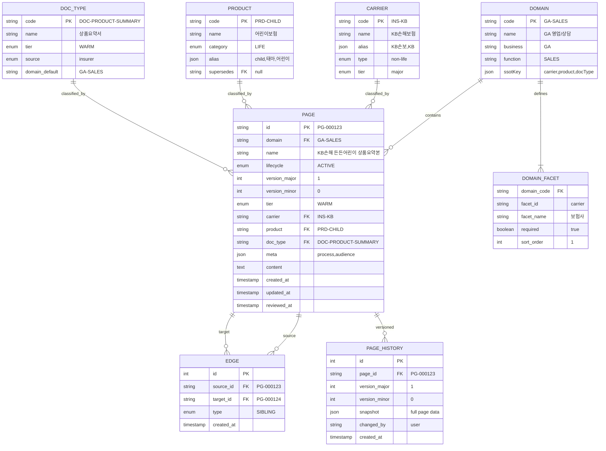
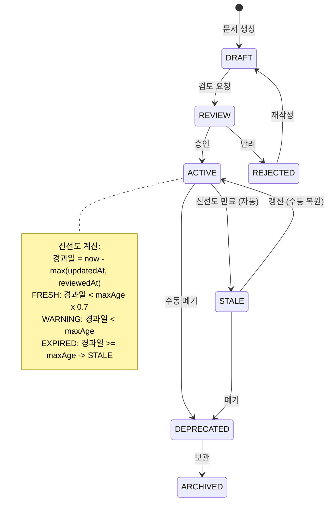
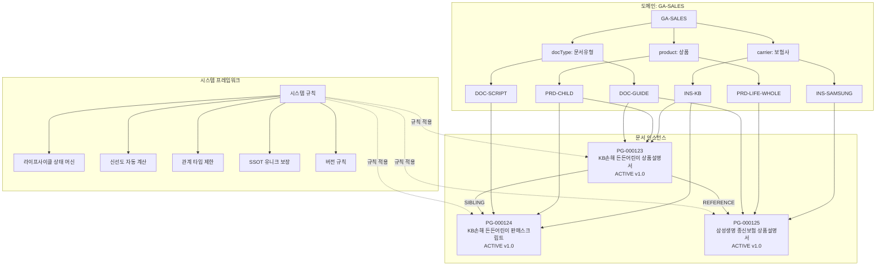
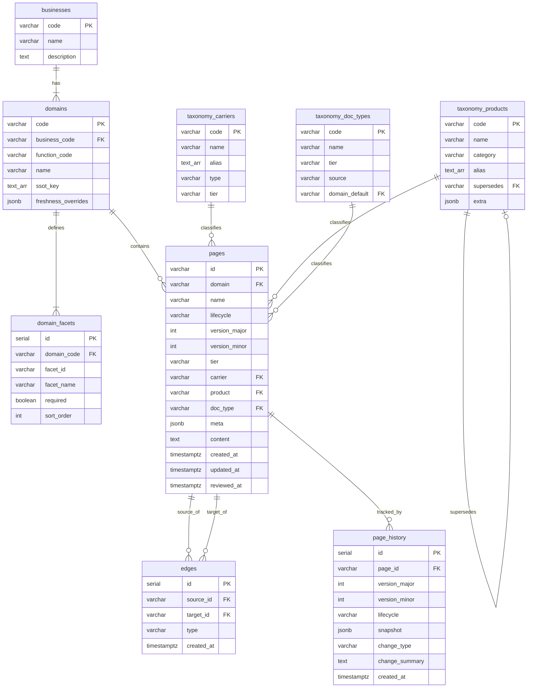

# KMS 데이터베이스 설계서

> **Version** 1.0 | 2026-02 | KMS 문서관리 프레임워크 v3.0

---

## 목차

1. [설계 원칙](#1-설계-원칙)
2. [핵심 엔티티 모델](#2-핵심-엔티티-모델)
3. [ER 다이어그램](#3-er-다이어그램)
4. [관계(Edge) 모델](#4-관계edge-모델)
5. [SSOT 유니크 제약](#5-ssot-유니크-제약)
6. [Phase 1: JSON/localStorage 구조](#6-phase-1-jsonlocalstorage-구조)
7. [Phase 2: RDB 테이블 설계](#7-phase-2-rdb-테이블-설계)
8. [Phase 3: 벡터 DB (Qdrant) 설계](#8-phase-3-벡터-db-qdrant-설계)
9. [인덱스 전략](#9-인덱스-전략)
10. [데이터 마이그레이션 경로](#10-데이터-마이그레이션-경로)

---

## 1. 설계 원칙

### 1.1 시스템-도메인 분리

```
┌─────────────────────────────────────────────────────────────┐
│                  SYSTEM FRAMEWORK (불변)                      │
│  채번 | 라이프사이클 | 신선도 | 관계 타입 | SSOT | 버전       │
├─────────────────────────────────────────────────────────────┤
│  Domain A (GA영업)  │  Domain B (메디코드)  │  ...           │
│  carrier, product,  │  service, stage,      │                │
│  docType            │  docType              │                │
└─────────────────────────────────────────────────────────────┘
```

- **시스템 필드**: 모든 도메인에 공통 적용 (id, domain, lifecycle, version, timestamps)
- **도메인 필드**: 도메인별 가변 구조 (classification, meta)
- **관계**: 시스템이 타입을 제한하되, 도메인 내부 연결은 자유

### 1.2 설계 목표

| 목표 | 설명 |
|------|------|
| **Phase 무관 일관성** | JSON/RDB/벡터 DB 어디서든 동일한 데이터 모델 유지 |
| **SSOT 보장** | 동일 분류 경로에 ACTIVE 문서 1건만 허용 |
| **도메인 확장성** | 새 도메인 추가 시 시스템 스키마 변경 불필요 |
| **RAG 최적화** | 벡터 DB 메타데이터 필터링에 최적화된 구조 |

---

## 2. 핵심 엔티티 모델

### 2.1 Page (문서) 엔티티

문서관리의 최소 단위. 시스템 필드(불변)와 도메인 필드(가변)로 구성된다.

```javascript
{
  // ── 시스템 필드 (불변, 모든 도메인 공통) ──
  id: "PG-000123",                    // 자동 채번, 위치 무관 고유 식별자
  domain: "GA-SALES",                 // 도메인 코드 (BIZ-FUNC)
  lifecycle: "ACTIVE",                // DRAFT | REVIEW | ACTIVE | STALE | DEPRECATED | ARCHIVED
  version: { major: 1, minor: 0 },   // Major.Minor 시맨틱 버전
  tier: "WARM",                       // HOT(30일) | WARM(90일) | COLD(365일)

  // ── 도메인 필드 (가변, 도메인별 facets에 따라 구조 상이) ──
  name: "KB손해보험 든든어린이보험 상품요약본",
  classification: {                   // 도메인 facets 기반 분류
    carrier: "INS-KB",                //   WHO: 보험사
    product: "PRD-CHILD",             //   WHAT: 상품군
    docType: "DOC-PRODUCT-SUMMARY"    //   WHICH: 문서유형
  },
  meta: {                             // 선택적 메타데이터
    process: "BIZ-CONSULT",           //   업무 프로세스
    audience: "AUD-AGENT"             //   대상 역할
  },
  content: "",                        // 문서 본문 (텍스트/마크다운)

  // ── 관계 (그래프 구조) ──
  relations: {
    parent: "STRUCT-INS-KB-PRD-CHILD",  // 상위 구조 노드
    children: [],                        // 하위 문서
    siblings: ["PG-000124", "PG-000125"],// 형제 문서
    references: ["PG-000200"],           // 참조 (크로스 도메인 가능)
    supersedes: null,                    // 이 문서가 대체하는 문서
    supersededBy: null                   // 이 문서를 대체한 문서
  },

  // ── 타임스탬프 ──
  createdAt: "2026-02-07T09:00:00.000Z",
  updatedAt: "2026-02-07T09:00:00.000Z",
  reviewedAt: null                    // 검토일 (신선도 계산 기준)
}
```

#### 필드 상세 명세

| 필드 | 타입 | 필수 | 시스템/도메인 | 설명 |
|------|------|:----:|:------------:|------|
| `id` | string | O | 시스템 | `PG-{6자리}` 자동 채번 |
| `domain` | string | O | 시스템 | 도메인 코드 (`GA-SALES`, `GA-COMM` 등) |
| `lifecycle` | enum | O | 시스템 | 6단계 상태 머신 |
| `version` | object | O | 시스템 | `{ major: number, minor: number }` |
| `tier` | enum | O | 시스템 | 문서유형에서 자동 결정 |
| `name` | string | O | 도메인 | 사람이 읽는 문서명 |
| `classification` | object | O | 도메인 | 도메인 facets에 정의된 필드만 포함 |
| `meta` | object | - | 도메인 | 선택적 메타데이터 |
| `content` | string | - | 도메인 | 문서 본문 |
| `relations` | object | - | 시스템 | 관계 그래프 |
| `createdAt` | ISO 8601 | O | 시스템 | 최초 생성일 |
| `updatedAt` | ISO 8601 | O | 시스템 | 최종 수정일 |
| `reviewedAt` | ISO 8601 | - | 시스템 | 최종 검토일 |

#### classification 필드의 도메인별 구조

| 도메인 | facets | classification 예시 |
|--------|--------|---------------------|
| GA-SALES | carrier x product x docType | `{ carrier: "INS-KB", product: "PRD-CHILD", docType: "DOC-GUIDE" }` |
| GA-COMM | carrier x product x docType | `{ carrier: "INS-SAMSUNG", product: "PRD-LIFE-WHOLE", docType: "DOC-COMMISSION" }` |
| GA-CONTRACT | carrier x product x docType | `{ carrier: "INS-HANWHA", product: "PRD-LIFE-TERM", docType: "DOC-APPLICATION" }` |
| GA-COMP | carrier x docType | `{ carrier: "INS-KB", docType: "DOC-COMPLIANCE-GUIDE" }` |
| GA-EDU | docType | `{ docType: "DOC-TRAINING" }` |
| COMMON-COMP | docType | `{ docType: "DOC-REGULATION" }` |

### 2.2 Domain (도메인) 엔티티

도메인별 분류체계와 SSOT 규칙을 정의한다. 새 도메인 추가 시 이 엔티티만 등록하면 시스템이 자동으로 규칙을 적용한다.

```javascript
{
  "GA-SALES": {
    name: "GA 영업/상담",
    business: "GA",                     // 사업 코드
    function: "SALES",                  // 기능 코드
    facets: [                           // 분류 축 (순서 = 경로 순서)
      { id: "carrier", name: "보험사", required: true },
      { id: "product", name: "상품", required: true },
      { id: "docType", name: "문서유형", required: true }
    ],
    optionalMeta: [                     // 선택적 메타데이터 필드
      { id: "audience", name: "역할" }
    ],
    freshnessOverrides: {               // 문서유형별 신선도 재정의 (일)
      "DOC-INCENTIVE": 14               // 시책: 기본 30일 -> 14일
    },
    ssotKey: ["carrier", "product", "docType"]  // SSOT 유니크 키 조합
  },
  "GA-COMM": {
    name: "GA 수수료/정산",
    business: "GA",
    function: "COMM",
    facets: [
      { id: "carrier", name: "보험사", required: true },
      { id: "product", name: "상품", required: true },
      { id: "docType", name: "문서유형", required: true }
    ],
    optionalMeta: [],
    freshnessOverrides: { "DOC-COMMISSION": 30, "DOC-COMMISSION-CALC": 30 },
    ssotKey: ["carrier", "product", "docType"]
  },
  "GA-CONTRACT": {
    name: "GA 계약관리",
    business: "GA",
    function: "CONTRACT",
    facets: [
      { id: "carrier", name: "보험사", required: true },
      { id: "product", name: "상품", required: true },
      { id: "docType", name: "문서유형", required: true }
    ],
    optionalMeta: [],
    freshnessOverrides: {},
    ssotKey: ["carrier", "product", "docType"]
  },
  "GA-COMP": {
    name: "GA 컴플라이언스",
    business: "GA",
    function: "COMP",
    facets: [
      { id: "carrier", name: "보험사", required: true },
      { id: "docType", name: "문서유형", required: true }
    ],
    optionalMeta: [],
    freshnessOverrides: {},
    ssotKey: ["carrier", "docType"]
  },
  "GA-EDU": {
    name: "GA 교육/역량",
    business: "GA",
    function: "EDU",
    facets: [
      { id: "docType", name: "문서유형", required: true }
    ],
    optionalMeta: [
      { id: "audience", name: "대상 역할" }
    ],
    freshnessOverrides: {},
    ssotKey: ["docType"]
  },
  "COMMON-COMP": {
    name: "공통 규제/법률",
    business: "COMMON",
    function: "COMP",
    facets: [
      { id: "docType", name: "문서유형", required: true }
    ],
    optionalMeta: [],
    freshnessOverrides: { "DOC-REGULATION": 365 },
    ssotKey: ["docType"]
  }
}
```

### 2.3 Taxonomy (분류값) 엔티티

각 facet의 실제 값을 정의한다. 마스터 데이터로서 변경 빈도가 낮다.

```javascript
// Carrier (보험사) - 18개
{
  "INS-KB": {
    name: "KB손해보험",
    alias: ["KB손보", "KB"],
    type: "non-life",       // life | non-life | common
    tier: "major"           // major | mid | common
  }
}

// Product (상품) - 25개 (버전 상품 포함)
{
  "PRD-CHILD": {
    name: "어린이보험",
    category: "LIFE",       // LIFE | HEALTH | NON-LIFE | ANNUITY | COMMON
    alias: ["child", "태아", "어린이"]
  },
  "PRD-CHILD-R2602": {
    name: "어린이보험 리뉴얼(2026-02)",
    category: "LIFE",
    alias: ["어린이 리뉴얼"],
    supersedes: "PRD-CHILD"  // 이전 버전 참조
  }
}

// DocType (문서유형) - 41개
{
  "DOC-PRODUCT-SUMMARY": {
    name: "상품요약서",
    tier: "WARM",           // HOT | WARM | COLD
    source: "insurer"       // insurer | ga | agent | regulator | expert
  }
}
```

---

## 3. ER 다이어그램

### 3.1 핵심 엔티티 관계도



### 3.2 시스템 레벨 관계도 (라이프사이클 + 신선도)



### 3.3 도메인-문서-분류 관계도



---

## 4. 관계(Edge) 모델

### 4.1 Edge 데이터 구조

```javascript
{
  id: 1,                          // 자동 증가 (Phase 2)
  source: "PG-000123",            // 출발 노드 (Page ID)
  target: "PG-000124",            // 도착 노드 (Page ID)
  type: "SIBLING",                // 관계 유형
  createdAt: "2026-02-07T..."     // 생성일
}
```

### 4.2 관계 유형별 규칙

| 관계 유형 | 역관계 | 양방향 | 크로스 도메인 | 설명 |
|-----------|--------|:------:|:------------:|------|
| `PARENT_OF` | `CHILD_OF` | O | X | 부모-자식 계층 (약관 > 특별약관) |
| `CHILD_OF` | `PARENT_OF` | O | X | 자식-부모 (역방향 자동 생성) |
| `SIBLING` | `SIBLING` | O | X | 형제 (같은 부모, 이동 시 자동 해제) |
| `REFERENCE` | - | X | O | 참조 (단방향, 도메인 간 허용) |
| `SUPERSEDES` | `SUPERSEDED_BY` | X | X | 버전 대체 (신규 -> 구버전) |

### 4.3 관계 생성/삭제 규칙

```
[PARENT_OF / CHILD_OF]
- 생성: source.domain == target.domain 필수
- 역관계 자동 생성: PARENT_OF 생성 시 CHILD_OF 자동 삽입
- 삭제: 양쪽 동시 삭제

[SIBLING]
- 생성: source.domain == target.domain 필수
- 양방향 자동 생성: A-SIBLING-B 생성 시 B-SIBLING-A 자동 삽입
- 삭제: 문서 이동(재분류) 시 기존 SIBLING 자동 해제

[REFERENCE]
- 생성: 도메인 제한 없음 (cross-domain 허용)
- 단방향: 역관계 없음
- 예: GA-SALES 문서가 COMMON-COMP 규제 문서 참조

[SUPERSEDES / SUPERSEDED_BY]
- 생성: 같은 분류 경로(carrier + product + docType) 내에서만
- SUPERSEDES 생성 시 SUPERSEDED_BY 자동 삽입
- 신규 문서 ACTIVE 전환 시 기존 문서 자동 DEPRECATED
```

### 4.4 관계 예시

```javascript
// 형제 관계: 같은 상품의 다른 문서유형
{ source: "PG-000123", target: "PG-000124", type: "SIBLING" }
{ source: "PG-000124", target: "PG-000123", type: "SIBLING" }  // 자동 역관계

// 참조 관계: 판매스크립트 -> 상품설명서 (단방향)
{ source: "PG-000124", target: "PG-000123", type: "REFERENCE" }

// 크로스 도메인 참조: 교육자료 -> 규제문서
{ source: "PG-000300", target: "PG-000400", type: "REFERENCE" }

// 부모-자식: 약관 > 특별약관
{ source: "PG-000500", target: "PG-000501", type: "PARENT_OF" }
{ source: "PG-000501", target: "PG-000500", type: "CHILD_OF" }  // 자동 역관계

// 버전 대체: 리뉴얼 상품 -> 기존 상품 문서
{ source: "PG-000600", target: "PG-000123", type: "SUPERSEDES" }
{ source: "PG-000123", target: "PG-000600", type: "SUPERSEDED_BY" }  // 자동 역관계
```

---

## 5. SSOT 유니크 제약

### 5.1 원칙

> **동일 분류 경로 내에서 ACTIVE 상태인 문서는 반드시 1건만 존재해야 한다.**

유니크 키 = `domain` + `ssotKey에 해당하는 classification 값` + `lifecycle = ACTIVE`

### 5.2 도메인별 유니크 키

| 도메인 | SSOT 키 조합 | 유니크 경로 예시 |
|--------|-------------|-----------------|
| GA-SALES | domain + carrier + product + docType | `GA-SALES:INS-KB:PRD-CHILD:DOC-GUIDE` |
| GA-COMM | domain + carrier + product + docType | `GA-COMM:INS-SAMSUNG:PRD-LIFE-WHOLE:DOC-COMMISSION` |
| GA-CONTRACT | domain + carrier + product + docType | `GA-CONTRACT:INS-KB:PRD-CHILD:DOC-APPLICATION` |
| GA-COMP | domain + carrier + docType | `GA-COMP:INS-KB:DOC-COMPLIANCE-GUIDE` |
| GA-EDU | domain + docType | `GA-EDU:DOC-TRAINING` |
| COMMON-COMP | domain + docType | `COMMON-COMP:DOC-REGULATION` |

### 5.3 SSOT 위반 시나리오와 처리

```
[시나리오 1: 유효 - 모두 유니크]
GA-SALES:INS-KB:PRD-CHILD:DOC-PRODUCT-SUMMARY (ACTIVE)      -- 경로 A
GA-SALES:INS-KB:PRD-CHILD:DOC-SCRIPT (ACTIVE)               -- 경로 B (docType 다름)
GA-SALES:INS-KB:PRD-CHILD-R2602:DOC-PRODUCT-SUMMARY (ACTIVE)-- 경로 C (product 다름)

[시나리오 2: SSOT 위반 감지]
GA-SALES:INS-KB:PRD-CHILD:DOC-PRODUCT-SUMMARY (ACTIVE)      -- 기존 문서
GA-SALES:INS-KB:PRD-CHILD:DOC-PRODUCT-SUMMARY (ACTIVE)      -- 신규 문서 (위반!)

-> 처리: 신규 문서를 ACTIVE로 전환 시, 기존 문서를 자동 DEPRECATED

[시나리오 3: 상태별 공존 허용]
GA-SALES:INS-KB:PRD-CHILD:DOC-GUIDE (ACTIVE)                -- 현재 유효 문서
GA-SALES:INS-KB:PRD-CHILD:DOC-GUIDE (DEPRECATED)            -- 이전 버전 (허용)
GA-SALES:INS-KB:PRD-CHILD:DOC-GUIDE (DRAFT)                 -- 작성 중 (허용)

-> ACTIVE만 유니크 제약, 다른 상태는 공존 가능
```

### 5.4 SSOT 검증 로직 (의사코드)

```javascript
function validateSSOT(newPage) {
  const domain = DOMAINS[newPage.domain]
  const ssotKey = domain.ssotKey

  // SSOT 경로 생성
  const path = ssotKey.map(key => newPage.classification[key]).join(':')
  const fullPath = `${newPage.domain}:${path}`

  // 동일 경로에 ACTIVE 문서 검색
  const existing = pages.find(p =>
    p.id !== newPage.id &&
    p.domain === newPage.domain &&
    p.lifecycle === 'ACTIVE' &&
    ssotKey.every(key => p.classification[key] === newPage.classification[key])
  )

  if (existing && newPage.lifecycle === 'ACTIVE') {
    // 기존 문서 자동 DEPRECATED
    existing.lifecycle = 'DEPRECATED'
    // SUPERSEDES 관계 자동 생성
    createEdge(newPage.id, existing.id, 'SUPERSEDES')
    createEdge(existing.id, newPage.id, 'SUPERSEDED_BY')
    return { warning: `기존 문서 ${existing.id} 자동 DEPRECATED`, path: fullPath }
  }

  return { ok: true, path: fullPath }
}
```

---

## 6. Phase 1: JSON/localStorage 구조

> Phase 1은 서버 없이 브라우저에서 동작하는 검증 단계이다.
> 모든 데이터를 JSON 파일 또는 localStorage에 저장한다.

### 6.1 저장소 구조

```
localStorage
├── kms_pages          // Page[] - 문서 목록
├── kms_edges          // Edge[] - 관계 목록
├── kms_domains        // Domain{} - 도메인 설정
├── kms_taxonomy       // { carriers, products, docTypes } - 분류값
├── kms_counter        // { page: 123 } - 채번 카운터
└── kms_settings       // { version, lastSync } - 앱 설정
```

### 6.2 JSON 파일 구조

```
data/
├── taxonomy.json              // 분류체계 마스터 (taxonomy.py에서 생성)
│   ├── system                 //   시스템 설정 (lifecycle, freshness, relations)
│   ├── domains                //   도메인 정의 (facets, ssotKey)
│   ├── carriers               //   보험사 목록
│   ├── products               //   상품 목록
│   ├── doc_types              //   문서유형 목록
│   └── ...                    //   기타 분류값
│
├── knowledge-graph.json       // 지식 그래프 (simulator.py에서 생성)
│   ├── stats                  //   통계 (노드/엣지/문서 수)
│   └── graph_data             //   { nodes[], edges[] }
│
└── knowledge-graph-ontology.json  // 온톨로지 그래프
```

### 6.3 Phase 1 데이터 흐름

```
[taxonomy.py]
    │ 마스터 데이터 정의
    ▼
[data/taxonomy.json]
    │ 분류체계 JSON
    ▼
[simulator.py]
    │ 그래프 + 샘플 문서 생성
    ▼
[data/knowledge-graph.json]  +  [data/samples/]
    │                              │
    ▼                              ▼
[ui/admin.html]              [ui/viewer.html]
    │ localStorage에 로드         │ vis-network로 시각화
    ▼                              ▼
[브라우저] CRUD + SSOT 검증    [브라우저] 그래프 탐색
```

### 6.4 localStorage와 Phase 2 매핑

| localStorage 키 | Phase 2 RDB 테이블 | 비고 |
|-----------------|-------------------|------|
| `kms_pages` | `pages` | 1:1 매핑 |
| `kms_edges` | `edges` | 1:1 매핑 |
| `kms_domains` | `domains` + `domain_facets` | 정규화 분리 |
| `kms_taxonomy.carriers` | `taxonomy_carriers` | 1:1 매핑 |
| `kms_taxonomy.products` | `taxonomy_products` | 1:1 매핑 |
| `kms_taxonomy.docTypes` | `taxonomy_doc_types` | 1:1 매핑 |
| `kms_counter` | DB auto-increment / sequence | 자동 전환 |

---

## 7. Phase 2: RDB 테이블 설계

> Phase 2에서는 Vue 3 + Pinia 앱으로 전환하며, RDB(PostgreSQL 권장)를 사용한다.

### 7.1 테이블 목록

| # | 테이블명 | 설명 | 레코드 규모 |
|---|---------|------|-----------|
| 1 | `pages` | 문서 (핵심 엔티티) | 수천~수만 |
| 2 | `edges` | 관계 (그래프 연결) | 수만 |
| 3 | `domains` | 도메인 정의 | 6~10 |
| 4 | `domain_facets` | 도메인별 facet 정의 | 20~30 |
| 5 | `taxonomy_carriers` | 보험사 마스터 | 18 |
| 6 | `taxonomy_products` | 상품 마스터 | 25 |
| 7 | `taxonomy_doc_types` | 문서유형 마스터 | 41 |
| 8 | `page_history` | 문서 변경 이력 | 수만 |
| 9 | `businesses` | 사업 구분 | 3~5 |

### 7.2 DDL (PostgreSQL)

```sql
-- ═══════════════════════════════════════════════════════════
-- 1. 사업 (Business)
-- ═══════════════════════════════════════════════════════════
CREATE TABLE businesses (
    code        VARCHAR(20)  PRIMARY KEY,        -- 'GA', 'MEDI', 'COMMON'
    name        VARCHAR(100) NOT NULL,           -- 'GA 보험영업'
    description TEXT,
    created_at  TIMESTAMPTZ  DEFAULT now()
);

-- ═══════════════════════════════════════════════════════════
-- 2. 도메인 (Domain)
-- ═══════════════════════════════════════════════════════════
CREATE TABLE domains (
    code            VARCHAR(30)  PRIMARY KEY,    -- 'GA-SALES'
    business_code   VARCHAR(20)  NOT NULL REFERENCES businesses(code),
    function_code   VARCHAR(20)  NOT NULL,       -- 'SALES'
    name            VARCHAR(100) NOT NULL,       -- 'GA 영업/상담'
    ssot_key        TEXT[]       NOT NULL,       -- '{carrier,product,docType}'
    freshness_overrides JSONB   DEFAULT '{}',    -- {"DOC-INCENTIVE": 14}
    created_at      TIMESTAMPTZ  DEFAULT now()
);

-- ═══════════════════════════════════════════════════════════
-- 3. 도메인 Facet (Domain Facet)
-- ═══════════════════════════════════════════════════════════
CREATE TABLE domain_facets (
    id          SERIAL      PRIMARY KEY,
    domain_code VARCHAR(30) NOT NULL REFERENCES domains(code),
    facet_id    VARCHAR(30) NOT NULL,            -- 'carrier', 'product', 'docType'
    facet_name  VARCHAR(50) NOT NULL,            -- '보험사', '상품', '문서유형'
    required    BOOLEAN     DEFAULT true,
    sort_order  INT         DEFAULT 0,
    UNIQUE (domain_code, facet_id)
);

-- ═══════════════════════════════════════════════════════════
-- 4. 보험사 마스터 (Carrier)
-- ═══════════════════════════════════════════════════════════
CREATE TABLE taxonomy_carriers (
    code        VARCHAR(30)  PRIMARY KEY,        -- 'INS-KB'
    name        VARCHAR(100) NOT NULL,           -- 'KB손해보험'
    alias       TEXT[]       DEFAULT '{}',       -- '{KB손보,KB}'
    type        VARCHAR(20)  NOT NULL,           -- 'life', 'non-life', 'common'
    tier        VARCHAR(20)  DEFAULT 'mid',      -- 'major', 'mid', 'common'
    created_at  TIMESTAMPTZ  DEFAULT now()
);

-- ═══════════════════════════════════════════════════════════
-- 5. 상품 마스터 (Product)
-- ═══════════════════════════════════════════════════════════
CREATE TABLE taxonomy_products (
    code        VARCHAR(40)  PRIMARY KEY,        -- 'PRD-CHILD'
    name        VARCHAR(100) NOT NULL,           -- '어린이보험'
    category    VARCHAR(20)  NOT NULL,           -- 'LIFE', 'HEALTH', ...
    alias       TEXT[]       DEFAULT '{}',       -- '{child,태아,어린이}'
    supersedes  VARCHAR(40)  REFERENCES taxonomy_products(code),  -- 버전 대체
    extra       JSONB        DEFAULT '{}',       -- 도메인 고유 속성
    created_at  TIMESTAMPTZ  DEFAULT now()
);

-- ═══════════════════════════════════════════════════════════
-- 6. 문서유형 마스터 (DocType)
-- ═══════════════════════════════════════════════════════════
CREATE TABLE taxonomy_doc_types (
    code           VARCHAR(40)  PRIMARY KEY,     -- 'DOC-PRODUCT-SUMMARY'
    name           VARCHAR(100) NOT NULL,        -- '상품요약서'
    tier           VARCHAR(10)  NOT NULL,        -- 'HOT', 'WARM', 'COLD'
    source         VARCHAR(20)  NOT NULL,        -- 'insurer', 'ga', 'agent', ...
    domain_default VARCHAR(30)  REFERENCES domains(code),  -- 기본 도메인
    description    TEXT,
    retention_years INT,                         -- 보존 기간 (년)
    created_at     TIMESTAMPTZ  DEFAULT now()
);

-- ═══════════════════════════════════════════════════════════
-- 7. 문서 (Page) - 핵심 엔티티
-- ═══════════════════════════════════════════════════════════
CREATE TABLE pages (
    id              VARCHAR(20)  PRIMARY KEY,    -- 'PG-000123'
    domain          VARCHAR(30)  NOT NULL REFERENCES domains(code),
    name            VARCHAR(500) NOT NULL,
    lifecycle       VARCHAR(20)  NOT NULL DEFAULT 'DRAFT',
    version_major   INT          NOT NULL DEFAULT 1,
    version_minor   INT          NOT NULL DEFAULT 0,
    tier            VARCHAR(10)  NOT NULL,       -- 'HOT', 'WARM', 'COLD'

    -- classification (도메인별 가변 - 정규화된 FK)
    carrier         VARCHAR(30)  REFERENCES taxonomy_carriers(code),
    product         VARCHAR(40)  REFERENCES taxonomy_products(code),
    doc_type        VARCHAR(40)  NOT NULL REFERENCES taxonomy_doc_types(code),

    -- 선택적 메타데이터
    meta            JSONB        DEFAULT '{}',   -- {process, audience, ...}
    content         TEXT         DEFAULT '',

    -- 타임스탬프
    created_at      TIMESTAMPTZ  NOT NULL DEFAULT now(),
    updated_at      TIMESTAMPTZ  NOT NULL DEFAULT now(),
    reviewed_at     TIMESTAMPTZ,

    -- SSOT 체크 제약: lifecycle이 ACTIVE인 경우만 유니크 제약 적용
    -- (Partial Unique Index로 구현, 아래 인덱스 참조)

    CONSTRAINT chk_lifecycle CHECK (
        lifecycle IN ('DRAFT', 'REVIEW', 'ACTIVE', 'STALE', 'DEPRECATED', 'ARCHIVED', 'REJECTED')
    ),
    CONSTRAINT chk_tier CHECK (
        tier IN ('HOT', 'WARM', 'COLD')
    )
);

-- SSOT Partial Unique Index: ACTIVE 문서의 분류 경로 유니크 보장
-- 도메인별로 ssotKey가 다르므로, 도메인별 인덱스 생성
CREATE UNIQUE INDEX idx_ssot_3axis ON pages (domain, carrier, product, doc_type)
    WHERE lifecycle = 'ACTIVE'
      AND carrier IS NOT NULL
      AND product IS NOT NULL;

CREATE UNIQUE INDEX idx_ssot_2axis ON pages (domain, carrier, doc_type)
    WHERE lifecycle = 'ACTIVE'
      AND carrier IS NOT NULL
      AND product IS NULL;

CREATE UNIQUE INDEX idx_ssot_1axis ON pages (domain, doc_type)
    WHERE lifecycle = 'ACTIVE'
      AND carrier IS NULL
      AND product IS NULL;

-- ═══════════════════════════════════════════════════════════
-- 8. 관계 (Edge)
-- ═══════════════════════════════════════════════════════════
CREATE TABLE edges (
    id          SERIAL       PRIMARY KEY,
    source_id   VARCHAR(20)  NOT NULL REFERENCES pages(id) ON DELETE CASCADE,
    target_id   VARCHAR(20)  NOT NULL REFERENCES pages(id) ON DELETE CASCADE,
    type        VARCHAR(30)  NOT NULL,
    created_at  TIMESTAMPTZ  DEFAULT now(),

    CONSTRAINT chk_edge_type CHECK (
        type IN ('PARENT_OF', 'CHILD_OF', 'SIBLING', 'REFERENCE', 'SUPERSEDES', 'SUPERSEDED_BY')
    ),
    CONSTRAINT chk_no_self_ref CHECK (source_id <> target_id),
    UNIQUE (source_id, target_id, type)
);

-- ═══════════════════════════════════════════════════════════
-- 9. 문서 변경 이력 (Page History)
-- ═══════════════════════════════════════════════════════════
CREATE TABLE page_history (
    id              SERIAL       PRIMARY KEY,
    page_id         VARCHAR(20)  NOT NULL REFERENCES pages(id) ON DELETE CASCADE,
    version_major   INT          NOT NULL,
    version_minor   INT          NOT NULL,
    lifecycle       VARCHAR(20)  NOT NULL,
    snapshot        JSONB        NOT NULL,       -- 변경 시점의 전체 데이터
    change_type     VARCHAR(20)  NOT NULL,       -- 'CREATE', 'UPDATE', 'STATUS_CHANGE'
    change_summary  TEXT,                        -- 변경 요약
    changed_by      VARCHAR(100),                -- 변경자
    created_at      TIMESTAMPTZ  DEFAULT now()
);
```

### 7.3 RDB ER 다이어그램



---

## 8. Phase 3: 벡터 DB (Qdrant) 설계

> Phase 3에서는 RAG 시스템 연동을 위해 Qdrant 벡터 DB를 사용한다.
> RDB의 Page 데이터를 청킹(chunking) 후 임베딩하여 벡터 DB에 저장한다.

### 8.1 컬렉션 분리 전략 (Hot-Warm-Cold)

| 컬렉션 | 재인덱싱 주기 | 대상 문서유형 | 벡터 차원 |
|--------|:----------:|-------------|:--------:|
| `kms_hot` | 매일 02:00 | 시책, 보험료표, 수수료, 공문, 내부공지 | 1536 |
| `kms_warm` | 매주 일 03:00 | 상품설명서, 스크립트, 심사가이드, 비교표 | 1536 |
| `kms_cold` | 분기 1회 | 약관, 규정, 교육자료, 청약서 | 1536 |

```
RDB pages 테이블
    │
    ├── tier = 'HOT'  ──► kms_hot 컬렉션
    ├── tier = 'WARM' ──► kms_warm 컬렉션
    └── tier = 'COLD' ──► kms_cold 컬렉션
```

### 8.2 Qdrant Point 구조

```javascript
{
  // Qdrant 내부 ID
  id: "uuid-v4",

  // 임베딩 벡터 (OpenAI text-embedding-3-small: 1536차원)
  vector: [0.0123, -0.0456, ...],    // float[1536]

  // 페이로드 (메타데이터 필터링용)
  payload: {
    // ── Page 참조 ──
    page_id: "PG-000123",            // RDB pages.id (원본 참조)
    chunk_index: 0,                   // 청크 순서 (0부터)
    chunk_total: 3,                   // 전체 청크 수

    // ── 시스템 필드 (필터링용) ──
    domain: "GA-SALES",
    lifecycle: "ACTIVE",
    tier: "WARM",
    version_major: 1,

    // ── 분류 필드 (Self-Query 필터링용) ──
    carrier: "INS-KB",
    carrier_name: "KB손해보험",        // 자연어 매칭용
    product: "PRD-CHILD",
    product_name: "어린이보험",
    doc_type: "DOC-PRODUCT-SUMMARY",
    doc_type_name: "상품요약서",

    // ── 메타데이터 ──
    process: "BIZ-CONSULT",
    audience: "AUD-AGENT",
    source: "insurer",

    // ── 컨텍스트 앵커 ──
    context_anchor: "KB손해보험 > 어린이보험 > 상품요약서",
    page_name: "KB손해보험 든든어린이보험 상품요약본",

    // ── 텍스트 ──
    text: "## 보장 내용\n\n입원의료비: 1일당 5만원...",

    // ── 타임스탬프 ──
    updated_at: "2026-02-07T09:00:00Z",
    indexed_at: "2026-02-07T10:00:00Z"
  }
}
```

### 8.3 Qdrant 컬렉션 설정

```javascript
// 컬렉션 생성 (kms_hot 예시)
{
  collection_name: "kms_hot",
  vectors: {
    size: 1536,                       // OpenAI embedding 차원
    distance: "Cosine"                // 코사인 유사도
  },
  // 페이로드 인덱스 (필터링 성능용)
  payload_schema: {
    "domain":      { type: "keyword", is_indexed: true },
    "lifecycle":   { type: "keyword", is_indexed: true },
    "carrier":     { type: "keyword", is_indexed: true },
    "product":     { type: "keyword", is_indexed: true },
    "doc_type":    { type: "keyword", is_indexed: true },
    "process":     { type: "keyword", is_indexed: true },
    "audience":    { type: "keyword", is_indexed: true },
    "updated_at":  { type: "datetime", is_indexed: true }
  }
}
```

### 8.4 Self-Query 필터 매핑

사용자 자연어에서 Qdrant 필터 조건으로 변환하는 규칙:

| 자연어 패턴 | Qdrant 필터 |
|:-----------|:-----------|
| "KB손해보험", "KB", "케이비" | `{ "key": "carrier", "match": { "value": "INS-KB" } }` |
| "어린이보험", "child" | `{ "key": "product", "match": { "value": "PRD-CHILD" } }` |
| "상품요약", "요약" | `{ "key": "doc_type", "match": { "value": "DOC-PRODUCT-SUMMARY" } }` |
| "수수료", "커미션" | `{ "key": "doc_type", "match": { "any": ["DOC-COMMISSION", "DOC-COMMISSION-CALC"] } }` |
| "현재", "유효한" | `{ "key": "lifecycle", "match": { "value": "ACTIVE" } }` |
| "영업", "상담" | `{ "key": "domain", "match": { "value": "GA-SALES" } }` |
| "심사" | `{ "key": "process", "match": { "value": "BIZ-UW" } }` |
| "신입설계사" | `{ "key": "audience", "match": { "value": "AUD-AGENT-NEW" } }` |

### 8.5 RDB-Qdrant 동기화

```
[동기화 트리거]

1. Page 생성/수정 시
   RDB INSERT/UPDATE → 이벤트 발행 → 청킹 → 임베딩 → Qdrant UPSERT

2. Page 상태 변경 시
   lifecycle 변경 → Qdrant payload 업데이트 (벡터 재계산 불필요)
   DEPRECATED 전환 → Qdrant Point 삭제 (또는 lifecycle 필터로 제외)

3. 정기 배치 (tier별)
   HOT:  매일 02:00 - 전체 재인덱싱
   WARM: 매주 일 03:00 - 변경분만 재인덱싱
   COLD: 분기 1회 - 전체 재인덱싱

[임베딩 작업 큐]

| 우선순위 | 대상 | 설명 |
|---------|------|------|
| 1 | HOT 문서 | 즉시~당일 처리 |
| 2 | 수동 요청 | 우선 처리 |
| 3 | WARM 문서 | 주간 배치 |
| 7 | COLD 문서 | 분기 배치 |
```

### 8.6 청킹(Chunking) 전략

```
[문서유형별 청킹 규칙]

DOC-TERMS (약관):        섹션(조항) 단위, 부모-자식 청킹
DOC-GUIDE (상품설명서):   H2/H3 헤더 단위, 500~800토큰
DOC-INCENTIVE (시책):     테이블 보존, 조건절 단위
DOC-COMMISSION (수수료):  테이블 보존, 등급별 분리
DOC-SCRIPT (스크립트):    대화 턴 단위, 500토큰
DOC-UW-RULE (심사기준):   질병/직업 카테고리 단위
기타:                     고정 크기 500토큰, 100토큰 오버랩

[컨텍스트 앵커 삽입]

각 청크 앞에 소속 정보를 자동 삽입:
"[KB손해보험 > 어린이보험 > 상품요약서 > v1.0 > 2026-02]"
+ 실제 청크 텍스트
```

---

## 9. 인덱스 전략

### 9.1 Phase 2 RDB 인덱스

```sql
-- ── 조회 성능 인덱스 ──

-- 도메인 + 라이프사이클 필터 (가장 빈번한 조회)
CREATE INDEX idx_pages_domain_lifecycle
    ON pages (domain, lifecycle);

-- 보험사별 문서 조회
CREATE INDEX idx_pages_carrier
    ON pages (carrier)
    WHERE carrier IS NOT NULL;

-- 상품별 문서 조회
CREATE INDEX idx_pages_product
    ON pages (product)
    WHERE product IS NOT NULL;

-- 문서유형별 조회
CREATE INDEX idx_pages_doc_type
    ON pages (doc_type);

-- 티어별 조회 (신선도 배치 처리용)
CREATE INDEX idx_pages_tier_lifecycle
    ON pages (tier, lifecycle);

-- 신선도 계산용 (updated_at, reviewed_at)
CREATE INDEX idx_pages_freshness
    ON pages (tier, lifecycle, updated_at, reviewed_at)
    WHERE lifecycle = 'ACTIVE';

-- ── 관계 그래프 탐색 인덱스 ──

-- source 기준 탐색 (나가는 관계)
CREATE INDEX idx_edges_source
    ON edges (source_id, type);

-- target 기준 탐색 (들어오는 관계)
CREATE INDEX idx_edges_target
    ON edges (target_id, type);

-- 관계 유형별 조회
CREATE INDEX idx_edges_type
    ON edges (type);

-- ── 이력 조회 인덱스 ──

CREATE INDEX idx_page_history_page
    ON page_history (page_id, created_at DESC);

-- ── 전문 검색 (옵션) ──

-- PostgreSQL Full-Text Search (벡터 DB 보완)
CREATE INDEX idx_pages_content_fts
    ON pages USING gin(to_tsvector('simple', content));

CREATE INDEX idx_pages_name_fts
    ON pages USING gin(to_tsvector('simple', name));
```

### 9.2 Qdrant 페이로드 인덱스

```javascript
// 각 컬렉션(kms_hot, kms_warm, kms_cold)에 동일하게 적용
const payloadIndexes = [
  // 키워드 인덱스 (정확 매칭)
  { field: "domain",    type: "keyword" },
  { field: "lifecycle", type: "keyword" },
  { field: "carrier",   type: "keyword" },
  { field: "product",   type: "keyword" },
  { field: "doc_type",  type: "keyword" },
  { field: "process",   type: "keyword" },
  { field: "audience",  type: "keyword" },
  { field: "source",    type: "keyword" },
  { field: "page_id",   type: "keyword" },

  // 날짜 인덱스 (범위 검색)
  { field: "updated_at", type: "datetime" },

  // 정수 인덱스 (버전 필터링)
  { field: "version_major", type: "integer" }
]
```

### 9.3 인덱스 성능 가이드

| 조회 패턴 | 사용 인덱스 | 예상 성능 |
|----------|-----------|----------|
| 도메인 내 ACTIVE 문서 목록 | `idx_pages_domain_lifecycle` | < 10ms |
| 특정 보험사의 모든 문서 | `idx_pages_carrier` | < 10ms |
| SSOT 중복 검사 | `idx_ssot_3axis` / `idx_ssot_2axis` / `idx_ssot_1axis` | < 5ms |
| 문서 관계 탐색 (1홉) | `idx_edges_source` / `idx_edges_target` | < 5ms |
| 문서 관계 탐색 (2홉) | 위 인덱스 조합 | < 20ms |
| 신선도 만료 대상 조회 | `idx_pages_freshness` | < 10ms |
| 벡터 유사도 검색 + 필터 | Qdrant payload index | < 100ms |
| 전문 검색 (fallback) | `idx_pages_content_fts` | < 50ms |

---

## 10. 데이터 마이그레이션 경로

### 10.1 Phase 1 -> Phase 2 마이그레이션

```
[단계 1: 스키마 생성]
PostgreSQL에 Phase 2 DDL 실행

[단계 2: 마스터 데이터 이관]
taxonomy.json → businesses, domains, domain_facets,
                taxonomy_carriers, taxonomy_products, taxonomy_doc_types

[단계 3: 문서 데이터 이관]
localStorage(kms_pages) → pages 테이블
- id: 그대로 이관
- classification.carrier → carrier 컬럼
- classification.product → product 컬럼
- classification.docType → doc_type 컬럼
- version.major → version_major
- version.minor → version_minor
- meta → meta (JSONB)
- relations → edges 테이블로 분해

[단계 4: 관계 데이터 이관]
localStorage(kms_edges) → edges 테이블
- 양방향 관계 자동 생성 검증
- 역관계 누락분 보완

[단계 5: SSOT 검증]
Partial Unique Index 활성화 후 충돌 검사
위반 건은 수동 해결 (관리자 리뷰)

[단계 6: 이력 초기화]
현재 상태를 page_history에 초기 스냅샷으로 기록
```

### 10.2 Phase 2 -> Phase 3 확장

```
[단계 1: Qdrant 컬렉션 생성]
kms_hot, kms_warm, kms_cold 3개 컬렉션 생성
페이로드 인덱스 설정

[단계 2: 청킹 파이프라인 구축]
pages 테이블의 content를 문서유형별 규칙으로 청킹
컨텍스트 앵커 자동 삽입

[단계 3: 임베딩 생성]
청크별 벡터 생성 (OpenAI text-embedding-3-small)
tier별 컬렉션에 UPSERT

[단계 4: 동기화 파이프라인]
RDB 변경 이벤트 → 임베딩 작업 큐 → Qdrant 업데이트
배치 스케줄러 (HOT:매일, WARM:매주, COLD:분기)

[단계 5: 검색 API 통합]
벡터 검색 + RDB 조회 + 그래프 탐색 결과 융합
Self-Query 메타데이터 필터 적용
```

### 10.3 데이터 정합성 검증

| 검증 항목 | Phase 1 | Phase 2 | Phase 3 |
|----------|:-------:|:-------:|:-------:|
| SSOT 유니크 | JS 로직 | DB 제약 (Partial Index) | Qdrant lifecycle 필터 |
| 관계 무결성 | JS 검증 | FK 제약 | page_id 참조 |
| 라이프사이클 상태 | JS 상태 머신 | CHECK 제약 | payload 동기화 |
| 신선도 계산 | JS 배치 | SQL 스케줄러 | 동기화 파이프라인 |
| 버전 일관성 | localStorage | page_history | version_major payload |

---

## 부록

### A. 채번 규칙

```
Page ID: PG-{6자리 순번}
- 예: PG-000001, PG-000123, PG-999999
- 순번은 전역 시퀀스 (도메인 무관)
- Phase 1: localStorage 카운터
- Phase 2: PostgreSQL SEQUENCE
- 한 번 부여된 ID는 재사용하지 않음
```

### B. 신선도 계산 공식

```
경과일 = 현재일 - max(updatedAt, reviewedAt)
maxAgeDays = DATA_TIERS[tier].max_age_days  (또는 freshnessOverrides)

판정:
  FRESH:   경과일 < maxAgeDays * 0.7
  WARNING: 경과일 >= maxAgeDays * 0.7 AND 경과일 < maxAgeDays
  EXPIRED: 경과일 >= maxAgeDays → 자동 STALE 전환
```

### C. 라이프사이클 전이 규칙

| 현재 상태 | 허용 전이 | 트리거 |
|----------|----------|--------|
| DRAFT | REVIEW | 수동 (검토 요청) |
| REVIEW | ACTIVE | 수동 (승인) |
| REVIEW | REJECTED | 수동 (반려) |
| REJECTED | DRAFT | 수동 (재작성) |
| ACTIVE | STALE | 자동 (신선도 만료) |
| ACTIVE | DEPRECATED | 수동 (폐기) 또는 SSOT 위반 시 자동 |
| STALE | ACTIVE | 수동 (갱신/복원) |
| STALE | DEPRECATED | 수동 (폐기) |
| DEPRECATED | ARCHIVED | 수동 (보관) |

### D. 문서유형-도메인 매핑 참조

| 문서유형 | 기본 도메인 | tier | source |
|---------|-----------|------|--------|
| DOC-TERMS | GA-SALES | COLD | insurer |
| DOC-GUIDE | GA-SALES | WARM | insurer |
| DOC-SCRIPT | GA-SALES | WARM | ga |
| DOC-INCENTIVE | GA-COMM | HOT | insurer |
| DOC-COMMISSION | GA-COMM | HOT | insurer |
| DOC-APPLICATION | GA-CONTRACT | COLD | insurer |
| DOC-COMPLIANCE-GUIDE | GA-COMP | WARM | ga |
| DOC-TRAINING | GA-EDU | COLD | ga |
| DOC-REGULATION | COMMON-COMP | COLD | regulator |

> 전체 41개 문서유형의 매핑은 `src/taxonomy.py`의 `DOC_TYPE_DOMAIN_MAP` 참조.
