# KMS 지식체계 설계도 (Knowledge Architecture Design)

> **Version** 3.0 · 2026-02 · iFA IT팀
> Phase 1 검증 완료 · 스트레스 테스트 79/79 통과

---

## 목차

1. [설계 철학](#1-설계-철학)
2. [전체 아키텍처 조감도](#2-전체-아키텍처-조감도)
3. [시스템 프레임워크 (불변 계층)](#3-시스템-프레임워크-불변-계층)
4. [도메인 설정 (가변 계층)](#4-도메인-설정-가변-계층)
5. [3-Axis Taxonomy: GA 도메인 분류체계](#5-3-axis-taxonomy-ga-도메인-분류체계)
6. [노션 페이지 모델: 모든 것은 페이지](#6-노션-페이지-모델-모든-것은-페이지)
7. [라이프사이클 상태 머신](#7-라이프사이클-상태-머신)
8. [신선도 엔진](#8-신선도-엔진)
9. [SSOT: 하나의 진실 원칙](#9-ssot-하나의-진실-원칙)
10. [관계 모델](#10-관계-모델)
11. [온톨로지 확장](#11-온톨로지-확장)
12. [검증 결과](#12-검증-결과)
13. [Phase 로드맵과 RAG 연동 전략](#13-phase-로드맵과-rag-연동-전략)
14. [부록: 데이터 모델 전체 명세](#14-부록-데이터-모델-전체-명세)

---

## 1. 설계 철학

### 1.1 핵심 명제: 창고지기(Warehouse) vs 요리사(Chef) 모델

이 프로젝트의 역할 분리 모델은 다음과 같다.

```
우리(iFA IT팀) = 창고지기                 외부 AI = 요리사
┌──────────────────────────┐         ┌──────────────────────────┐
│ 재료(문서)를 수집, 분류     │         │ 창고에서 재료를 가져다     │
│ 유통기한(신선도)을 추적     │ ──────> │ 요리(답변)를 만듦          │
│ 재료 간 관계를 정리         │         │ 메타데이터로 재료를 선별    │
│ SSOT로 중복을 방지         │         │ 유통기한 지난 재료 자동 제외 │
│ 어떤 요리사가 와도          │         │                          │
│ 재료를 찾을 수 있게 정돈    │         │                          │
└──────────────────────────┘         └──────────────────────────┘
     데이터 품질 책임                       답변 품질 책임
```

이 분리가 의미하는 것은, **우리가 RAG 시스템 자체를 만드는 것이 아니라 RAG가 소비할 최상의 데이터를 준비하는 것**이다. 데이터 품질이 답변 품질을 결정한다.

### 1.2 설계 3원칙

| 원칙 | 설명 | 근거 |
|------|------|------|
| **프레임워크 불변성** | 시스템 규칙은 도메인에 상관없이 동일 | 새 사업 추가 시 프레임워크 수정 불필요 |
| **도메인 자율성** | 각 도메인 전문가가 내부 체계를 결정 | 보험 전문가가 분류축을 정의, IT는 틀만 제공 |
| **위치 무관 ID** | 문서의 ID에 분류 정보를 넣지 않음 | 이동/재분류 시 ID가 바뀌면 참조가 깨짐 |

### 1.3 해결하려는 7대 결함

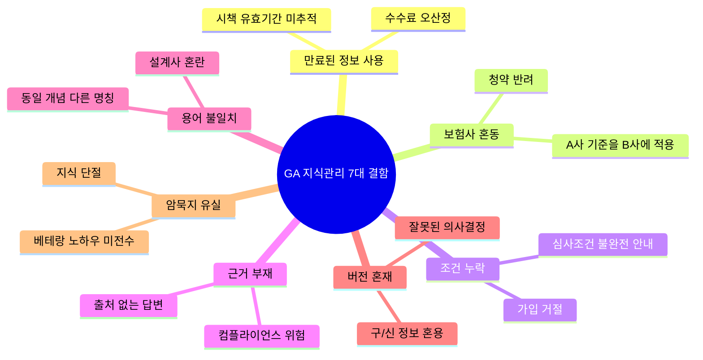

각 결함에 대응하는 시스템 메커니즘:

| 결함 | 대응 메커니즘 |
|------|-------------|
| 만료된 정보 사용 | 신선도 엔진: HOT 30일, 자동 STALE 전환 |
| 보험사 혼동 | 3-Axis 분류: carrier 축으로 격리 |
| 조건 누락 | 관계 전파: 문서 선택 시 연관 문서 자동 노출 |
| 근거 부재 | 모든 문서에 ID + 출처(source) 메타데이터 |
| 용어 불일치 | 동의어 시소러스: 60+ 키워드 매핑 |
| 버전 혼재 | SSOT + SUPERSEDES 관계 |
| 암묵지 유실 | ExpertKnowledge 문서유형: 베스트프랙티스, 전문가팁, 케이스스터디 |

---

## 2. 전체 아키텍처 조감도

### 2.1 시스템 계층 구조

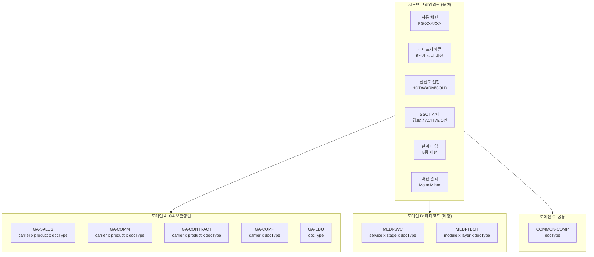

### 2.2 Phase별 기술 진화

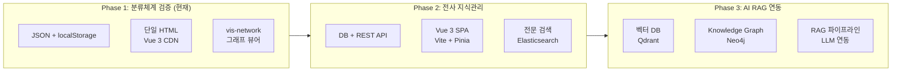

---

## 3. 시스템 프레임워크 (불변 계층)

시스템 프레임워크는 **모든 도메인이 반드시 따라야 하는 규칙**이다. GA든 메디코드든, 신규 사업이든 동일하게 적용된다.

### 3.1 프레임워크가 강제하는 6가지

| # | 규칙 | 강제 사항 | 비유 |
|---|------|----------|------|
| 1 | **자동 채번** | 모든 문서에 위치 무관 고유 ID (PG-XXXXXX) | 주민등록번호: 이사가도 바뀌지 않음 |
| 2 | **라이프사이클** | 6단계 상태 머신, 허용된 전이만 가능 | 출생신고 -> 학교 -> 직장 -> 퇴직 -> 은퇴 |
| 3 | **신선도** | HOT(30일)/WARM(90일)/COLD(365일) 자동 판정 | 식품 유통기한 스티커 |
| 4 | **SSOT** | 동일 분류 경로에 ACTIVE 문서 1건만 | 도서관 서가에 같은 책은 1권만 |
| 5 | **관계 타입** | 5종으로 제한 (PARENT_OF, CHILD_OF, SIBLING, REFERENCE, SUPERSEDES) | 가족관계: 부모, 자식, 형제, 지인, 후임 |
| 6 | **버전** | Major.Minor 규칙, SUPERSEDES 시 자동 Major 증가 | 소프트웨어 버전: v1.0 -> v1.1 -> v2.0 |

### 3.2 프레임워크가 강제하지 않는 것

| 영역 | 설명 | 결정 주체 |
|------|------|----------|
| 분류축(facets) 구성 | 도메인마다 몇 개의 축으로 분류할지 | 도메인 전문가 |
| 분류값 | 보험사 목록, 상품 목록 등 | 도메인 전문가 |
| 문서 본문 형식 | Markdown, PDF 등 | 도메인 전문가 |
| 내부 관계 구조 | 어떤 문서유형이 어떤 문서유형의 부모인지 | 도메인 전문가 |
| 신선도 세부 오버라이드 | 특정 문서유형의 유통기한 단축/연장 | 도메인 전문가 |

### 3.3 시스템 설정 코드 (`taxonomy.py`)

```python
SYSTEM_CONFIG = {
    "lifecycle_states": [
        "DRAFT", "REVIEW", "ACTIVE", "STALE", "DEPRECATED", "ARCHIVED"
    ],
    "lifecycle_transitions": {
        "DRAFT":      ["REVIEW"],
        "REVIEW":     ["ACTIVE", "REJECTED"],
        "REJECTED":   ["DRAFT"],
        "ACTIVE":     ["STALE", "DEPRECATED"],
        "STALE":      ["ACTIVE", "DEPRECATED"],
        "DEPRECATED": ["ARCHIVED"],
        "ARCHIVED":   [],
    },
    "freshness_defaults": {"HOT": 30, "WARM": 90, "COLD": 365},
    "freshness_thresholds": {"FRESH": 0.7, "WARNING": 1.0},
    "relationship_types": {
        "PARENT_OF":  {"inverse": "CHILD_OF",      "scope": "same_domain",  "bidirectional": True},
        "CHILD_OF":   {"inverse": "PARENT_OF",     "scope": "same_domain",  "bidirectional": True},
        "SIBLING":    {"inverse": "SIBLING",        "scope": "same_domain",  "bidirectional": True},
        "REFERENCE":  {"inverse": None,             "scope": "cross_domain", "bidirectional": False},
        "SUPERSEDES": {"inverse": "SUPERSEDED_BY",  "scope": "cross_domain", "bidirectional": False},
    },
    "version_scheme": "MAJOR.MINOR",
}
```

---

## 4. 도메인 설정 (가변 계층)

### 4.1 도메인 코드 체계

도메인 코드는 `{BIZ}-{FUNC}` 형식으로, 사업(Business)과 기능(Function)을 조합한다.

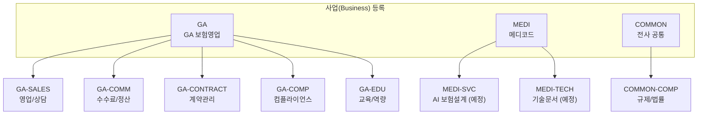

### 4.2 GA 도메인 상세 정의

각 도메인은 독립적으로 **facets(분류축)**, **ssotKey(유니크 경로)**, **freshnessOverrides(신선도 예외)**를 정의한다.

| 도메인 | facets (분류축) | ssotKey | freshnessOverrides | 문서유형 수 |
|--------|----------------|---------|-------------------|------------|
| **GA-SALES** | carrier x product x docType | [carrier, product, docType] | DOC-INCENTIVE: 14일 | 22종 |
| **GA-COMM** | carrier x product x docType | [carrier, product, docType] | DOC-COMMISSION: 30일 | 6종 |
| **GA-CONTRACT** | carrier x product x docType | [carrier, product, docType] | - | 3종 |
| **GA-COMP** | carrier x docType | [carrier, docType] | - | 3종 |
| **GA-EDU** | docType | [docType] | - | 4종 |
| **COMMON-COMP** | docType | [docType] | DOC-REGULATION: 365일 | 3종 |

### 4.3 도메인별 분류축 비교

핵심 차이: **도메인마다 필요한 분류 깊이가 다르다.**

```
GA-SALES (3축):
  삼성생명 > 종신보험 > 상품설명서    <- 보험사 x 상품 x 문서유형

GA-COMP (2축):
  삼성생명 > 컴플라이언스가이드       <- 보험사 x 문서유형 (상품 무관)

GA-EDU (1축):
  교육자료                           <- 문서유형만 (보험사/상품 무관)
```

이것이 의미하는 것은, 컴플라이언스 가이드는 "삼성생명의 컴플라이언스 가이드"이지 "삼성생명 종신보험의 컴플라이언스 가이드"가 아니라는 도메인 전문가의 판단이 반영된 것이다.

### 4.4 새 도메인 추가 절차

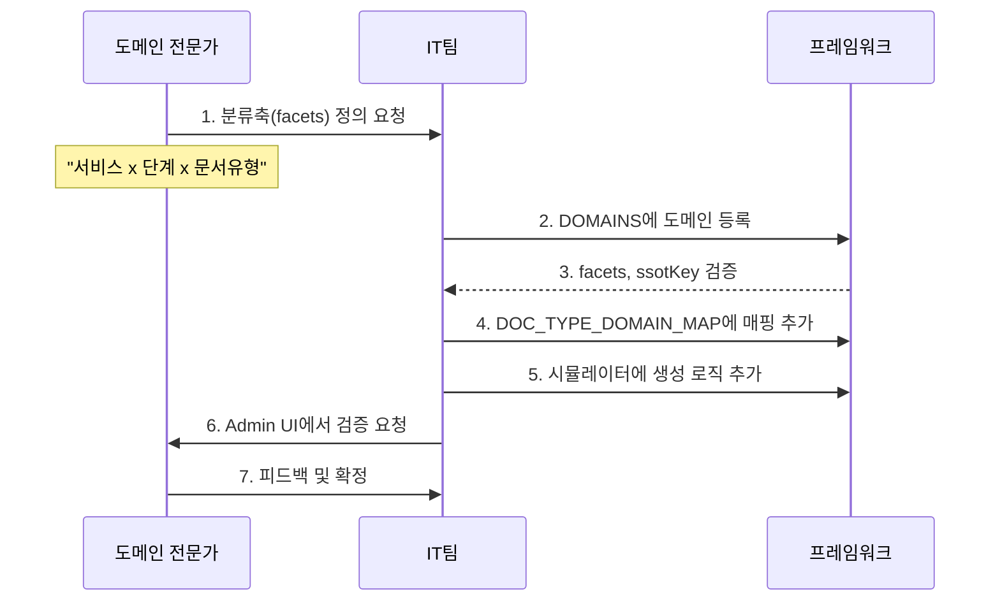

스트레스 테스트(test_01)에서 메디코드 도메인 5개(MEDI-SALES, MEDI-CONTRACT, MEDI-COMP, MEDI-EDU, MEDI-TECH)를 동적으로 등록하여 이 절차가 정상 동작함을 검증했다.

---

## 5. 3-Axis Taxonomy: GA 도메인 분류체계

GA 도메인은 3개의 축(Axis)으로 문서를 분류한다. 이 3축의 교차점이 문서의 고유 위치(주소)가 된다.

### 5.1 3축 구조 다이어그램

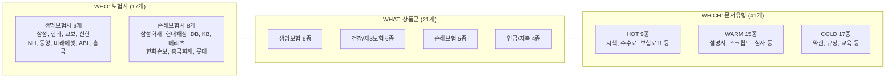

### 5.2 WHO: 보험사 (17개)

| 구분 | 코드 | 이름 | 별칭 | 등급 |
|------|------|------|------|------|
| **생명 대형** | INS-SAMSUNG | 삼성생명 | 삼성, SL | major |
| | INS-HANWHA | 한화생명 | 한화, HL | major |
| | INS-KYOBO | 교보생명 | 교보, KL | major |
| | INS-SHINHAN | 신한라이프 | 신한, SHL | major |
| **생명 중형** | INS-NH | NH농협생명 | 농협, NHL | mid |
| | INS-DONGYANG | 동양생명 | 동양, DYL | mid |
| | INS-MIRAE | 미래에셋생명 | 미래에셋 | mid |
| | INS-ABL | ABL생명 | ABL | mid |
| | INS-HEUNGKUK | 흥국생명 | 흥국 | mid |
| **손해 대형** | INS-SAMSUNGF | 삼성화재 | 삼성화재해상, SF | major |
| | INS-HYUNDAI | 현대해상 | 현대, HM | major |
| | INS-DB | DB손해보험 | DB손보, DB | major |
| | INS-KB | KB손해보험 | KB손보, KB | major |
| | INS-MERITZ | 메리츠화재 | 메리츠, MZ | major |
| **손해 중형** | INS-HANWHA-D | 한화손해보험 | 한화손보, HWD | mid |
| | INS-HEUNGKUK-D | 흥국화재 | 흥국화재 | mid |
| | INS-LOTTE | 롯데손해보험 | 롯데손보 | mid |

### 5.3 WHAT: 상품군 (21개 기본 + 5개 버전 상품)

| 카테고리 | 코드 | 이름 | 특이사항 |
|----------|------|------|---------|
| **생명보험** | PRD-LIFE-WHOLE | 종신보험 | - |
| | PRD-LIFE-TERM | 정기보험 | - |
| | PRD-LIFE-VARIABLE | 변액보험 | 변액자격 필수 |
| | PRD-LIFE-UNIVERSAL | 유니버셜보험 | - |
| | PRD-CHILD | 어린이보험 | - |
| | PRD-LIFE-EDU | 교육보험 | - |
| **건강/제3보험** | PRD-HEALTH-CI | CI보험 | - |
| | PRD-HEALTH-CANCER | 암보험 | 면책기간 90일 |
| | PRD-HEALTH-MEDICAL | 실손의료보험 | 현재 4세대 |
| | PRD-HEALTH-LTC | 간병보험 | - |
| | PRD-HEALTH-DENTAL | 치아보험 | - |
| | PRD-HEALTH-SIMPLE | 간편심사보험 | 간편고지 UW |
| **손해보험** | PRD-NONLIFE-AUTO | 자동차보험 | 의무보험 |
| | PRD-NONLIFE-FIRE | 화재보험 | - |
| | PRD-NONLIFE-LIAB | 배상책임보험 | - |
| | PRD-NONLIFE-MARINE | 해상보험 | - |
| | PRD-NONLIFE-TRAVEL | 여행자보험 | - |
| **연금/저축** | PRD-ANNUITY-TAX | 세제적격연금 | 세제혜택 |
| | PRD-ANNUITY-GEN | 일반연금 | - |
| | PRD-ANNUITY-VAR | 변액연금 | 변액자격 필수 |
| | PRD-SAVING | 저축보험 | - |

**버전/개편 상품** (별도 엔티티로 관리, SUPERSEDES 관계 설정):

| 코드 | 이름 | 대체 대상 |
|------|------|----------|
| PRD-LIFE-WHOLE-R2602 | 종신보험 리뉴얼(2026-02) | PRD-LIFE-WHOLE |
| PRD-CHILD-R2602 | 어린이보험 리뉴얼(2026-02) | PRD-CHILD |
| PRD-HEALTH-CANCER-V2 | 암보험 2세대 | PRD-HEALTH-CANCER |
| PRD-HEALTH-CI-PLUS | CI보험 플러스 | PRD-HEALTH-CI |
| PRD-HEALTH-MEDICAL-5G | 실손의료보험 5세대 | PRD-HEALTH-MEDICAL |

### 5.4 WHICH: 문서유형 (41종)

티어별 분류:

**HOT (9종) -- 30일 유통기한, 수시 변경:**

| 코드 | 이름 | 발행주체 | 도메인 |
|------|------|---------|--------|
| DOC-RATE-TABLE | 보험료표 | 보험사 | GA-SALES |
| DOC-INCENTIVE | 시책 | 보험사 | GA-COMM |
| DOC-COMMISSION | 수수료체계 | 보험사 | GA-COMM |
| DOC-COMMISSION-CALC | 수수료계산기준 | 보험사 | GA-COMM |
| DOC-PROPOSAL | 가입설계서 | 설계사 | GA-SALES |
| DOC-INTERNAL-MEMO | 내부공지 | GA | GA-SALES |
| DOC-NOTICE | 공문 | 보험사 | GA-SALES |
| DOC-SETTLEMENT | 정산자료 | GA | GA-COMM |
| DOC-PERFORMANCE | 실적보고서 | GA | GA-COMM |

**WARM (15종) -- 90일 유통기한, 분기 변경:**

| 코드 | 이름 | 발행주체 | 도메인 |
|------|------|---------|--------|
| DOC-GUIDE | 상품설명서 | 보험사 | GA-SALES |
| DOC-SCRIPT | 판매스크립트 | GA | GA-SALES |
| DOC-COMPARISON | 상품비교표 | GA | GA-SALES |
| DOC-BROCHURE | 브로슈어 | 보험사 | GA-SALES |
| DOC-PRODUCT-SUMMARY | 상품요약서 | 보험사 | GA-SALES |
| DOC-UW-GUIDE | 심사가이드라인 | 보험사 | GA-SALES |
| DOC-COMPLIANCE-GUIDE | 컴플라이언스가이드 | GA | GA-COMP |
| DOC-PROCESS | 업무프로세스 | GA | GA-COMP |
| DOC-CUSTOMER-CARD | 고객관리카드 | 설계사 | GA-SALES |
| DOC-NEEDS-ANALYSIS | 니즈분석표 | 설계사 | GA-SALES |
| DOC-CHARGEBACK | 환수기준 | GA | GA-COMM |
| DOC-BEST-PRACTICE | 베스트프랙티스 | 전문가 | GA-SALES |
| DOC-EXPERT-TIP | 전문가팁 | 전문가 | GA-SALES |
| DOC-CASE-STUDY | 케이스스터디 | 전문가 | GA-SALES |
| DOC-FAQ | 자주묻는질문 | GA | GA-SALES |

**COLD (17종) -- 365일 유통기한, 연간 변경:**

| 코드 | 이름 | 발행주체 | 도메인 |
|------|------|---------|--------|
| DOC-TERMS | 보통약관 | 보험사 | GA-SALES |
| DOC-TERMS-SPECIAL | 특별약관 | 보험사 | GA-SALES |
| DOC-UW-RULE | 심사기준 | 보험사 | GA-SALES |
| DOC-UW-DISEASE | 질병별심사기준 | 보험사 | GA-SALES |
| DOC-UW-JOB | 직업별심사기준 | 보험사 | GA-SALES |
| DOC-EXCLUSION | 면책조항 | 보험사 | GA-SALES |
| DOC-APPLICATION | 청약서 | 보험사 | GA-CONTRACT |
| DOC-DISCLOSURE | 고지사항 | 보험사 | GA-CONTRACT |
| DOC-CONFIRMATION | 확인서 | 설계사 | GA-CONTRACT |
| DOC-LAW-INSURANCE | 보험업법 | 금감원 | COMMON-COMP |
| DOC-LAW-CONSUMER | 금융소비자보호법 | 금감원 | COMMON-COMP |
| DOC-REGULATION | 감독규정 | 금감원 | COMMON-COMP |
| DOC-TRAINING | 교육자료 | GA | GA-EDU |
| DOC-ONBOARDING | 신입교육 | GA | GA-EDU |
| DOC-COMPLIANCE | 컴플라이언스교육 | GA | GA-EDU |
| DOC-CERTIFICATION | 자격증교육 | GA | GA-EDU |
| DOC-SYSTEM-MANUAL | 시스템매뉴얼 | GA | GA-COMP |

---

## 6. 노션 페이지 모델: 모든 것은 페이지

### 6.1 핵심 개념

이 시스템의 데이터 모델은 **노션(Notion)**의 "모든 것은 페이지" 철학을 차용한다.

- **카테고리도 페이지**, 문서도 페이지, 구조 노드도 페이지
- 페이지가 하위 페이지를 포함하면 PARENT_OF / CHILD_OF 관계
- 페이지가 다른 페이지를 참조하면 REFERENCE 관계
- 임의 깊이의 계층 구조를 지원

### 6.2 구조 노드와 자동 분류

**구조 노드(Structure Node)**는 `facet_type`과 `facet_value`를 가진 특별한 페이지다. 하위 문서는 부모 체인을 올라가며 classification을 자동 유도한다.

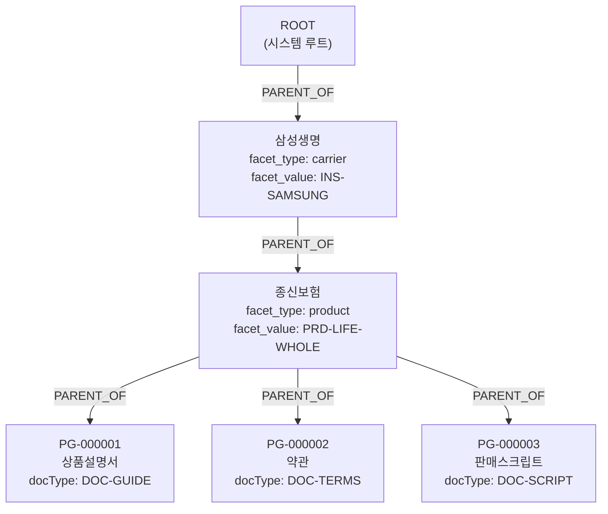

PG-000001의 classification은 부모 체인에서 자동 유도된다:

```
derive_classification(PG-000001):
  1. 부모 체인: PG-000001 -> 종신보험(product) -> 삼성생명(carrier)
  2. 구조 노드에서 facet 수집:
     - carrier: INS-SAMSUNG (삼성생명 노드에서)
     - product: PRD-LIFE-WHOLE (종신보험 노드에서)
  3. 문서 자체 docType: DOC-GUIDE
  4. 최종 classification:
     { carrier: "INS-SAMSUNG", product: "PRD-LIFE-WHOLE", docType: "DOC-GUIDE" }
```

### 6.3 이동(Move) 시 재분류

페이지를 다른 부모 아래로 이동하면:

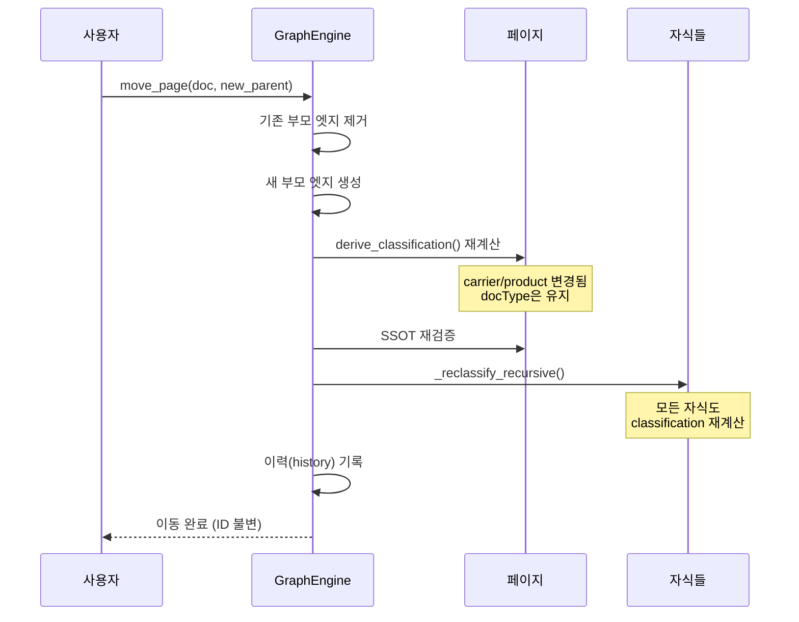

이동 시 보장되는 사항:

| 항목 | 보장 |
|------|------|
| **ID** | 불변 -- 모든 참조(REFERENCE) 유지 |
| **docType** | 유지 -- 문서 고유 속성 |
| **carrier/product** | 자동 재계산 -- 새 위치에서 유도 |
| **자식 페이지** | 재귀적 재분류 |
| **SIBLINGS** | 도메인 변경 시 자동 해제 (같은 도메인만 허용) |
| **버전(minor)** | 자동 증가 |
| **이력** | old/new 도메인, classification, 영향받은 ID 기록 |

---

## 7. 라이프사이클 상태 머신

### 7.1 상태 전이도

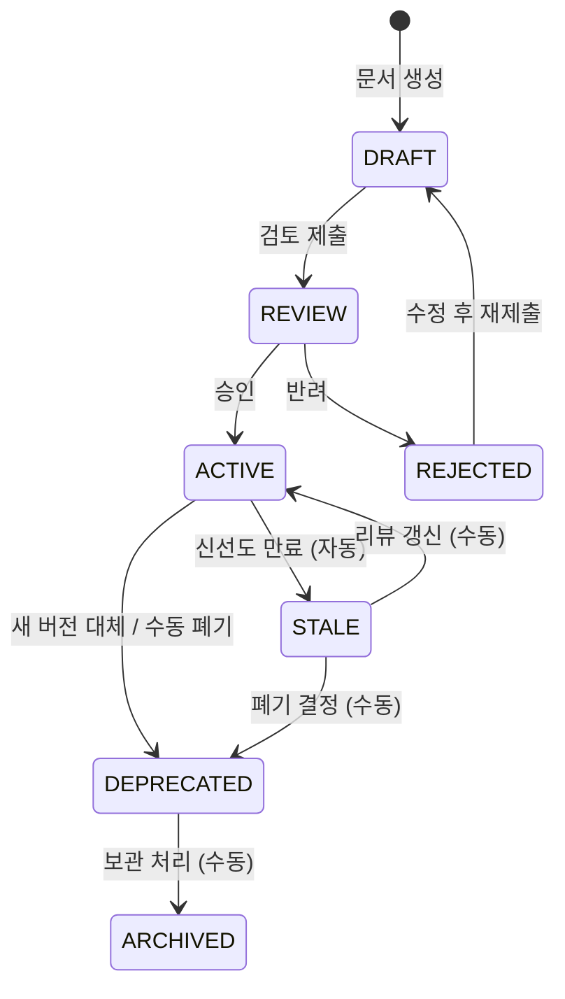

### 7.2 상태별 의미와 가시성

| 상태 | 색상 | 누가 보는가 | 검색 노출 | 전환 방법 |
|------|------|-----------|----------|----------|
| **DRAFT** | 회색 | 작성자만 | X | 작성자가 REVIEW 제출 |
| **REVIEW** | 파란색 | 검토자 | X | 검토자가 승인/반려 |
| **ACTIVE** | 초록색 | 전체 직원 | O | 신선도 만료 시 자동 STALE |
| **STALE** | 주황색 | 관리자 | 경고 표시 | 리뷰 갱신 -> ACTIVE / 폐기 -> DEPRECATED |
| **DEPRECATED** | 빨간색 | 관리자 | X | 보관 -> ARCHIVED |
| **ARCHIVED** | 검정색 | (비공개) | X | 종료 상태 |

### 7.3 라이프사이클 분배 (시뮬레이션 기준)

시뮬레이터(`simulator.py`)는 실제 GA 환경을 반영한 비율로 문서를 생성한다:

```
ACTIVE:      80%  -- 대부분의 문서는 사용 중
STALE:       10%  -- 갱신이 필요한 문서
DRAFT:        5%  -- 작성 중인 문서
DEPRECATED:   5%  -- 대체된 문서
```

### 7.4 상태 전이 검증

`stress_test.py`의 test_04에서 검증하는 항목:

- ACTIVE에서 직접 ARCHIVED 시도 -> **거부** (DEPRECATED를 거쳐야 함)
- CASCADE DEPRECATE: 부모 폐기 시 자식도 함께 DEPRECATED
- SUPERSEDE: 신규 ACTIVE 전환 시 기존 문서 자동 DEPRECATED

---

## 8. 신선도 엔진

### 8.1 판정 공식

```
경과일 = 현재일 - max(updatedAt, reviewedAt)

maxAgeDays = 해당 문서유형의 티어별 기본값
             (도메인 freshnessOverrides로 오버라이드 가능)

FRESH:    경과일 < maxAgeDays x 0.7    (녹색)
WARNING:  경과일 < maxAgeDays x 1.0    (노란색)
EXPIRED:  경과일 >= maxAgeDays          (빨간색) --> 자동 STALE 전환
```

### 8.2 티어별 신선도 타임라인

```mermaid
gantt
    title 문서 신선도 타임라인 (경과일 기준)
    dateFormat X
    axisFormat %s일

    section HOT (30일)
    FRESH (0~21일)     :done, hot_fresh, 0, 21
    WARNING (21~30일)  :active, hot_warn, 21, 30
    EXPIRED (30일~)    :crit, hot_exp, 30, 40

    section WARM (90일)
    FRESH (0~63일)     :done, warm_fresh, 0, 63
    WARNING (63~90일)  :active, warm_warn, 63, 90
    EXPIRED (90일~)    :crit, warm_exp, 90, 100

    section COLD (365일)
    FRESH (0~255일)    :done, cold_fresh, 0, 255
    WARNING (255~365일):active, cold_warn, 255, 365
    EXPIRED (365일~)   :crit, cold_exp, 365, 400
```

### 8.3 도메인별 오버라이드 예시

| 도메인 | 문서유형 | 기본 maxAge | 오버라이드 | 이유 |
|--------|---------|------------|-----------|------|
| GA-SALES | DOC-INCENTIVE | 30일 (HOT) | **14일** | 시책은 2주 단위로 변경되는 경우가 많음 |
| GA-COMM | DOC-COMMISSION | 30일 (HOT) | 30일 (유지) | 수수료 체계는 월 단위 변경 |
| GA-COMM | DOC-COMMISSION-CALC | 30일 (HOT) | 30일 (유지) | 수수료 계산 기준 |
| COMMON-COMP | DOC-REGULATION | 365일 (COLD) | 365일 (유지) | 감독규정은 연단위 개정 |

### 8.4 캐시 정책과 검색 우선순위

| 티어 | 갱신 주기 | 캐시 TTL | 검색 우선순위 | 대상 벡터 인덱스 (Phase 3) |
|------|----------|---------|-------------|--------------------------|
| **HOT** | 매일 | 60분 | 1 (최우선) | idx_hot_daily |
| **WARM** | 주간 | 1일 | 2 | idx_warm_weekly |
| **COLD** | 분기 | 7일 | 3 | idx_cold_archive |

---

## 9. SSOT: 하나의 진실 원칙

### 9.1 SSOT 유니크 키 구성

```
유니크 키 = 도메인 + ssotKey로 구성된 분류 경로 내 ACTIVE 문서 1건
```

### 9.2 SSOT 강제 메커니즘

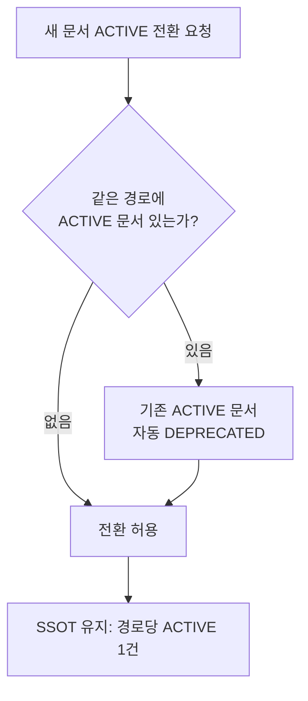

### 9.3 도메인별 SSOT 경로 비교

| 도메인 | ssotKey | SSOT 경로 예시 | 의미 |
|--------|---------|---------------|------|
| GA-SALES | [carrier, product, docType] | 삼성생명 x 종신보험 x 상품설명서 | 같은 보험사, 같은 상품, 같은 문서유형은 1건 |
| GA-COMP | [carrier, docType] | 삼성생명 x 컴플라이언스가이드 | 상품과 무관하게 보험사당 1건 |
| GA-EDU | [docType] | 교육자료 | 전사 통합 1건 |

### 9.4 유효/위반 예시

```
[유효 -- 모두 유니크]
GA-SALES: KB손해보험 > 든든 어린이보험 > 상품요약본 (ACTIVE)
GA-SALES: KB손해보험 > 든든 어린이보험 > 판매스크립트 (ACTIVE)  <- 문서유형 다름
GA-SALES: KB손해보험 > 든든 어린이보험 리뉴얼 > 상품요약본 (ACTIVE)  <- 상품 다름

[SSOT 위반]
GA-SALES: KB손해보험 > 든든 어린이보험 > 상품요약본 (ACTIVE)  <- 이미 존재!
--> 새 문서를 ACTIVE로 전환하면 기존 문서 자동 DEPRECATED
```

---

## 10. 관계 모델

### 10.1 5종 관계 타입

| 관계 | 방향 | 범위 | 역관계 | 설명 |
|------|------|------|--------|------|
| **PARENT_OF** | 양방향 | 같은 도메인 | CHILD_OF | 부모-자식 계층 |
| **CHILD_OF** | 양방향 | 같은 도메인 | PARENT_OF | 자식-부모 역관계 |
| **SIBLING** | 양방향 | 같은 도메인 | SIBLING | 동급 형제 |
| **REFERENCE** | 단방향 | 크로스 도메인 가능 | (없음) | 참조 링크 |
| **SUPERSEDES** | 단방향 | 크로스 도메인 가능 | SUPERSEDED_BY | 버전 대체 |

### 10.2 GA 도메인 기본 관계 규칙

문서유형 간의 표준 관계가 `DEFAULT_RELATIONS`(`taxonomy.py`)로 정의되어 있다. 시뮬레이터가 문서를 생성할 때 이 규칙에 따라 자동으로 관계를 설정한다.

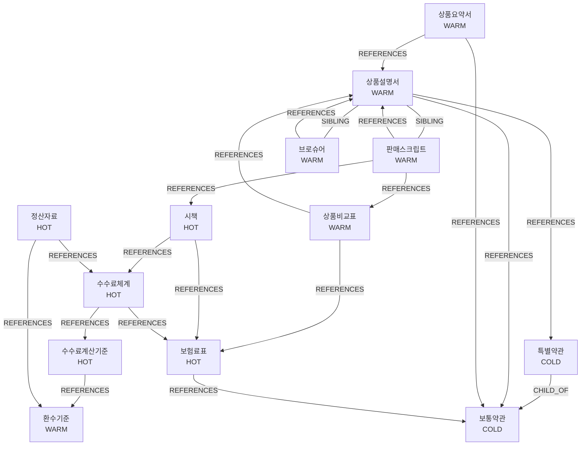

### 10.3 전파 체인 예시: 시책 -> 수수료 -> 정산

이것이 실무에서 의미하는 것: **시책 문서를 열면, 관련 수수료체계와 정산자료까지 자동으로 따라온다.**

```
[시책] --REFERENCES--> [수수료체계] --REFERENCES--> [수수료계산기준]
   |                       |                            |
   +--REFERENCES--> [보험료표]  +--REFERENCES--> [정산자료]  +--REFERENCES--> [환수기준]
```

이 전파 체인은 스트레스 테스트 test_06("전파/역전파 테스트")에서 정상 동작이 확인되었다.

### 10.4 이동 시 관계 영향 분석

```
문서 이동: GA-SALES -> GA-EDU (크로스 도메인)

자동 처리:
  - classification 재계산 (service/stage 제거, category 유도)
  - SIBLINGS 관계 자동 해제 (같은 도메인만 허용)
  - 자식 페이지 재귀적 재분류

보존:
  - REFERENCE (단방향, 크로스 도메인 허용, ID 불변)
  - SUPERSEDES (버전 이력)

이력 기록:
  - old_domain, new_domain
  - old_classification, new_classification
  - severed_siblings (해제된 형제 목록)
  - affected (영향받은 자식 ID 목록)
```

---

## 11. 온톨로지 확장

### 11.1 클래스 계층 (Class Hierarchy)

분류체계(Taxonomy) 위에 **온톨로지 계층**을 쌓아, 의미적 관계를 표현한다. 예를 들어 "삼성생명은 대형 생명보험사다"라는 관계를 명시한다.

```mermaid
graph TB
    Thing["ga:Thing"]
    Entity["ga:Entity"]
    Product["ga:Product"]
    DocType["ga:DocumentType"]
    Process["ga:BusinessProcess"]
    Concept["ga:Concept"]
    Regulation["ga:Regulation"]

    Thing --> Entity
    Thing --> Product
    Thing --> DocType
    Thing --> Process
    Thing --> Concept
    Thing --> Regulation

    Entity --> Carrier["ga:Carrier"]
    Entity --> Role["ga:Role"]

    Carrier --> LifeIns["ga:LifeInsurer"]
    Carrier --> NonLifeIns["ga:NonLifeInsurer"]
    LifeIns --> MajorLife["ga:MajorLifeInsurer<br/>(삼성, 한화, 교보, 신한)"]
    LifeIns --> MidLife["ga:MidLifeInsurer<br/>(NH, 동양, 미래에셋, ABL, 흥국)"]
    NonLifeIns --> MajorNL["ga:MajorNonLifeInsurer<br/>(삼성화재, 현대, DB, KB, 메리츠)"]
    NonLifeIns --> MidNL["ga:MidNonLifeInsurer<br/>(한화손보, 흥국화재, 롯데)"]

    Product --> LifePrd["ga:LifeProduct"]
    Product --> HealthPrd["ga:HealthProduct"]
    Product --> NonLifePrd["ga:NonLifeProduct"]
    Product --> AnnuityPrd["ga:AnnuityProduct"]

    DocType --> InsurerDoc["ga:InsurerDocument"]
    DocType --> GADoc["ga:GADocument"]
    DocType --> TrainingDoc["ga:TrainingDocument"]
    DocType --> ExpertDoc["ga:ExpertKnowledge"]

    InsurerDoc --> ProductDoc["ga:ProductDocument"]
    InsurerDoc --> SalesDoc["ga:SalesDocument"]
    InsurerDoc --> UWDoc["ga:UWDocument"]
    InsurerDoc --> ContractDoc["ga:ContractDocument"]

    Concept --> Premium["ga:PremiumConcept"]
    Concept --> CommissionC["ga:CommissionConcept"]
    Concept --> ContractC["ga:ContractConcept"]
    Concept --> UWConcept["ga:UWConcept"]
    Concept --> ComplianceC["ga:ComplianceConcept"]
```

### 11.2 동의어 시소러스 (60+ 항목)

검색 시 다양한 표현을 하나의 문서유형으로 매핑한다. `ontology.py`의 `SYNONYM_MAP`에 정의.

| 키워드 | 매핑 대상 |
|--------|----------|
| "약관", "보통약관" | DOC-TERMS |
| "특약", "특별약관" | DOC-TERMS-SPECIAL |
| "화법", "스크립트" | DOC-SCRIPT |
| "심사", "언더라이팅" | DOC-UW-GUIDE, DOC-UW-RULE |
| "수수료", "커미션" | DOC-COMMISSION, DOC-COMMISSION-CALC, DOC-SETTLEMENT |
| "1200%", "1200%룰" | DOC-COMMISSION-CALC, DOC-REGULATION |
| "금소법", "금융소비자보호법" | DOC-LAW-CONSUMER |
| "시책", "인센티브" | DOC-INCENTIVE |
| "당뇨", "고혈압" | DOC-UW-DISEASE |
| "온보딩", "신입" | DOC-ONBOARDING |

### 11.3 개념 노드 (25개)

보험 도메인의 핵심 개념을 노드로 정의하여, 문서와 개념 간의 EXPLAINS 관계를 표현한다.

| 개념 그룹 | 개념 노드 | 관련 문서 |
|----------|----------|----------|
| **보험료 구조** | 영업보험료, 순보험료, 위험보험료, 저축보험료, 부가보험료 | DOC-RATE-TABLE, DOC-GUIDE |
| **수수료 관련** | FYC, 유지수수료, 오버라이드, 유지관리수수료, 환산보험료(APE) | DOC-COMMISSION, DOC-SETTLEMENT |
| **규제 관련** | 1200%룰, 분급제 | DOC-COMMISSION-CALC, DOC-REGULATION |
| **계약 관련** | 실효, 부활, 해약환급금, 청약철회, 유지율 | DOC-TERMS, DOC-APPLICATION |
| **심사 관련** | 고지의무, 표준체, 부표준체, 면책기간, 간편심사 | DOC-UW-GUIDE, DOC-DISCLOSURE |
| **컴플라이언스** | 불완전판매, 승환계약, 해피콜 | DOC-COMPLIANCE-GUIDE |

### 11.4 온톨로지 관계 타입 확장

문서 간 관계(5종) 외에, 온톨로지에서는 추가 관계 타입을 정의한다:

| 관계 | 도메인 | 레인지 | 설명 |
|------|--------|--------|------|
| ISSUED_BY | DocumentType | Carrier | 보험사가 발행한 문서 |
| APPLIES_TO | DocumentType | Product | 문서가 적용되는 상품 |
| TARGETS_AUDIENCE | DocumentType | Role | 문서의 대상 역할 |
| USED_IN | DocumentType | BusinessProcess | 업무프로세스에서 사용 (813개 엣지) |
| OFFERS | Carrier | Product | 보험사가 판매하는 상품 |
| PRECEDES / FOLLOWS | BusinessProcess | BusinessProcess | 프로세스 순서 (7개 엣지) |
| GOVERNS | Regulation | BusinessProcess | 규제가 적용되는 프로세스 |
| RESTRICTS | Regulation | DocumentType | 규제가 제한하는 문서유형 |
| BROADER / NARROWER | Concept | Concept | 개념의 상위/하위 관계 |
| EXPLAINS | Concept | DocumentType | 개념을 설명하는 문서 |

### 11.5 온톨로지 통계

`ontology.py`의 `get_ontology_stats()` 결과:

| 항목 | 수치 |
|------|------|
| 전체 클래스 | 150+ |
| 보험사 매핑 | 18개 |
| 상품 매핑 | 22개 |
| 문서유형 매핑 | 41개 |
| 프로세스 매핑 | 12개 |
| 동의어 항목 | 60+ |
| 개념 노드 | 25개 |
| 관계 타입 | 15개 |

---

## 12. 검증 결과

### 12.1 온톨로지 구조 검증 (6/6 통과)

`ontology_validator.py` 실행 결과:

| # | 검증 항목 | 결과 | 상세 |
|---|----------|------|------|
| 1 | 노드 @type 커버리지 | PASS (100%) | 840/840 노드에 @type 존재 |
| 2 | 문서 필수 속성 완전성 | PASS (100%) | 767/767 문서에 필수 속성 존재 |
| 3 | 프로세스 순서 관계 | PASS (100%) | 7개 PRECEDES 엣지 |
| 4 | 규제 관계 존재 | PASS (100%) | 규제 5개, GOVERNS 2개, RESTRICTS 2개 |
| 5 | 개념 그래프 존재 | PASS (100%) | 개념 25개, 개념관계 42개 |
| 6 | 문서-프로세스 연결 | PASS (100%) | 813개 USED_IN 엣지 |

### 12.2 스트레스 테스트 (79/79 통과)

`stress_test.py` 실행 결과 -- GraphEngine 기반의 대규모 시뮬레이션:

| 항목 | 수치 |
|------|------|
| 총 노드 | 9,810개 |
| 총 엣지 | 19,893개 |
| 등록 도메인 | 6개 |
| 테스트 통과 | **79/79 (100%)** |

**10개 테스트 시나리오:**

| # | 시나리오 | 검증 항목 | 통과 |
|---|---------|----------|------|
| 1 | 도메인 등록 | facets/ssotKey 검증, 잘못된 도메인 거부 | 6/6 |
| 2 | 대량 계층 구조 | 30 x 20 x 15 = 9,000+ 페이지 생성 | 2/2 |
| 3 | 크로스 참조 | 도메인 내/간 500+ 참조 | 1/1 |
| 4 | CRUD 시뮬레이션 | 중복ID 거부, 필수facet 검증, SSOT 위반 거부, CASCADE DEPRECATE, SUPERSEDE, ARCHIVE | 12/12 |
| 5 | 무결성 검증 | 노드 유니크, 엣지 양끝 존재, 필수필드, lifecycle 유효, SSOT, classification 범위, PARENT/CHILD 쌍 | 7/7 |
| 6 | 전파/역전파 | 하향 전파 320개, 상향 전파 2개, 참조 체인 추적 | 5/5 |
| 7 | 범위 제한 검색 | 도메인 필터, classification 필터, lifecycle 필터, 복합 필터, 도메인 경계 격리 | 7/7 |
| 8 | AI 에이전트 뷰 | 계약/판매/컴플라이언스/통합 에이전트 격리, 에이전트 간 중복 0건 | 6/6 |
| 9 | 자동 채번 + 자동 분류 | PG-XXXXXX 형식, 시퀀스 단조 증가, 구조 노드 기반 자동 유도, 깊은 구조 | 12/12 |
| 10 | 페이지 이동 | 도메인 내 이동, 재귀적 재분류, 크로스 도메인 이동, SIBLINGS 자동 해제, 참조 안정성, 이력 기록 | 21/21 |

### 12.3 CLAUDE.md 4대 검증 시나리오 매핑

| 검증 시나리오 | 대응 테스트 | 상태 |
|-------------|-----------|------|
| **시나리오 1: 문서 전파** -- 시책 선택 시 연관 문서 조회 | test_06 (전파/역전파) | 통과 |
| **시나리오 2: 유니크 검증** -- 같은 경로에 문서 추가 시 중복 경고 | test_04 (SSOT 위반 거부), test_05 (SSOT 무결성) | 통과 |
| **시나리오 3: 상품 개편** -- 리뉴얼 상품 별개 등록, SUPERSEDES 관계 | test_04 (SUPERSEDE), 버전 상품 시뮬레이션 | 통과 |
| **시나리오 4: 자동 분류** -- 파일명에서 보험사/상품/문서유형 추출 | test_09 (자동 채번 + 자동 분류) | 통과 |

---

## 13. Phase 로드맵과 RAG 연동 전략

### 13.1 Phase 진행 현황

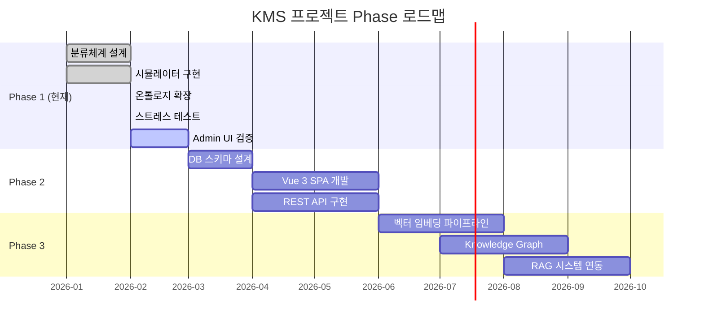

### 13.2 Phase 1에서 Phase 3까지 데이터 흐름

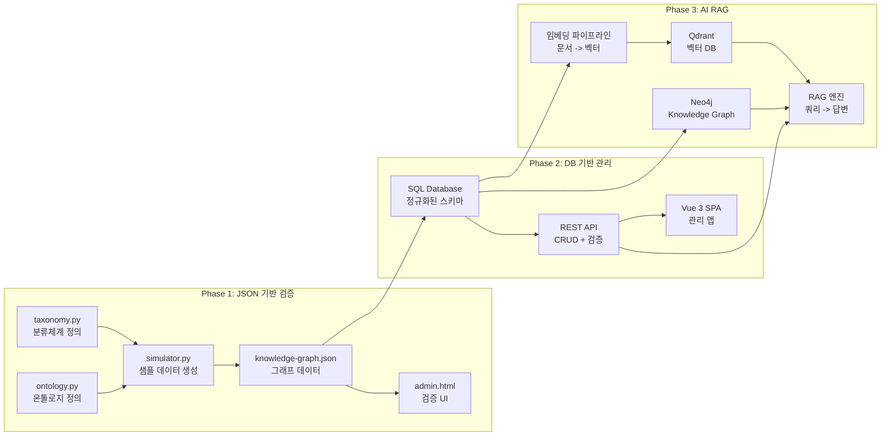

### 13.3 RAG 연동 시 메타데이터 활용 전략

Phase 1에서 구축한 메타데이터가 Phase 3 RAG에서 어떻게 활용되는지:

| Phase 1 메타데이터 | Phase 3 RAG에서의 역할 |
|-------------------|----------------------|
| **classification** (carrier, product, docType) | Self-Query 필터: "삼성생명 종신보험" -> carrier=INS-SAMSUNG |
| **lifecycle** | 검색 범위 제한: ACTIVE 문서만 노출 |
| **tier** (HOT/WARM/COLD) | 벡터 인덱스 분리 + 검색 우선순위 |
| **freshness** | 만료 문서 자동 제외, 경고 표시 |
| **relations** | Graph 탐색: 시책에서 수수료, 정산까지 참조 체인 추적 |
| **synonyms** | 쿼리 확장: "금소법" -> DOC-LAW-CONSUMER |
| **concepts** | 개념 기반 검색: "1200%룰" -> 관련 문서 + 개념 설명 |
| **domain** | 에이전트별 범위 제한: 판매 에이전트는 GA-SALES만 |

### 13.4 Hot-Warm-Cold 벡터 인덱스 전략

```
HOT  문서 -> idx_hot_daily       -> 매일 재인덱싱 -> Priority 1 (즉시~당일)
WARM 문서 -> idx_warm_weekly     -> 주간 재인덱싱 -> Priority 3 (주간 배치)
COLD 문서 -> idx_cold_archive    -> 분기 재인덱싱 -> Priority 7 (분기 배치)
수동 요청 -> (해당 인덱스)        -> 즉시          -> Priority 2 (우선 처리)
```

핵심: **변경 빈도가 다른 데이터를 같은 인덱스에 넣지 않는다.** HOT 문서의 잦은 재인덱싱이 COLD 문서의 안정적인 벡터 공간을 교란하지 않도록 한다.

### 13.5 AI 에이전트 범위 제한 (스트레스 테스트 검증 완료)

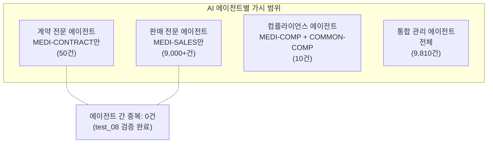

---

## 14. 부록: 데이터 모델 전체 명세

### 14.1 문서 데이터 모델 (v3)

```javascript
{
  // === 시스템 필드 (불변, 프레임워크가 강제) ===
  id: "PG-000001",                    // 위치 무관 자동 채번
  domain: "GA-SALES",                 // 소속 도메인
  lifecycle: "ACTIVE",                // 라이프사이클 상태
  version: { major: 1, minor: 0 },    // 버전 번호
  createdAt: "2026-02-01T09:00:00",   // 생성일
  updatedAt: "2026-02-05T14:30:00",   // 수정일
  reviewedAt: "2026-02-05T14:30:00",  // 검토일 (신선도 기준)

  // === 도메인 필드 (가변, 도메인이 정의) ===
  classification: {                   // facet 값 (도메인의 facets에 정의된 것만)
    carrier: "INS-SAMSUNG",           //   WHO: 보험사
    product: "PRD-LIFE-WHOLE",        //   WHAT: 상품
    docType: "DOC-GUIDE",             //   WHICH: 문서유형
  },
  meta: {                             // 선택적 메타데이터
    process: "BIZ-CONSULT",           //   업무프로세스
    audience: "AUD-AGENT",            //   대상 역할
  },

  // === 콘텐츠 ===
  name: "삼성생명 종신보험 상품설명서",
  content: "# 상품설명서\n\n...",       // Markdown 본문
  tier: "WARM",                        // HOT/WARM/COLD

  // === 관계 ===
  relations: {
    parent: null,
    children: ["PG-000010", "PG-000011"],
    siblings: ["PG-000020"],
    references: ["PG-000030", "PG-000031"],
    supersedes: null,
    supersededBy: null,
  }
}
```

### 14.2 자동 분류 규칙

파일 업로드 시 파일명에서 메타데이터를 추출하는 규칙:

```
파일명: "KB손해_든든어린이_상품요약_202602.pdf"

1. 보험사 매칭 (우선순위 1):
   "KB손해" -> CARRIERS에서 alias 검색 -> INS-KB (KB손해보험)

2. 상품 매칭 (우선순위 2):
   "든든어린이" -> PRODUCTS에서 alias 유사도 비교 -> PRD-CHILD (어린이보험)

3. 문서유형 매칭 (우선순위 3):
   "상품요약" -> 키워드 매핑: "요약" -> DOC-PRODUCT-SUMMARY (상품요약서)

4. 날짜/버전 추출 (우선순위 4):
   "202602" -> 정규식 -> 2026년 2월
```

### 14.3 그래프 엔진 핵심 연산

| 연산 | 설명 | 검증 |
|------|------|------|
| create_page | 페이지 생성 + facets/SSOT 검증 | test_02, test_04 |
| move_page | 이동 + 재귀적 재분류 + 관계 정리 | test_10 |
| derive_classification | 부모 체인에서 classification 유도 | test_09 |
| deprecate_page | DEPRECATED 전환 + cascade 옵션 | test_04 |
| supersede_page | 버전 대체 + 자동 DEPRECATED | test_04 |
| search | 도메인/classification/lifecycle/tier 필터 | test_07 |
| agent_view | 에이전트 유형별 가시 범위 제한 | test_08 |
| propagate_down/up | 하향/상향 전파 | test_06 |
| propagate_references | 참조 체인 추적 (다중 홉) | test_06 |

### 14.4 소스 파일 참조

| 파일 | 역할 | 경로 |
|------|------|------|
| taxonomy.py | 시스템 설정 + GA 도메인 마스터 데이터 | src/taxonomy.py |
| ontology.py | 클래스 계층, 동의어, 개념 노드 | src/ontology.py |
| simulator.py | 지식 그래프 + 샘플 문서 생성 | src/simulator.py |
| simulator_ontology.py | 온톨로지 그래프 생성 | src/simulator_ontology.py |
| stress_test.py | GraphEngine + 10개 시나리오 (79/79) | src/stress_test.py |
| verifier.py | 데이터 무결성 검증 | src/verifier.py |
| ontology_validator.py | 온톨로지 구조 검증 (6/6) | src/ontology_validator.py |
| doc_templates.py | 문서 내용 템플릿 | src/doc_templates.py |
| admin.html | 분류체계 검증 Admin 페이지 | ui/admin.html |
| viewer.html | 그래프 뷰어 | ui/viewer.html |

---

> **작성자:** iFA IT팀
> **최종 수정일:** 2026-02-07
> **버전:** 3.0
> **관련 문서:**
> - `docs/core/project-goal.md` -- 프로젝트 목표 및 단계별 계획
> - `docs/core/domain-knowledge.md` -- GA 산업 도메인 지식
> - `docs/architecture/architecture-guide.md` -- 전체 아키텍처
> - `docs/architecture/document-pipeline.md` -- 문서 파이프라인
> - `docs/framework-guide.md` -- 프레임워크 기획서 + 사용 매뉴얼 (비기술)
