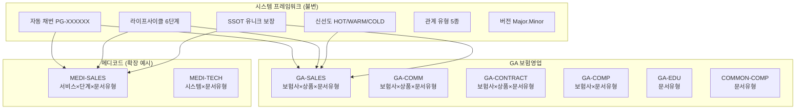
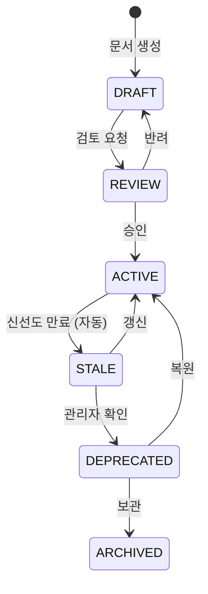
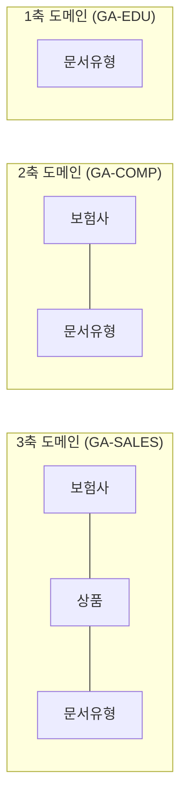
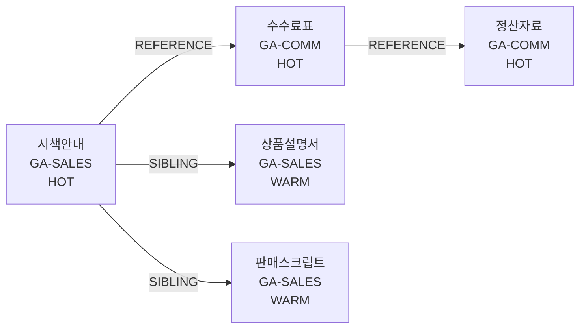

# KMS 지식체계 설계도 (Knowledge Architecture)

> 버전: 3.0 | 작성일: 2026-02-07 | Phase 1 검증 완료

## 목차
1. [설계 철학](#1-설계-철학)
2. [시스템 계층 구조](#2-시스템-계층-구조)
3. [시스템 프레임워크 (불변)](#3-시스템-프레임워크-불변)
4. [도메인 설정 (가변)](#4-도메인-설정-가변)
5. [분류체계 (Taxonomy)](#5-분류체계-taxonomy)
6. [노션 페이지 모델](#6-노션-페이지-모델)
7. [관계 시스템](#7-관계-시스템)
8. [검증 결과](#8-검증-결과)

---

## 1. 설계 철학

### 창고지기(Warehouse) vs 요리사(Chef) 모델

```
우리(KMS) = 창고지기          외부(AI) = 요리사
┌────────────────────┐     ┌────────────────────┐
│ 문서를 정확히 분류   │     │ 문서를 가져다 답변   │
│ 관계를 명확히 정의   │ ──► │ 맥락을 조합해 설명   │
│ 신선도를 자동 관리   │     │ 사용자 질문에 응답   │
│ SSOT를 강제 보장    │     │ 추천/비교 제공      │
└────────────────────┘     └────────────────────┘
    데이터 품질 책임            답변 품질 책임
```

**원칙: 우리가 데이터를 잘 정리하면, AI가 좋은 답을 낸다.**

### 시스템 vs 도메인 분리

```
┌─────────────────────────────────────────────────────────┐
│              SYSTEM FRAMEWORK (불변 규칙)                 │
│  채번 │ 라이프사이클 │ 신선도 │ 관계 │ SSOT │ 버전      │
├─────────────────────────────────────────────────────────┤
│  Domain A (GA영업)  │  Domain B (메디코드)  │  ...      │
│  carrier, product,  │  service, stage,      │           │
│  docType            │  docType              │           │
└─────────────────────────────────────────────────────────┘
```

- **시스템 프레임워크**: 어떤 도메인이든 반드시 따르는 규칙
- **도메인 설정**: 각 사업부가 자기 분류축을 자유롭게 정의

---

## 2. 시스템 계층 구조



---

## 3. 시스템 프레임워크 (불변)

### 3.1 자동 채번

| 항목 | 규칙 |
|------|------|
| 형식 | `PG-XXXXXX` (6자리 제로패딩) |
| 특징 | 위치 무관 — 이동해도 ID 불변 |
| 시퀀스 | 단조 증가, 재사용 없음 |

### 3.2 라이프사이클



| 상태 | 의미 | 검색 노출 |
|------|------|----------|
| DRAFT | 작성 중 | X |
| REVIEW | 검토 대기 | X |
| ACTIVE | 유효 문서 | O |
| STALE | 신선도 만료 | 경고 표시 |
| DEPRECATED | 폐기 예정 | X |
| ARCHIVED | 영구 보관 | X |

### 3.3 신선도 (Freshness)

```
경과일 = 현재 - max(updatedAt, reviewedAt)

┌─────────────┬──────────────┬──────────────┐
│   FRESH     │   WARNING    │   EXPIRED    │
│  < 70%      │  < 100%      │  >= 100%     │
│  (녹색)     │  (노란색)     │  (빨간색)    │
└─────────────┴──────────────┴──────────────┘
```

| 티어 | 대상 문서 | 변경빈도 | maxAge |
|------|----------|----------|--------|
| HOT | 시책, 수수료 | 수시 | 30일 |
| WARM | 상품설명서, 스크립트 | 분기 | 90일 |
| COLD | 약관, 교육자료 | 연간 | 365일 |

### 3.4 SSOT (Single Source of Truth)

**규칙: 동일 도메인 + 동일 분류 경로에 ACTIVE 문서 최대 1건**

```
[유효]
GA-SALES: KB손해 > 든든어린이 > 상품요약본 (ACTIVE)
GA-SALES: KB손해 > 든든어린이 > 판매스크립트 (ACTIVE)  ← 문서유형 다름, OK

[SSOT 위반]
GA-SALES: KB손해 > 든든어린이 > 상품요약본 (ACTIVE)  ← 이미 존재!
→ 신규 ACTIVE 전환 시 자동 경고, 기존 문서 DEPRECATED 처리
```

### 3.5 관계 유형

| 관계 | 방향 | 크로스 도메인 | 이동 시 |
|------|------|-------------|--------|
| PARENT_OF / CHILD_OF | 양방향 | X | 자식 함께 이동 |
| SIBLING | 양방향 | X | 도메인 변경 시 자동 해제 |
| REFERENCE | 단방향 | O | ID 불변, 유지 |
| SUPERSEDES | 단방향 | X | 유지 (버전 이력) |

---

## 4. 도메인 설정 (가변)

### GA 보험영업 도메인 6개

| 도메인 | 분류축 (facets) | SSOT 키 | 용도 |
|--------|----------------|---------|------|
| GA-SALES | carrier × product × docType | 3축 | 영업/상담 문서 |
| GA-COMM | carrier × product × docType | 3축 | 수수료/정산 |
| GA-CONTRACT | carrier × product × docType | 3축 | 계약관리 |
| GA-COMP | carrier × docType | 2축 | 컴플라이언스 |
| GA-EDU | docType | 1축 | 교육/역량 |
| COMMON-COMP | docType | 1축 | 전사 규제/법률 |



### 도메인 확장 예시: 메디코드

```javascript
"MEDI-SALES": {
  facets: [
    { id: "service", name: "서비스", required: true },
    { id: "stage", name: "단계", required: true },
    { id: "docType", name: "문서유형", required: true }
  ],
  ssotKey: ["service", "stage", "docType"]
}
```

**핵심: 시스템 규칙은 동일, 분류축만 다르게 정의하면 새 도메인 추가 가능.**

---

## 5. 분류체계 (Taxonomy)

### 3-Axis Taxonomy (GA)

```
WHO (보험사)          WHAT (상품)              WHICH (문서유형)
├─ KB손해보험         ├─ 든든 어린이보험        ├─ 상품요약본
├─ 삼성생명           ├─ 종신보험              ├─ 약관
├─ 한화생명           ├─ 저축보험              ├─ 판매스크립트
├─ 교보생명           ├─ 연금보험              ├─ 시책안내
├─ 메리츠화재         ├─ 건강보험              ├─ 수수료표
├─ NH농협생명         ├─ 교육보험              ├─ 브로슈어
├─ ...               ├─ 운전자보험             ├─ 가입설계서
│  (17개)            │  (21개)                │  (41개)
```

### 문서유형 → 도메인 자동 매핑

| 문서유형 | 도메인 | 티어 |
|---------|--------|------|
| 시책안내, 수수료표 | GA-SALES / GA-COMM | HOT |
| 상품설명서, 판매스크립트 | GA-SALES | WARM |
| 약관, 교육자료 | GA-SALES / GA-EDU | COLD |
| 심사가이드 | GA-CONTRACT | WARM |
| 감독규정 | COMMON-COMP | COLD |

---

## 6. 노션 페이지 모델

### 모든 것은 페이지

```
ROOT-GA-SALES (구조 노드)
├─ KB손해보험 (구조 노드, facet: carrier=INS-KB)
│  ├─ 든든 어린이보험 (구조 노드, facet: product=PRD-CHILD)
│  │  ├─ PG-000001 상품요약본 (문서)
│  │  ├─ PG-000002 약관 v3 (문서)
│  │  ├─ PG-000003 판매스크립트 (문서)
│  │  └─ PG-000004 시책안내 (문서)
│  └─ 무배당 암보험 (구조 노드, facet: product=PRD-CANCER)
│     └─ ...
├─ 삼성생명 (구조 노드, facet: carrier=INS-SAMSUNG)
│  └─ ...
```

### 자동 분류 (derive_classification)

```
PG-000001이 STRUCT-INS-KB-PRD-CHILD 아래에 생성되면:
→ 부모 체인을 올라가며 facet_value 수집
→ carrier: INS-KB (구조 노드에서 유도)
→ product: PRD-CHILD (구조 노드에서 유도)
→ docType: DOC-PRODUCT-SUMMARY (직접 지정)
```

---

## 7. 관계 시스템

### 전파 체인 (시책 → 수수료 → 정산)



### SUPERSEDES (상품 개편)

```mermaid
graph LR
    OLD[든든어린이보험<br/>상품요약본<br/>DEPRECATED] -->|SUPERSEDED_BY| NEW[든든어린이보험<br/>리뉴얼(2026-02)<br/>상품요약본<br/>ACTIVE]
    NEW -->|SUPERSEDES| OLD
```

### 이동 영향 분석 (Git Conflict 방식)

```
문서 이동: GA-CONTRACT → GA-COMP

✅ 자동 처리:
  - product 필드 제거 (GA-COMP에 없음)
  - 자식 문서 함께 이동

═ 보존:
  - 나가는 참조 (ID 불변)
  - SUPERSEDES 체인

⚠️ 컨플릭트 (관리자 결정):
  - 형제 "PG-000124" (GA-CONTRACT) → [유지] [해제]
  - 참조자 "PG-000200" (GA-SALES) → [유지] [해제]
```

---

## 8. 검증 결과

### 스트레스 테스트 (stress_test.py)

| 항목 | 결과 |
|------|------|
| 총 노드 | 9,810개 |
| 총 엣지 | 19,893개 |
| 도메인 | 5개 |
| 변경 이력 | 9,832건 |
| 테스트 | **79/79 통과** |
| 소요 시간 | 21초 |

### E2E 테스트 (e2e_real_docs.py)

| 항목 | 결과 |
|------|------|
| 실제 GA 문서 | 50건 |
| 자동 분류 정확도 | **100% (50/50)** |
| SSOT 충돌 감지 | 정상 |
| 상품 개편 (SUPERSEDES) | 정상 |
| 도메인 이동 + 관계 영향 | 정상 |
| 참조 체인 전파 | 시책→수수료→정산 확인 |
| 테스트 | **28/28 통과** |

### 도메인별 문서 분포 (E2E)

```
GA-SALES:    47건 ████████████████████████████████████████████████
GA-COMM:     15건 ████████████████
GA-CONTRACT:  9건 ██████████
GA-EDU:       6건 ██████
GA-COMP:      3건 ███
COMMON-COMP:  2건 ██
```
