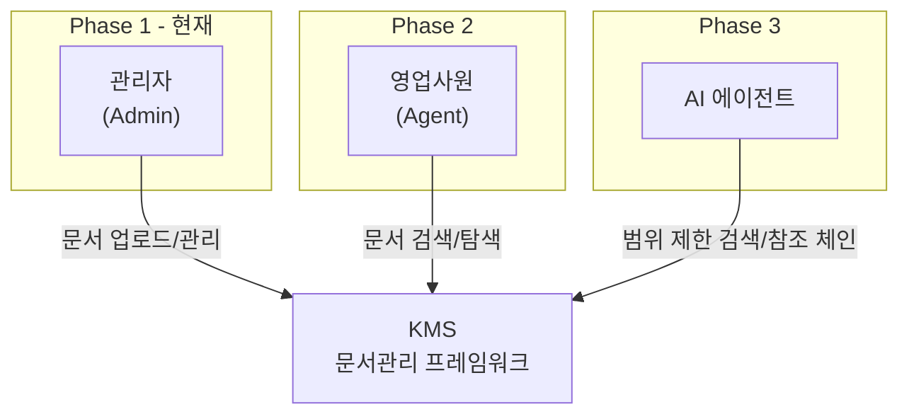
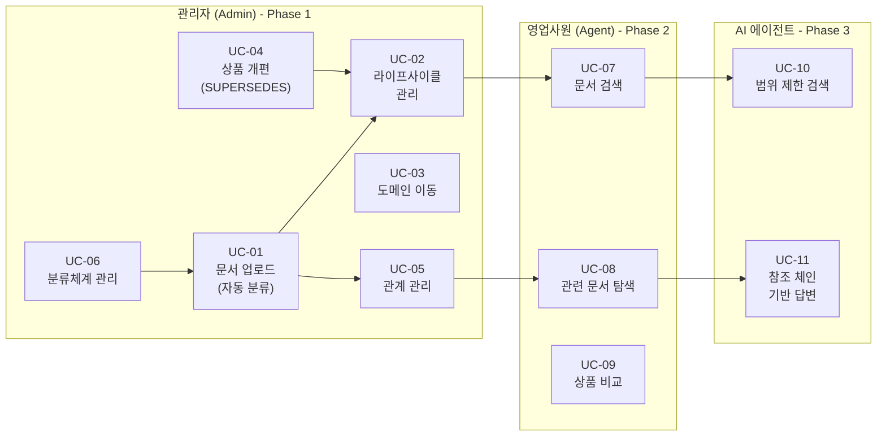
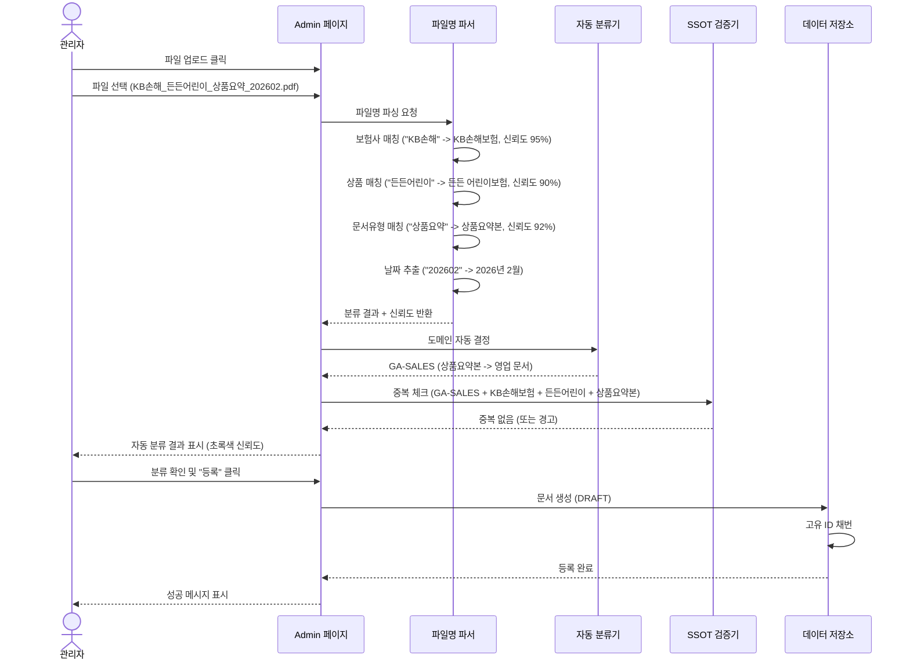
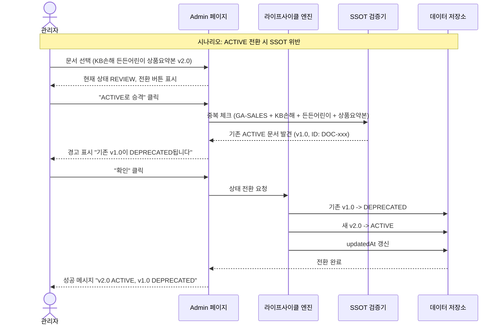
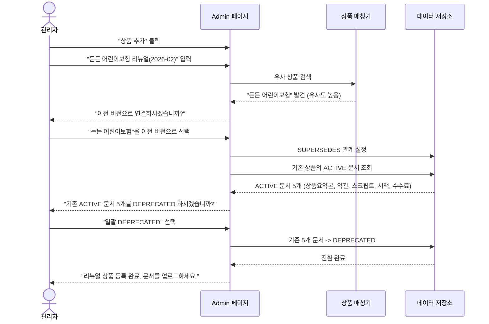
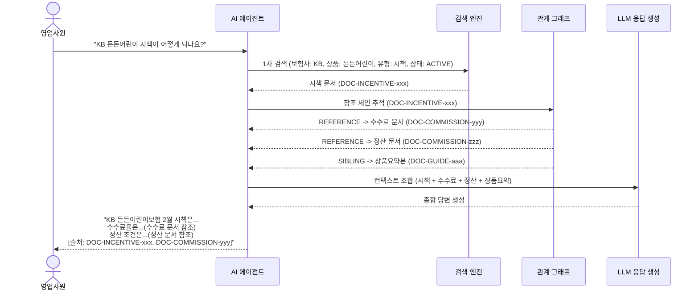
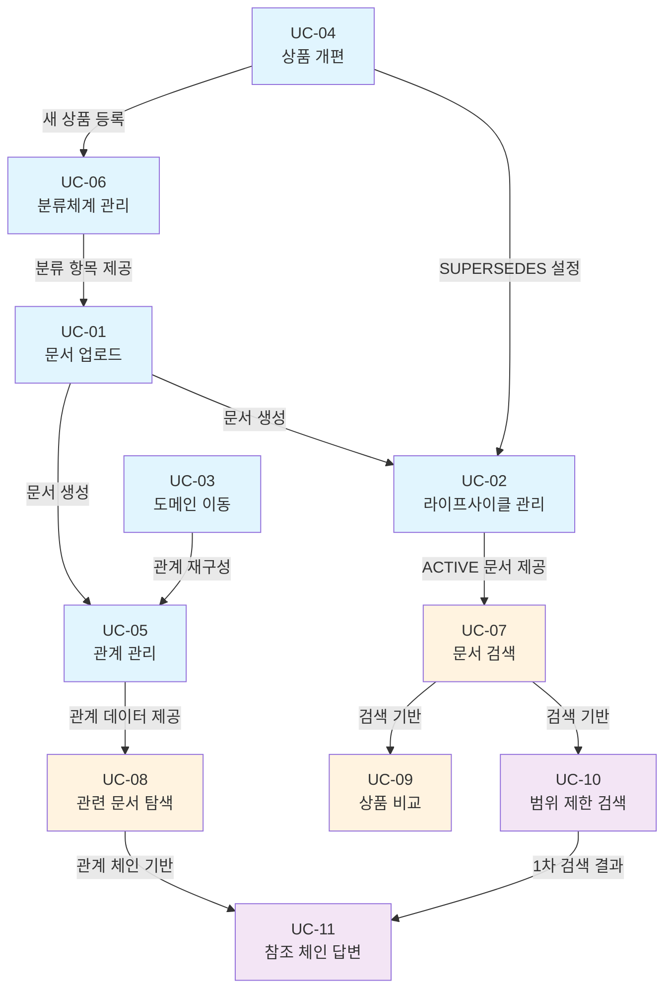

# KMS 문서관리 프레임워크 — 유즈케이스 명세서

> **Version** 1.0 · 2026-02 · iFA IT팀

---

## 목차

1. [개요](#1-개요)
2. [액터 정의](#2-액터-정의)
3. [유즈케이스 맵](#3-유즈케이스-맵)
4. [관리자(Admin) 유즈케이스](#4-관리자admin-유즈케이스)
   - [UC-01: 문서 업로드 (자동 분류)](#uc-01-문서-업로드-자동-분류)
   - [UC-02: 문서 라이프사이클 관리](#uc-02-문서-라이프사이클-관리)
   - [UC-03: 문서 도메인 이동](#uc-03-문서-도메인-이동)
   - [UC-04: 상품 개편 관리 (SUPERSEDES)](#uc-04-상품-개편-관리-supersedes)
   - [UC-05: 관계 관리](#uc-05-관계-관리)
   - [UC-06: 분류체계 관리](#uc-06-분류체계-관리)
5. [영업사원(Agent) 유즈케이스 — Phase 2](#5-영업사원agent-유즈케이스--phase-2)
   - [UC-07: 문서 검색](#uc-07-문서-검색)
   - [UC-08: 관련 문서 탐색](#uc-08-관련-문서-탐색)
   - [UC-09: 상품 비교](#uc-09-상품-비교)
6. [AI 에이전트 유즈케이스 — Phase 3](#6-ai-에이전트-유즈케이스--phase-3)
   - [UC-10: 범위 제한 검색 (Scoped Search)](#uc-10-범위-제한-검색-scoped-search)
   - [UC-11: 참조 체인 기반 답변](#uc-11-참조-체인-기반-답변)
7. [유즈케이스 간 의존 관계](#7-유즈케이스-간-의존-관계)
8. [시스템 규칙 요약](#8-시스템-규칙-요약)

---

## 1. 개요

### 목적

이 문서는 KMS 문서관리 프레임워크의 유즈케이스를 정의한다.
GA(법인보험대리점) 지식관리 시스템의 세 가지 액터(관리자, 영업사원, AI 에이전트)가
시스템과 상호작용하는 모든 시나리오를 명세한다.

### 범위

| Phase | 유즈케이스 | 상태 |
|-------|-----------|------|
| Phase 1 (현재) | UC-01 ~ UC-06 (관리자) | 구현 대상 |
| Phase 2 | UC-07 ~ UC-09 (영업사원) | 설계 예정 |
| Phase 3 | UC-10 ~ UC-11 (AI 에이전트) | 설계 예정 |

### 관련 문서

- `docs/framework-guide.md` — 프레임워크 기획서 & 매뉴얼
- `docs/architecture/architecture-guide.md` — 전체 아키텍처
- `docs/architecture/document-pipeline.md` — 문서 파이프라인
- `docs/core/project-goal.md` — 프로젝트 목표
- `CLAUDE.md` — 시스템 규칙 정의

---

## 2. 액터 정의

| 액터 | 설명 | Phase | 주요 목표 |
|------|------|-------|----------|
| **관리자 (Admin)** | IT팀 또는 문서 담당자. 분류체계 관리, 문서 등록/변경 수행 | Phase 1 | 문서의 정확한 분류와 신선도 유지 |
| **영업사원 (Agent)** | 보험 설계사. 고객 상담 시 문서를 검색하고 참조 | Phase 2 | 최신 유효 문서를 빠르게 찾기 |
| **AI 에이전트** | RAG 기반 질의응답 시스템. 영업사원의 질문에 문서 기반 답변 생성 | Phase 3 | 정확한 범위의 문서로 근거 있는 답변 생성 |

---

## 3. 유즈케이스 맵

---

## 4. 관리자(Admin) 유즈케이스

---

### UC-01: 문서 업로드 (자동 분류)

**요약:** 관리자가 파일을 업로드하면 시스템이 파일명을 파싱하여 보험사/상품/문서유형을 자동 매칭하고, 도메인을 자동 결정한다.

| 항목 | 내용 |
|------|------|
| **액터** | 관리자 (Admin) |
| **우선순위** | 높음 (Phase 1 핵심) |
| **빈도** | 매일 (시책/수수료 변경 시 수시) |

#### 사전 조건

1. 관리자가 Admin 페이지에 접속한 상태이다.
2. 분류체계(보험사, 상품, 문서유형)가 최소 1건 이상 등록되어 있다.
3. 업로드할 파일이 지원 형식(.md, .pdf, .hwp, .docx)이다.

#### 기본 흐름

1. 관리자가 상단 **"파일 업로드"** 버튼을 클릭한다.
2. 관리자가 파일을 선택한다.
3. 시스템이 파일명을 파싱한다.
   - 3a. 보험사 매칭: 파일명에서 보험사 코드/별칭 검색 (예: "KB손해" -> KB손해보험)
   - 3b. 상품 매칭: 기존 등록 상품명과 유사도 비교
   - 3c. 문서유형 매칭: 키워드 기반 ("요약" -> 상품요약본, "스크립트" -> 판매스크립트)
   - 3d. 날짜/버전 추출: 정규식 ("202602" -> 2026년 2월)
4. 시스템이 자동 분류 결과를 **신뢰도 점수**와 함께 표시한다.
   - 90% 이상: 초록색 (높은 확률)
   - 70~89%: 노란색 (확인 필요)
   - 70% 미만: 빨간색 (수동 선택 필요)
5. 시스템이 분류 결과로부터 **도메인을 자동 결정**한다.
   - 문서유형이 시책/수수료 -> GA-COMM
   - 문서유형이 상품설명서/판매스크립트 -> GA-SALES
   - 문서유형이 컴플라이언스 -> GA-COMP
   - 문서유형이 교육자료 -> GA-EDU
6. 시스템이 **SSOT 중복 체크**를 수행한다.
   - 동일 분류 경로에 ACTIVE 문서가 이미 존재하는지 확인
7. 관리자가 분류 결과를 확인하고, 필요 시 드롭다운에서 수정한다.
8. 관리자가 **"등록"** 버튼을 클릭한다.
9. 시스템이 고유 ID를 채번하고 DRAFT 상태로 문서를 생성한다.
10. 시스템이 등록 완료 메시지를 표시한다.

#### 대안 흐름

**AF-01a: 스티키 컨텍스트 (연속 업로드)**

- 6단계 후, 관리자가 **"등록 + 다음 파일"** 버튼을 클릭한다.
- 시스템이 현재 선택된 보험사/상품 값을 유지한 상태로 새 파일 선택 화면을 표시한다.
- 관리자가 같은 보험사/상품의 다른 문서를 연속으로 업로드할 수 있다.

**AF-01b: SSOT 중복 감지**

- 6단계에서 동일 분류 경로에 ACTIVE 문서가 존재할 경우:
  - 시스템이 빨간색 경고 배너를 표시한다: "동일 경로에 ACTIVE 문서가 존재합니다."
  - 기존 ACTIVE 문서의 이름, ID, 등록일을 표시한다.
  - 관리자는 "그래도 등록 (DRAFT)" 또는 "취소"를 선택한다.
  - 등록 시 DRAFT 상태로만 생성 가능하다 (바로 ACTIVE 불가).

**AF-01c: 파일명 파싱 실패**

- 3단계에서 보험사/상품/문서유형 모두 매칭 실패 시:
  - 시스템이 "자동 분류 불가" 메시지를 표시한다.
  - 모든 필드를 수동 선택하도록 빈 드롭다운을 표시한다.
  - 관리자가 직접 보험사, 상품, 문서유형을 선택한다.

**AF-01d: 미지원 파일 형식**

- 2단계에서 지원하지 않는 파일 형식을 선택한 경우:
  - 시스템이 "지원하지 않는 파일 형식입니다" 오류를 표시한다.
  - 업로드를 차단한다.

#### 사후 조건

1. 새 문서가 DRAFT 상태로 생성되어 시스템에 등록된다.
2. 고유 ID가 채번되어 문서에 부여된다.
3. 분류 정보(보험사, 상품, 문서유형)가 문서에 태깅된다.
4. 도메인이 자동 결정되어 문서에 설정된다.
5. 스티키 컨텍스트 사용 시, 다음 업로드를 위한 이전 선택값이 유지된다.

#### 관련 시스템 규칙

- **채번**: 모든 문서에 고유 ID 자동 부여
- **SSOT**: 동일 분류 경로에 ACTIVE 문서 1개만 허용
- **도메인 자동 결정**: `DOC_TYPE_DOMAIN_MAP`에 의한 자동 매핑
- **자동 분류 우선순위**: 파일명 규칙 > 키워드 > 유사도

#### 시퀀스 다이어그램

---

### UC-02: 문서 라이프사이클 관리

**요약:** 관리자가 문서의 라이프사이클 상태를 관리한다. DRAFT에서 ACTIVE까지의 승격, 신선도 만료에 의한 자동 STALE 전환, SSOT 위반 자동 감지를 포함한다.

| 항목 | 내용 |
|------|------|
| **액터** | 관리자 (Admin), 시스템 (자동) |
| **우선순위** | 높음 (Phase 1 핵심) |
| **빈도** | 수시 (문서 상태 변경 시마다) |

#### 사전 조건

1. 대상 문서가 시스템에 등록되어 있다.
2. 관리자가 해당 문서의 상세 패널을 열어둔 상태이다.

#### 기본 흐름 (수동 승격)

1. 관리자가 문서를 선택하여 오른쪽 상세 패널을 연다.
2. 시스템이 현재 라이프사이클 상태와 전환 가능한 버튼을 표시한다.
3. 관리자가 전환 버튼을 클릭한다 (예: DRAFT -> "REVIEW로 제출").
4. 시스템이 전환 유효성을 검증한다.
   - DRAFT -> REVIEW: 필수 분류 정보(보험사, 상품, 문서유형) 존재 확인
   - REVIEW -> ACTIVE: 검토 완료 확인
5. 시스템이 상태를 전환하고 `updatedAt`을 갱신한다.
6. 시스템이 전환 성공 메시지를 표시한다 (초록색 알림).

#### 대안 흐름

**AF-02a: ACTIVE 전환 시 SSOT 위반 자동 감지**

- 4단계에서 REVIEW -> ACTIVE 전환 시도 시:
  - 시스템이 동일 분류 경로 (도메인 + 보험사 + 상품 + 문서유형)에 기존 ACTIVE 문서가 있는지 검사한다.
  - **기존 ACTIVE 문서가 있는 경우:**
    - 시스템이 경고를 표시한다: "동일 경로에 ACTIVE 문서가 존재합니다. 기존 문서가 DEPRECATED로 전환됩니다."
    - 기존 ACTIVE 문서의 이름과 ID를 표시한다.
    - 관리자가 "확인 (기존 문서 DEPRECATED)" 또는 "취소"를 선택한다.
    - 확인 시: 기존 문서 -> DEPRECATED, 새 문서 -> ACTIVE로 동시 전환.

**AF-02b: 신선도 만료에 의한 자동 STALE 전환**

- 시스템이 주기적으로 ACTIVE 문서의 신선도를 계산한다.
  - `경과일 = 현재일 - max(updatedAt, reviewedAt)`
  - 경과일이 해당 문서유형의 `maxAgeDays` 이상이면:
    - 시스템이 자동으로 ACTIVE -> STALE 전환한다.
    - 관리자 대시보드에 "신선도 만료" 알림을 추가한다.

**AF-02c: REVIEW에서 REJECTED (반려)**

- 3단계에서 관리자가 "반려" 버튼을 클릭한다.
- 시스템이 반려 사유 입력 필드를 표시한다.
- 관리자가 반려 사유를 입력하고 확인한다.
- 문서가 REVIEW -> DRAFT로 전환된다.

**AF-02d: STALE에서 ACTIVE 복원**

- 관리자가 STALE 상태의 문서를 선택한다.
- 관리자가 문서 내용을 검토 후 "ACTIVE로 복원" 버튼을 클릭한다.
- 시스템이 `reviewedAt`을 현재 일시로 갱신한다.
- 문서가 STALE -> ACTIVE로 전환되고, 신선도가 리셋된다.

#### 사후 조건

1. 문서의 라이프사이클 상태가 변경된다.
2. `updatedAt` 또는 `reviewedAt` 타임스탬프가 갱신된다.
3. SSOT 위반이 있었다면 기존 ACTIVE 문서가 DEPRECATED로 전환된다.
4. 대시보드의 라이프사이클 분포 통계가 갱신된다.

#### 관련 시스템 규칙

- **라이프사이클 상태 머신**: DRAFT -> REVIEW -> ACTIVE -> STALE -> DEPRECATED -> ARCHIVED
- **SSOT**: ACTIVE 전환 시 동일 경로 유니크 보장
- **신선도 자동 계산**: HOT 30일, WARM 90일, COLD 365일
- **버전**: 대버전 변경 시 새 문서 생성, 기존 문서 DEPRECATED

#### 시퀀스 다이어그램

---

### UC-03: 문서 도메인 이동

**요약:** 관리자가 문서를 하나의 도메인에서 다른 도메인으로 이동한다. 도메인 변경 시 영향 분석을 git conflict 방식으로 수행하며, 관계와 분류 필드에 대한 처리를 결정한다.

| 항목 | 내용 |
|------|------|
| **액터** | 관리자 (Admin) |
| **우선순위** | 중간 |
| **빈도** | 낮음 (조직 변경 또는 분류 오류 수정 시) |

#### 사전 조건

1. 이동할 문서가 시스템에 등록되어 있다.
2. 대상 도메인이 시스템에 정의되어 있다.
3. 관리자가 해당 문서의 상세 패널을 열어둔 상태이다.

#### 기본 흐름

1. 관리자가 문서를 선택하고 상세 패널에서 "도메인 변경"을 클릭한다.
2. 관리자가 대상 도메인을 선택한다 (예: GA-SALES -> GA-COMM).
3. 시스템이 **영향 분석**을 수행한다.
4. 시스템이 git conflict 방식의 영향 분석 리포트를 표시한다:

   | 구분 | 처리 방식 | 항목 |
   |------|----------|------|
   | **자동 처리** | 안전하게 자동 적용 | classification 필드 재구성, 자식 문서 함께 이동 |
   | **보존** | 변경 없이 유지 | 나가는 참조(ID 불변), SUPERSEDES 관계 |
   | **컨플릭트** | 관리자 결정 필요 | 부모 관계(크로스 도메인), 형제 관계, 들어오는 참조 |

5. 관리자가 컨플릭트 항목에 대해 **keep(유지)** 또는 **sever(절단)** 를 선택한다.
6. 관리자가 "이동 확인"을 클릭한다.
7. 시스템이 도메인을 변경하고 선택에 따라 관계를 처리한다.
8. 시스템이 이동 완료 메시지를 표시한다.

#### 대안 흐름

**AF-03a: 대상 도메인의 facet이 다른 경우**

- 3단계에서 원본 도메인과 대상 도메인의 facet 구성이 다를 때:
  - 예: GA-SALES (carrier x product x docType) -> GA-EDU (docType만)
  - 시스템이 불필요한 classification 필드(carrier, product) 제거를 안내한다.
  - 관리자가 확인하면 해당 필드를 null로 설정한다.

**AF-03b: 자식 문서가 있는 경우**

- 3단계에서 이동 대상 문서에 자식 문서가 있을 때:
  - 시스템이 "자식 문서 N개를 함께 이동하시겠습니까?" 확인 다이얼로그를 표시한다.
  - "함께 이동": 자식 문서도 같은 도메인으로 이동
  - "부모만 이동": 부모-자식 관계가 끊어짐 (컨플릭트 처리)

**AF-03c: 이동 취소**

- 4~5단계에서 관리자가 "취소"를 클릭한다.
- 모든 변경 사항이 롤백되고 원래 상태로 복원된다.

#### 사후 조건

1. 문서의 도메인이 변경된다.
2. classification 필드가 대상 도메인의 facet에 맞게 재구성된다.
3. 자동 처리 항목이 적용된다.
4. 관리자가 선택한 컨플릭트 해결 방안이 반영된다.
5. 관련 문서의 관계가 keep/sever 선택에 따라 갱신된다.

#### 관련 시스템 규칙

- **ID 불변**: 도메인 이동 후에도 문서 ID는 변경되지 않음
- **관계 유형 제한**: PARENT_OF, SIBLING은 같은 도메인 내에서만 (크로스 도메인 불가)
- **REFERENCE**: 크로스 도메인 허용 (이동 시 보존)
- **SUPERSEDES**: 도메인 무관 (이동 시 보존)

---

### UC-04: 상품 개편 관리 (SUPERSEDES)

**요약:** 보험 상품이 리뉴얼될 때 새 상품을 등록하고, 기존 상품과 SUPERSEDES 관계를 설정하며, 기존 문서를 자동 DEPRECATED 처리한다.

| 항목 | 내용 |
|------|------|
| **액터** | 관리자 (Admin) |
| **우선순위** | 높음 |
| **빈도** | 분기별 (상품 개편 시) |

#### 사전 조건

1. 기존 상품이 시스템에 등록되어 있고, 관련 문서가 ACTIVE 상태이다.
2. 리뉴얼 상품의 정보(상품명, 시행일 등)가 확정되어 있다.

#### 기본 흐름

1. 관리자가 분류체계 관리에서 **"상품 추가"**를 클릭한다.
2. 관리자가 리뉴얼 상품 정보를 입력한다.
   - 상품명: "든든 어린이보험 리뉴얼(2026-02)"
   - 카테고리: 어린이보험
   - 시행일: 2026-02-01
3. 시스템이 상품명 유사도를 분석하여 **기존 상품 후보**를 제안한다.
   - "든든 어린이보험"이 기존 등록 상품과 유사 -> "이전 버전으로 연결하시겠습니까?"
4. 관리자가 기존 상품("든든 어린이보험")을 이전 버전으로 선택한다.
5. 시스템이 **SUPERSEDES 관계**를 설정한다.
   - 리뉴얼 상품 --SUPERSEDES--> 기존 상품
6. 시스템이 기존 상품의 ACTIVE 문서 목록을 표시하고 처리 방법을 묻는다:
   - "기존 상품의 ACTIVE 문서 N개를 DEPRECATED로 전환하시겠습니까?"
7. 관리자가 **"일괄 DEPRECATED"**를 선택한다.
8. 시스템이 기존 상품의 모든 ACTIVE 문서를 DEPRECATED로 전환한다.
9. 시스템이 리뉴얼 상품에 대한 문서 업로드를 안내한다.
10. 관리자가 리뉴얼 상품의 문서들을 UC-01 흐름으로 업로드한다.

#### 대안 흐름

**AF-04a: 단계적 전환 (즉시 DEPRECATED하지 않음)**

- 6단계에서 관리자가 "나중에 처리"를 선택한다.
- 기존 상품의 문서들은 ACTIVE를 유지한다.
- 리뉴얼 상품 문서가 ACTIVE로 전환될 때, 같은 문서유형의 기존 문서가 자동 DEPRECATED된다 (UC-02의 SSOT 규칙에 의해).

**AF-04b: 부분 개편 (일부 문서유형만 변경)**

- 6단계에서 관리자가 개별 문서를 선택하여 DEPRECATED 여부를 결정한다.
- 변경되지 않은 문서유형(예: 약관)은 기존 상품의 문서가 ACTIVE를 유지한다.
- 리뉴얼 상품에서 해당 문서유형은 기존 문서를 REFERENCE로 참조한다.

**AF-04c: 이전 버전 연결 없이 등록**

- 4단계에서 관리자가 "이전 버전 없음"을 선택한다.
- 완전히 새로운 상품으로 등록된다 (SUPERSEDES 관계 없음).

#### 사후 조건

1. 리뉴얼 상품이 시스템에 등록된다.
2. 리뉴얼 상품과 기존 상품 사이에 SUPERSEDES 관계가 설정된다.
3. 기존 상품의 ACTIVE 문서들이 DEPRECATED로 전환된다 (관리자 선택에 따라).
4. 버전 이력 추적이 가능하다 (리뉴얼 -> 기존 -> 이전 버전...).

#### 관련 시스템 규칙

- **SUPERSEDES 관계**: 단방향, 같은 도메인 내에서만
- **버전 관리**: 상품 개편은 새 상품(새 엔티티)으로 관리, 기존 상품과 별개
- **SSOT**: 리뉴얼 문서 ACTIVE 시 동일 경로의 기존 문서 자동 DEPRECATED

#### 시퀀스 다이어그램

---

### UC-05: 관계 관리

**요약:** 관리자가 문서 간 관계(부모-자식, 형제, 참조, SUPERSEDES)를 설정하고, 전파 확인을 통해 연관 문서 체인을 검증한다.

| 항목 | 내용 |
|------|------|
| **액터** | 관리자 (Admin) |
| **우선순위** | 높음 (Phase 1 핵심) |
| **빈도** | 문서 등록/변경 시마다 |

#### 사전 조건

1. 관계를 설정할 문서들이 시스템에 등록되어 있다.
2. 관리자가 소스 문서의 상세 패널을 열어둔 상태이다.

#### 기본 흐름

1. 관리자가 소스 문서를 선택하여 오른쪽 상세 패널을 연다.
2. 상세 패널의 "관계" 영역에서 관계 유형을 선택한다.
   - 부모 / 자식 / 형제 / 참조 / 대체(SUPERSEDES)
3. 드롭다운에서 대상 문서를 선택한다.
4. "추가" 버튼을 클릭한다.
5. 시스템이 관계 유효성을 검증한다.
   - 부모-자식, 형제: 같은 도메인 내 문서만 허용
   - 참조: 크로스 도메인 허용
   - SUPERSEDES: 같은 도메인, 같은 문서유형만 허용
6. 시스템이 양방향 관계를 자동 동기화한다.
   - A -> B (부모) 설정 시: B -> A (자식) 자동 생성
   - A -> B (형제) 설정 시: B -> A (형제) 자동 생성
7. 시스템이 관계 설정 완료를 표시한다.
8. 그래프 뷰에서 관계가 시각적으로 표시된다.

#### 대안 흐름

**AF-05a: 같은 보험사-상품 내 자동 형제 설정**

- 같은 보험사, 같은 상품의 문서들에 대해:
  - 시스템이 "형제로 설정하시겠습니까?" 제안을 표시한다.
  - 예: KB손해보험 든든어린이보험의 상품요약본, 약관, 스크립트 -> 형제 관계

**AF-05b: 크로스 도메인 참조 설정**

- 3단계에서 다른 도메인의 문서를 참조로 설정하려는 경우:
  - 예: GA-SALES의 시책 문서 -> GA-COMM의 수수료 문서 참조
  - 시스템이 "크로스 도메인 참조입니다"를 안내하고 허용한다.
  - 참조는 단방향이므로 반대 방향은 자동 생성되지 않는다.

**AF-05c: 전파 확인**

- 관리자가 "전파 확인" 버튼을 클릭한다.
- 시스템이 선택한 문서의 관계 체인을 추적한다.
  - 1차: 직접 관계 (부모, 자식, 형제, 참조)
  - 2차: 간접 관계 (자식의 참조, 형제의 참조 등)
- 그래프 뷰에서 전파된 문서들이 강조 표시된다.
- 하단 상태바에 "전파된 문서: N개"가 표시된다.

**AF-05d: 순환 관계 감지**

- 5단계에서 부모-자식 관계가 순환을 형성하려는 경우:
  - 예: A의 부모가 B, B의 부모가 A
  - 시스템이 "순환 관계가 감지되었습니다" 오류를 표시한다.
  - 관계 설정을 차단한다.

#### 사후 조건

1. 두 문서 사이에 관계가 설정된다.
2. 양방향 관계의 경우 반대 방향도 자동 생성된다.
3. 그래프 뷰에서 관계가 시각적으로 표시된다.
4. 전파 확인 시 관계 체인이 정상 동작한다.

#### 관련 시스템 규칙

- **관계 유형 제한**: PARENT_OF, CHILD_OF, SIBLING, REFERENCE, SUPERSEDES
- **도메인 제약**: PARENT_OF/CHILD_OF/SIBLING은 같은 도메인, REFERENCE는 크로스 도메인 허용
- **양방향 자동 동기화**: 부모-자식, 형제는 양방향 자동
- **참조/SUPERSEDES**: 단방향

---

### UC-06: 분류체계 관리

**요약:** 관리자가 분류체계의 구성 요소(보험사, 상품, 문서유형)를 추가/수정/삭제하고, 새로운 도메인을 등록한다.

| 항목 | 내용 |
|------|------|
| **액터** | 관리자 (Admin) |
| **우선순위** | 중간 |
| **빈도** | 낮음 (신규 보험사/상품 출시 시) |

#### 사전 조건

1. 관리자가 Admin 페이지에 접속한 상태이다.

#### 기본 흐름 (보험사/상품/문서유형 추가)

1. 관리자가 왼쪽 사이드바에서 해당 탭(보험사/상품/문서유형)을 선택한다.
2. "추가" 버튼을 클릭한다.
3. 필수 정보를 입력한다:
   - **보험사**: 코드(INS-xxx), 이름, 별칭(동의어), 유형(생보/손보)
   - **상품**: 코드(PRD-xxx), 이름, 카테고리, 소속 보험사
   - **문서유형**: 코드(DOC-xxx), 이름, 데이터 티어(HOT/WARM/COLD), maxAgeDays
4. 시스템이 코드 중복 여부를 검증한다.
5. 시스템이 항목을 등록하고 사이드바 목록을 갱신한다.

#### 대안 흐름

**AF-06a: 도메인 추가 (새 사업부)**

- 관리자가 도메인 관리에서 "도메인 추가"를 클릭한다.
- 다음 정보를 입력한다:
  - 도메인 코드: `{BIZ}-{FUNC}` (예: MEDI-SVC)
  - 도메인명: 메디코드 서비스
  - facets 구성: 사용할 분류축 선택 (예: service, stage, docType)
  - SSOT 키: facets의 조합 정의
  - 신선도 오버라이드: 도메인별 maxAgeDays 설정 (선택)
- 시스템이 도메인을 등록한다.

**AF-06b: 기존 항목 수정**

- 관리자가 기존 항목을 선택하고 "수정" 버튼을 클릭한다.
- 이름, 별칭 등을 수정한다.
- **코드는 변경 불가** (ID 불변 원칙).
- 시스템이 변경 사항을 저장한다.

**AF-06c: 항목 삭제 시 참조 검사**

- 관리자가 항목 삭제를 시도한다.
- 시스템이 해당 항목을 참조하는 문서가 있는지 검사한다.
- **참조 문서가 있는 경우**: "이 항목을 참조하는 문서 N개가 있습니다. 삭제할 수 없습니다."
- **참조 문서가 없는 경우**: 삭제를 수행한다.

#### 사후 조건

1. 분류체계 항목이 추가/수정/삭제된다.
2. 사이드바 목록이 갱신된다.
3. 새 항목은 즉시 문서 업로드 시 선택 가능하다.
4. 도메인 추가 시 해당 도메인의 문서 등록이 가능해진다.

#### 관련 시스템 규칙

- **코드 불변**: 한번 등록된 코드는 변경 불가
- **참조 무결성**: 문서가 참조 중인 항목은 삭제 불가
- **도메인 분리**: 시스템 규칙은 공통, 도메인별 facet은 독립적

---

## 5. 영업사원(Agent) 유즈케이스 -- Phase 2

---

### UC-07: 문서 검색

**요약:** 영업사원이 도메인/보험사/상품/문서유형 필터와 키워드를 사용하여 문서를 검색하고, 검색 결과에서 신선도와 라이프사이클 상태를 확인한다.

| 항목 | 내용 |
|------|------|
| **액터** | 영업사원 (Agent) |
| **우선순위** | 높음 (Phase 2 핵심) |
| **빈도** | 매일 (고객 상담 시 수시) |

#### 사전 조건

1. 영업사원이 KMS 시스템에 로그인한 상태이다.
2. ACTIVE 상태의 문서가 1건 이상 존재한다.

#### 기본 흐름

1. 영업사원이 검색 화면에 접속한다.
2. 검색 필터를 설정한다 (선택적):
   - 도메인: GA-SALES, GA-COMM 등
   - 보험사: 삼성생명, 한화생명 등
   - 상품: 종신보험, 어린이보험 등
   - 문서유형: 상품설명서, 시책 등
3. 키워드를 입력한다 (선택적).
4. "검색" 버튼을 클릭한다.
5. 시스템이 검색 결과를 표시한다:
   - 문서명
   - 보험사 / 상품 / 문서유형
   - **라이프사이클 상태** (ACTIVE: 초록, STALE: 주황 등)
   - **신선도** (FRESH: 초록, WARNING: 노란, EXPIRED: 빨강)
   - 최종 수정일
6. 영업사원이 문서를 클릭하여 상세 내용을 확인한다.

#### 대안 흐름

**AF-07a: ACTIVE 문서만 필터**

- 2단계에서 "ACTIVE만 표시" 체크박스를 활성화한다.
- 검색 결과에서 DEPRECATED, ARCHIVED 문서가 제외된다.

**AF-07b: 신선도 경고 표시**

- 5단계에서 WARNING 또는 EXPIRED 신선도의 문서가 있는 경우:
  - 해당 문서에 "갱신 필요" 뱃지가 표시된다.
  - 영업사원이 해당 문서를 클릭하면 "이 문서는 갱신이 필요합니다" 안내가 표시된다.

**AF-07c: 검색 결과 없음**

- 5단계에서 검색 결과가 0건인 경우:
  - "검색 결과가 없습니다. 필터를 변경하거나 키워드를 수정해주세요."
  - 유사한 키워드 제안 (동의어 기반)

#### 사후 조건

1. 검색 조건에 맞는 문서 목록이 표시된다.
2. 각 문서의 신선도와 라이프사이클 상태가 시각적으로 구분된다.

#### 관련 시스템 규칙

- **신선도 표시**: FRESH/WARNING/EXPIRED 상태를 색상으로 구분
- **라이프사이클 표시**: ACTIVE 문서만 기본 표시, 필터로 다른 상태 포함 가능
- **동의어 검색**: 분류체계의 별칭(synonym) 기반 확장 검색

---

### UC-08: 관련 문서 탐색

**요약:** 영업사원이 특정 문서를 선택하면 관계(부모-자식, 형제, 참조)를 따라 연관 문서가 자동으로 표시된다.

| 항목 | 내용 |
|------|------|
| **액터** | 영업사원 (Agent) |
| **우선순위** | 높음 |
| **빈도** | 매일 (문서 확인 시마다) |

#### 사전 조건

1. 영업사원이 특정 문서를 열어둔 상태이다.
2. 해당 문서에 1개 이상의 관계가 설정되어 있다.

#### 기본 흐름

1. 영업사원이 문서를 선택한다 (예: KB손해보험 든든어린이보험 시책).
2. 시스템이 해당 문서의 관계를 자동으로 추적한다.
3. "관련 문서" 패널에 연관 문서가 관계 유형별로 그룹화되어 표시된다:
   - **같은 상품의 문서 (형제)**: 상품요약본, 약관, 스크립트
   - **참조 문서**: 수수료표 (GA-COMM 도메인)
   - **대체 이력**: 이전 버전 시책 (DEPRECATED)
4. 영업사원이 관련 문서를 클릭하여 바로 이동한다.

#### 대안 흐름

**AF-08a: 전파 체인 탐색**

- 시책 -> 수수료 -> 정산 문서로 이어지는 전파 체인을 탐색한다.
- 1차 관련 문서에서 추가로 "이 문서의 관련 문서" 를 확인할 수 있다.
- 그래프 뷰에서 전파 경로가 시각적으로 표시된다.

**AF-08b: 관련 문서가 없는 경우**

- 2단계에서 관계가 설정되지 않은 문서인 경우:
  - "관련 문서가 없습니다" 메시지를 표시한다.
  - 같은 보험사/상품의 다른 문서를 "추천 문서"로 제안한다.

#### 사후 조건

1. 선택한 문서와 관련된 모든 문서가 표시된다.
2. 관계 유형별로 그룹화되어 직관적으로 확인 가능하다.

#### 관련 시스템 규칙

- **관계 전파**: 직접 관계 우선 표시, 간접 관계는 한 단계까지
- **ACTIVE 우선**: 관련 문서 중 ACTIVE 문서를 상단에 표시
- **크로스 도메인 참조**: 다른 도메인의 참조 문서도 표시

---

### UC-09: 상품 비교

**요약:** 영업사원이 동일 문서유형을 보험사별로 비교하거나, 리뉴얼 전후의 상품을 비교한다.

| 항목 | 내용 |
|------|------|
| **액터** | 영업사원 (Agent) |
| **우선순위** | 중간 |
| **빈도** | 주 수회 (고객 상담 시) |

#### 사전 조건

1. 비교 대상 보험사 또는 상품의 문서가 ACTIVE 상태로 존재한다.
2. 최소 2개 이상의 비교 대상이 있다.

#### 기본 흐름 (보험사별 비교)

1. 영업사원이 "상품 비교" 기능을 선택한다.
2. 비교할 문서유형을 선택한다 (예: 수수료체계).
3. 비교할 보험사를 2개 이상 선택한다 (예: 삼성생명, 한화생명, 교보생명).
4. 시스템이 동일 문서유형의 ACTIVE 문서를 보험사별로 나란히 표시한다.
5. 주요 항목(수수료율, 조건, 유효기간 등)이 표 형태로 비교된다.

#### 대안 흐름

**AF-09a: 리뉴얼 전후 비교**

- 2단계에서 "리뉴얼 비교"를 선택한다.
- 상품을 선택하면 SUPERSEDES 관계로 연결된 이전 버전이 자동으로 비교 대상에 추가된다.
- 리뉴얼 전후 문서를 나란히 표시하며 변경 사항을 강조한다.

**AF-09b: 비교 대상 문서 부재**

- 4단계에서 특정 보험사에 해당 문서유형이 없는 경우:
  - 해당 칸에 "문서 없음"을 표시한다.
  - 유사한 문서유형이 있으면 제안한다.

#### 사후 조건

1. 선택한 보험사별 또는 리뉴얼 전후의 문서가 비교 형태로 표시된다.
2. 주요 차이점이 시각적으로 강조된다.

#### 관련 시스템 규칙

- **ACTIVE 문서만**: 비교 대상은 ACTIVE 문서만 (DEPRECATED 제외, 리뉴얼 비교 제외)
- **SUPERSEDES 추적**: 리뉴얼 비교 시 SUPERSEDES 관계 체인을 자동 추적

---

## 6. AI 에이전트 유즈케이스 -- Phase 3

---

### UC-10: 범위 제한 검색 (Scoped Search)

**요약:** AI 에이전트가 역할별로 접근 가능한 도메인을 제한하여 검색하며, ACTIVE 문서만 검색 대상에 포함한다.

| 항목 | 내용 |
|------|------|
| **액터** | AI 에이전트 |
| **우선순위** | 높음 (Phase 3 핵심) |
| **빈도** | 실시간 (질의 발생 시마다) |

#### 사전 조건

1. AI 에이전트에 역할(scope)이 설정되어 있다.
2. 벡터 인덱스에 ACTIVE 문서의 임베딩이 적재되어 있다.
3. 사용자(영업사원)의 질문이 입력된 상태이다.

#### 기본 흐름

1. 영업사원이 AI 에이전트에 질문한다.
   - 예: "KB손해보험 든든어린이보험 상품요약 알려줘"
2. AI 에이전트가 질문을 분석하여 메타데이터 필터를 추출한다.
   - 보험사: KB손해보험 (INS-KB)
   - 상품: 든든 어린이보험 (PRD-CHILD)
   - 문서유형: 상품요약본 (DOC-GUIDE)
3. AI 에이전트가 역할 기반 범위를 적용한다.
   - 판매 에이전트: GA-SALES, GA-COMM만 접근
   - 계약 에이전트: GA-CONTRACT만 접근
   - 교육 에이전트: GA-EDU만 접근
4. 시스템이 **범위 내 ACTIVE 문서만** 검색한다.
   - 라이프사이클 필터: `lifecycle = ACTIVE`
   - 도메인 필터: 역할에 허용된 도메인만
5. 검색 결과를 AI 에이전트에 반환한다.
6. AI 에이전트가 검색 결과를 기반으로 답변을 생성한다.

#### 대안 흐름

**AF-10a: 범위 외 문서 요청**

- 3단계에서 질문이 허용 범위 외의 도메인을 요구하는 경우:
  - 예: 판매 에이전트가 계약관리 문서를 요청
  - AI 에이전트가 "해당 정보는 계약관리 영역입니다. 담당자에게 문의하세요." 안내

**AF-10b: DEPRECATED 문서 참조 필요**

- 사용자가 명시적으로 이전 버전을 요청하는 경우:
  - 예: "지난달 시책은 어떻게 됐었어?"
  - AI 에이전트가 시간 조건을 감지하고, DEPRECATED 문서도 검색 범위에 포함
  - 답변에 "(이전 버전, 현재 폐기됨)" 경고를 포함

#### 사후 조건

1. 역할 범위 내의 ACTIVE 문서만 검색에 사용된다.
2. AI 에이전트가 정확한 범위의 문서를 기반으로 답변을 생성한다.

#### 관련 시스템 규칙

- **역할별 도메인 접근 제한**: 각 역할은 허용된 도메인만 검색 가능
- **ACTIVE 필터**: 기본적으로 ACTIVE 문서만 검색 대상
- **시간 기반 예외**: 명시적 과거 시점 요청 시 DEPRECATED 포함 가능

---

### UC-11: 참조 체인 기반 답변

**요약:** AI 에이전트가 질문에 대해 단일 문서가 아닌, 참조 체인(REFERENCE)을 따라 관련 문서를 함께 컨텍스트로 제공하여 종합적인 답변을 생성한다.

| 항목 | 내용 |
|------|------|
| **액터** | AI 에이전트 |
| **우선순위** | 높음 |
| **빈도** | 실시간 (질의 발생 시마다) |

#### 사전 조건

1. UC-10을 통해 기본 검색이 수행된 상태이다.
2. 검색된 문서에 REFERENCE 또는 기타 관계가 설정되어 있다.

#### 기본 흐름

1. 영업사원이 AI 에이전트에 질문한다.
   - 예: "KB 든든어린이 시책이 어떻게 되나요?"
2. AI 에이전트가 1차 검색을 수행한다 (UC-10 흐름).
   - 검색 결과: KB손해보험 든든어린이보험 시책 문서
3. AI 에이전트가 1차 검색 결과 문서의 **관계를 추적**한다.
   - 시책 문서의 REFERENCE: 수수료 문서 (GA-COMM)
   - 수수료 문서의 REFERENCE: 정산 문서 (GA-COMM)
   - 시책 문서의 SIBLING: 상품요약본 (GA-SALES)
4. AI 에이전트가 관련 문서를 **컨텍스트에 추가**한다.
   - 시책 문서 (주 컨텍스트)
   - 수수료 문서 (보충 컨텍스트)
   - 정산 문서 (보충 컨텍스트)
5. AI 에이전트가 종합 답변을 생성한다.
   - 시책 내용 + 관련 수수료 정보 + 정산 조건을 포함
   - 각 정보의 출처 문서를 명시한다.

#### 대안 흐름

**AF-11a: 참조 체인이 없는 경우**

- 3단계에서 검색된 문서에 관계가 설정되지 않은 경우:
  - 같은 보험사/상품의 다른 문서를 유사도 기반으로 추가 검색한다.
  - 또는 단일 문서 기반으로 답변을 생성한다.

**AF-11b: 참조 체인이 너무 긴 경우**

- 3단계에서 참조 체인이 3단계 이상으로 깊어지는 경우:
  - 최대 2단계(1차 참조 + 2차 참조)까지만 추적한다.
  - 추가 관련 문서가 있음을 안내한다.

**AF-11c: 충돌하는 정보**

- 5단계에서 참조 체인의 문서 간 정보가 충돌하는 경우:
  - 최신 문서(updatedAt 기준)를 우선한다.
  - 충돌 사실을 답변에 명시한다: "시책 문서와 수수료 문서의 정보가 다릅니다."

#### 사후 조건

1. 질문에 대한 답변이 참조 체인의 컨텍스트를 포함하여 생성된다.
2. 각 정보의 출처 문서가 명시된다.
3. 영업사원이 출처 문서를 클릭하여 원본을 확인할 수 있다.

#### 관련 시스템 규칙

- **참조 체인 추적**: REFERENCE 관계를 따라 최대 2단계까지 추적
- **크로스 도메인 참조 허용**: 시책(GA-SALES) -> 수수료(GA-COMM) 참조 추적
- **출처 명시 의무**: 모든 답변에 근거 문서 ID와 이름을 포함
- **충돌 해결**: 최신 유효 문서 우선, 충돌 시 사실 명시

#### 시퀀스 다이어그램

---

## 7. 유즈케이스 간 의존 관계

| Phase | 색상 | 유즈케이스 |
|-------|------|-----------|
| Phase 1 (관리자) | 파란색 | UC-01 ~ UC-06 |
| Phase 2 (영업사원) | 주황색 | UC-07 ~ UC-09 |
| Phase 3 (AI 에이전트) | 보라색 | UC-10 ~ UC-11 |

---

## 8. 시스템 규칙 요약

유즈케이스 전반에 걸쳐 적용되는 시스템 규칙을 요약한다.

### 불변 규칙 (시스템 프레임워크)

| 규칙 | 설명 | 관련 UC |
|------|------|---------|
| **채번** | 모든 문서에 고유 ID 자동 부여, 변경 불가 | UC-01 |
| **라이프사이클 상태 머신** | DRAFT -> REVIEW -> ACTIVE -> STALE -> DEPRECATED -> ARCHIVED | UC-02 |
| **신선도 자동 계산** | HOT: 30일, WARM: 90일, COLD: 365일. 만료 시 자동 STALE 전환 | UC-02, UC-07 |
| **SSOT** | 동일 분류 경로에 ACTIVE 문서 1개만 허용 | UC-01, UC-02, UC-04 |
| **관계 유형 제한** | PARENT_OF, CHILD_OF, SIBLING, REFERENCE, SUPERSEDES만 허용 | UC-05 |
| **양방향 자동 동기화** | 부모-자식, 형제 관계는 반대 방향도 자동 생성 | UC-05 |
| **버전 관리** | Major.Minor 체계. 대버전은 새 문서, 소버전은 수정일 갱신 | UC-02, UC-04 |

### 도메인별 가변 규칙

| 도메인 | SSOT 키 (facets) | 비고 |
|--------|-----------------|------|
| GA-SALES | carrier x product x docType | 보험사별 상품별 영업 문서 |
| GA-COMM | carrier x product x docType | 수수료/정산 문서 |
| GA-CONTRACT | carrier x product x docType | 계약관리 문서 |
| GA-COMP | carrier x docType | 컴플라이언스 (상품 무관) |
| GA-EDU | docType | 교육/역량 (보험사/상품 무관) |
| COMMON-COMP | docType | 전사 공통 규제/법률 |

### 관계 규칙 매트릭스

| 관계 | 양방향 | 크로스 도메인 | 자동 생성 |
|------|--------|-------------|----------|
| PARENT_OF / CHILD_OF | O | X | 반대 방향 자동 |
| SIBLING | O | X | 반대 방향 자동 |
| REFERENCE | X | O | 수동만 |
| SUPERSEDES | X | X | UC-04에서 반자동 |

---

> **문서 관리 담당자:** IT팀
> **최종 수정일:** 2026-02-07
> **버전:** 1.0
