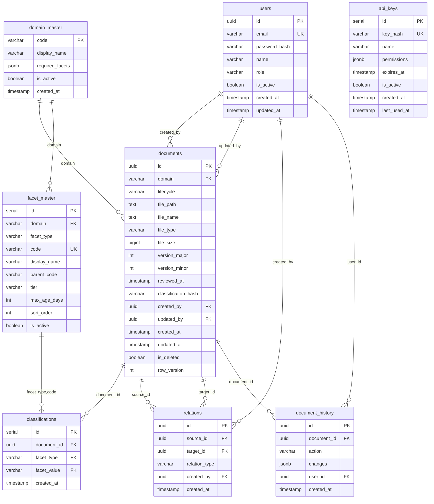

# Phase 2 데이터베이스 스키마 (정본)

> **Version** 1.0 | 2026-02-08
> **상태**: 확정 (모든 문서는 이 스키마를 참조)

---

## ERD (Mermaid)



### 테이블 관계 요약

| 관계 | 설명 |
|------|------|
| `domain_master` → `documents` | 문서는 반드시 유효한 도메인에 속함 |
| `domain_master` → `facet_master` | 분류 값은 도메인별로 정의 가능 |
| `facet_master` → `classifications` | 문서 분류는 마스터 데이터 참조 |
| `users` → `documents` | 생성자/수정자 추적 |
| `documents` → `relations` | 문서 간 관계 (source/target) |
| `documents` → `document_history` | 변경 이력 추적 |

---

## 1. 사용자 (users)

```sql
CREATE TABLE users (
    id UUID PRIMARY KEY DEFAULT gen_random_uuid(),
    email VARCHAR(255) NOT NULL UNIQUE,
    password_hash VARCHAR(255) NOT NULL,
    name VARCHAR(100) NOT NULL,
    role VARCHAR(20) NOT NULL DEFAULT 'USER',
    is_active BOOLEAN DEFAULT true,
    created_at TIMESTAMP DEFAULT NOW(),
    updated_at TIMESTAMP DEFAULT NOW(),

    CONSTRAINT chk_role CHECK (role IN ('ADMIN', 'USER', 'VIEWER'))
);

CREATE INDEX idx_users_email ON users(email);
```

---

## 2. 도메인 마스터 (domain_master)

```sql
CREATE TABLE domain_master (
    code VARCHAR(20) PRIMARY KEY,
    display_name VARCHAR(100) NOT NULL,
    required_facets JSONB NOT NULL DEFAULT '[]',
    is_active BOOLEAN DEFAULT true,
    created_at TIMESTAMP DEFAULT NOW()
);

-- 초기 데이터
INSERT INTO domain_master (code, display_name, required_facets) VALUES
('GA-SALES', 'GA 영업', '["carrier", "product", "docType"]'),
('GA-COMM', 'GA 수수료', '["carrier", "product", "docType"]'),
('GA-CONTRACT', 'GA 계약', '["carrier", "product", "docType"]'),
('GA-COMP', 'GA 컴플라이언스', '["carrier", "docType"]'),
('GA-EDU', 'GA 교육', '["docType"]'),
('COMMON-COMP', '전사 규제', '["docType"]');
```

---

## 3. 분류 마스터 (facet_master)

```sql
CREATE TABLE facet_master (
    id SERIAL PRIMARY KEY,
    domain VARCHAR(20) REFERENCES domain_master(code),
    facet_type VARCHAR(50) NOT NULL,
    code VARCHAR(50) NOT NULL,
    display_name VARCHAR(100) NOT NULL,
    parent_code VARCHAR(50),
    tier VARCHAR(10),                    -- HOT, WARM, COLD
    max_age_days INT,                    -- 신선도 만료일
    sort_order INT DEFAULT 0,
    is_active BOOLEAN DEFAULT true,
    created_at TIMESTAMP DEFAULT NOW(),

    CONSTRAINT chk_tier CHECK (tier IS NULL OR tier IN ('HOT', 'WARM', 'COLD')),
    UNIQUE(facet_type, code)
);

CREATE INDEX idx_facet_type ON facet_master(facet_type);
CREATE INDEX idx_facet_domain ON facet_master(domain);
```

---

## 4. 문서 (documents)

```sql
CREATE TABLE documents (
    id UUID PRIMARY KEY DEFAULT gen_random_uuid(),
    domain VARCHAR(20) NOT NULL REFERENCES domain_master(code),
    lifecycle VARCHAR(20) NOT NULL DEFAULT 'DRAFT',

    -- 파일 정보
    file_path TEXT NOT NULL,
    file_name TEXT NOT NULL,
    file_type VARCHAR(10) NOT NULL,
    file_size BIGINT,

    -- 버전
    version_major INT NOT NULL DEFAULT 1,
    version_minor INT NOT NULL DEFAULT 0,

    -- 신선도
    reviewed_at TIMESTAMP,

    -- SSOT
    classification_hash VARCHAR(64),

    -- 감사
    created_by UUID REFERENCES users(id),
    updated_by UUID REFERENCES users(id),
    created_at TIMESTAMP DEFAULT NOW(),
    updated_at TIMESTAMP DEFAULT NOW(),

    -- 논리 삭제
    is_deleted BOOLEAN DEFAULT false,

    -- 낙관적 잠금
    row_version INT NOT NULL DEFAULT 1,

    CONSTRAINT chk_lifecycle CHECK (lifecycle IN ('DRAFT', 'ACTIVE', 'DEPRECATED')),
    CONSTRAINT chk_file_type CHECK (file_type IN ('pdf', 'md', 'csv'))
);

CREATE INDEX idx_doc_domain ON documents(domain);
CREATE INDEX idx_doc_lifecycle ON documents(lifecycle);
CREATE INDEX idx_doc_hash ON documents(classification_hash) WHERE lifecycle = 'ACTIVE';
CREATE INDEX idx_doc_deleted ON documents(is_deleted) WHERE is_deleted = false;
```

### 라이프사이클 설명

| 상태 | 설명 | 전환 가능 |
|------|------|----------|
| DRAFT | 작성 중, 검토 필요 | → ACTIVE |
| ACTIVE | 현재 유효한 문서 | → DEPRECATED |
| DEPRECATED | 만료됨, 참고용 | (종료 상태) |

> **참고**: REVIEW, STALE, ARCHIVED는 Phase 3에서 추가 검토

---

## 5. 분류 (classifications)

```sql
CREATE TABLE classifications (
    id SERIAL PRIMARY KEY,
    document_id UUID NOT NULL REFERENCES documents(id) ON DELETE CASCADE,
    facet_type VARCHAR(50) NOT NULL,
    facet_value VARCHAR(100) NOT NULL,
    created_at TIMESTAMP DEFAULT NOW(),

    UNIQUE(document_id, facet_type),
    FOREIGN KEY (facet_type, facet_value) REFERENCES facet_master(facet_type, code)
);

CREATE INDEX idx_class_doc ON classifications(document_id);
CREATE INDEX idx_class_facet ON classifications(facet_type, facet_value);
```

---

## 6. 관계 (relations)

```sql
CREATE TABLE relations (
    id UUID PRIMARY KEY DEFAULT gen_random_uuid(),
    source_id UUID NOT NULL REFERENCES documents(id) ON DELETE CASCADE,
    target_id UUID NOT NULL REFERENCES documents(id) ON DELETE CASCADE,
    relation_type VARCHAR(20) NOT NULL,
    created_by UUID REFERENCES users(id),
    created_at TIMESTAMP DEFAULT NOW(),

    CONSTRAINT chk_no_self_ref CHECK (source_id != target_id),
    CONSTRAINT chk_relation_type CHECK (relation_type IN (
        'PARENT_OF', 'CHILD_OF', 'SIBLING', 'REFERENCE', 'SUPERSEDES'
    )),
    UNIQUE(source_id, target_id, relation_type)
);

CREATE INDEX idx_rel_source ON relations(source_id);
CREATE INDEX idx_rel_target ON relations(target_id);
```

---

## 7. 문서 이력 (document_history)

```sql
CREATE TABLE document_history (
    id UUID PRIMARY KEY DEFAULT gen_random_uuid(),
    document_id UUID NOT NULL REFERENCES documents(id) ON DELETE CASCADE,
    action VARCHAR(20) NOT NULL,
    changes JSONB,
    user_id UUID REFERENCES users(id),
    created_at TIMESTAMP DEFAULT NOW(),

    CONSTRAINT chk_action CHECK (action IN (
        'CREATE', 'UPDATE', 'DELETE', 'LIFECYCLE_CHANGE', 'RELATION_ADD', 'RELATION_REMOVE'
    ))
);

CREATE INDEX idx_history_doc ON document_history(document_id);
CREATE INDEX idx_history_time ON document_history(created_at);
```

---

## 8. API 키 (api_keys)

```sql
CREATE TABLE api_keys (
    id SERIAL PRIMARY KEY,
    key_hash VARCHAR(64) NOT NULL UNIQUE,
    name VARCHAR(100) NOT NULL,
    permissions JSONB DEFAULT '["read"]',
    expires_at TIMESTAMP,
    is_active BOOLEAN DEFAULT true,
    created_at TIMESTAMP DEFAULT NOW(),
    last_used_at TIMESTAMP
);

CREATE INDEX idx_apikey_hash ON api_keys(key_hash) WHERE is_active = true;
```

---

## 9. 트리거 및 함수

### 9.1 순환 참조 방지

```sql
CREATE OR REPLACE FUNCTION check_circular_reference()
RETURNS TRIGGER AS $$
DECLARE
    has_cycle BOOLEAN;
BEGIN
    -- INSERT와 UPDATE 모두 처리
    WITH RECURSIVE path AS (
        SELECT target_id, ARRAY[NEW.source_id, target_id] AS visited
        FROM relations
        WHERE source_id = NEW.target_id
          AND relation_type IN ('PARENT_OF', 'CHILD_OF')  -- 계층 관계만 체크

        UNION ALL

        SELECT r.target_id, p.visited || r.target_id
        FROM relations r
        JOIN path p ON r.source_id = p.target_id
        WHERE NOT r.target_id = ANY(p.visited)
          AND r.relation_type IN ('PARENT_OF', 'CHILD_OF')
    )
    SELECT EXISTS (
        SELECT 1 FROM path WHERE target_id = NEW.source_id
    ) INTO has_cycle;

    IF has_cycle THEN
        RAISE EXCEPTION 'Circular reference detected';
    END IF;

    RETURN NEW;
END;
$$ LANGUAGE plpgsql;

CREATE TRIGGER trg_check_cycle
BEFORE INSERT OR UPDATE ON relations
FOR EACH ROW EXECUTE FUNCTION check_circular_reference();
```

### 9.2 SSOT 검증 (같은 분류 경로에 ACTIVE 1개만)

```sql
CREATE OR REPLACE FUNCTION check_ssot_constraint()
RETURNS TRIGGER AS $$
DECLARE
    existing_count INT;
BEGIN
    -- ACTIVE로 변경될 때만 체크
    IF NEW.lifecycle = 'ACTIVE' AND (OLD IS NULL OR OLD.lifecycle != 'ACTIVE') THEN
        SELECT COUNT(*) INTO existing_count
        FROM documents
        WHERE classification_hash = NEW.classification_hash
          AND lifecycle = 'ACTIVE'
          AND id != NEW.id
          AND is_deleted = false;

        IF existing_count > 0 THEN
            RAISE EXCEPTION 'SSOT violation: Active document already exists for this classification';
        END IF;
    END IF;

    RETURN NEW;
END;
$$ LANGUAGE plpgsql;

CREATE TRIGGER trg_check_ssot
BEFORE INSERT OR UPDATE ON documents
FOR EACH ROW EXECUTE FUNCTION check_ssot_constraint();
```

### 9.3 Classification Hash 자동 생성

```sql
CREATE OR REPLACE FUNCTION update_classification_hash()
RETURNS TRIGGER AS $$
DECLARE
    hash_input TEXT;
BEGIN
    -- 분류 값들을 정렬하여 연결
    SELECT string_agg(facet_type || ':' || facet_value, '|' ORDER BY facet_type)
    INTO hash_input
    FROM classifications
    WHERE document_id = NEW.document_id;

    -- 도메인 포함하여 해시 생성
    UPDATE documents
    SET classification_hash = encode(
        sha256((SELECT domain FROM documents WHERE id = NEW.document_id) || '|' || COALESCE(hash_input, ''))::bytea,
        'hex'
    )
    WHERE id = NEW.document_id;

    RETURN NEW;
END;
$$ LANGUAGE plpgsql;

CREATE TRIGGER trg_update_hash
AFTER INSERT OR UPDATE OR DELETE ON classifications
FOR EACH ROW EXECUTE FUNCTION update_classification_hash();
```

### 9.4 Updated_at 자동 갱신

```sql
CREATE OR REPLACE FUNCTION update_timestamp()
RETURNS TRIGGER AS $$
BEGIN
    NEW.updated_at = NOW();
    NEW.row_version = OLD.row_version + 1;
    RETURN NEW;
END;
$$ LANGUAGE plpgsql;

CREATE TRIGGER trg_doc_timestamp
BEFORE UPDATE ON documents
FOR EACH ROW EXECUTE FUNCTION update_timestamp();
```

---

## 10. 뷰 (Views)

### 10.1 문서 + 분류 통합 뷰

```sql
CREATE VIEW v_documents_with_classification AS
SELECT
    d.*,
    dm.display_name as domain_name,
    jsonb_object_agg(c.facet_type, c.facet_value) as classifications,
    -- 신선도 계산
    CASE
        WHEN d.lifecycle != 'ACTIVE' THEN NULL
        WHEN fm.max_age_days IS NULL THEN 'UNKNOWN'
        WHEN EXTRACT(DAY FROM NOW() - COALESCE(d.reviewed_at, d.updated_at)) < fm.max_age_days * 0.7 THEN 'FRESH'
        WHEN EXTRACT(DAY FROM NOW() - COALESCE(d.reviewed_at, d.updated_at)) < fm.max_age_days THEN 'WARNING'
        ELSE 'EXPIRED'
    END as freshness
FROM documents d
LEFT JOIN classifications c ON d.id = c.document_id
LEFT JOIN domain_master dm ON d.domain = dm.code
LEFT JOIN facet_master fm ON c.facet_type = 'docType' AND c.facet_value = fm.code
WHERE d.is_deleted = false
GROUP BY d.id, dm.display_name, fm.max_age_days;
```

---

## 11. 초기 데이터

### 11.1 기본 사용자

```sql
-- 비밀번호: admin123 (실제로는 해시값)
INSERT INTO users (email, password_hash, name, role) VALUES
('admin@company.com', '$2a$10$...', '관리자', 'ADMIN');
```

### 11.2 기본 분류 마스터

```sql
-- 문서유형 (tier, max_age_days 포함)
INSERT INTO facet_master (facet_type, code, display_name, tier, max_age_days) VALUES
('docType', 'DOC-INCENTIVE', '시책', 'HOT', 30),
('docType', 'DOC-COMMISSION', '수수료표', 'HOT', 30),
('docType', 'DOC-SUMMARY', '상품요약본', 'WARM', 90),
('docType', 'DOC-SCRIPT', '판매스크립트', 'WARM', 90),
('docType', 'DOC-GUIDE', '상품설명서', 'WARM', 90),
('docType', 'DOC-TERMS', '약관', 'COLD', 365),
('docType', 'DOC-TRAINING', '교육자료', 'COLD', 365);

-- 보험사
INSERT INTO facet_master (facet_type, code, display_name) VALUES
('carrier', 'INS-SAMSUNG', '삼성화재'),
('carrier', 'INS-HANWHA', '한화생명'),
('carrier', 'INS-KB', 'KB손해보험'),
('carrier', 'INS-KYOBO', '교보생명');
```

---

## 12. 제약사항 요약

| 제약 | 구현 방식 | 설명 |
|------|----------|------|
| 순환 참조 방지 | 트리거 | PARENT_OF, CHILD_OF에만 적용 |
| SSOT | 트리거 | 같은 hash + ACTIVE = 1개만 |
| 파일 형식 | CHECK | pdf, md, csv만 |
| 라이프사이클 | CHECK | DRAFT, ACTIVE, DEPRECATED |
| 낙관적 잠금 | row_version | 동시성 제어 |
| 자기참조 금지 | CHECK | source_id != target_id |

---

**문서 끝**
