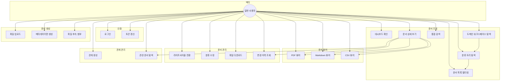
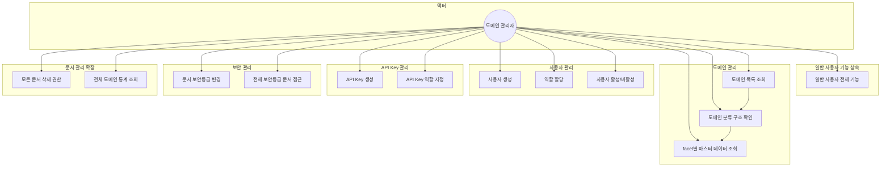
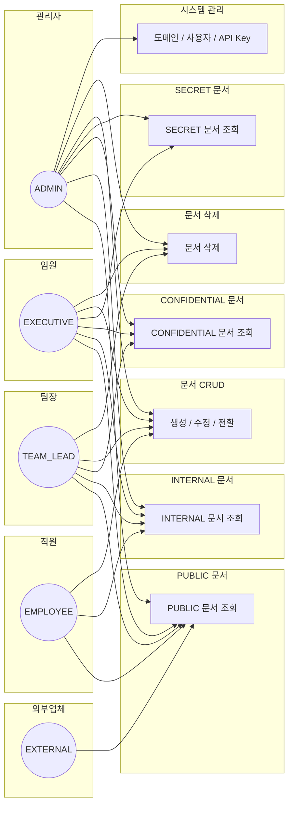
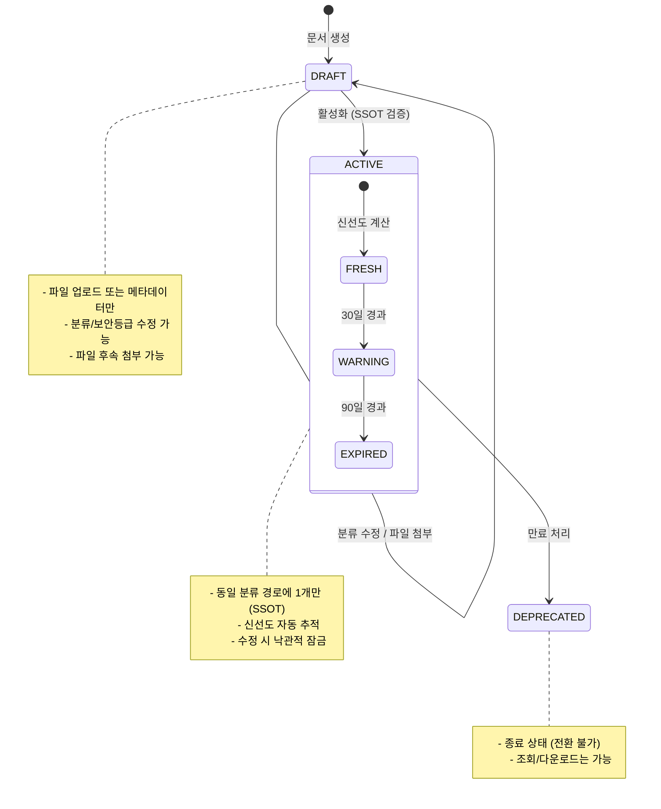
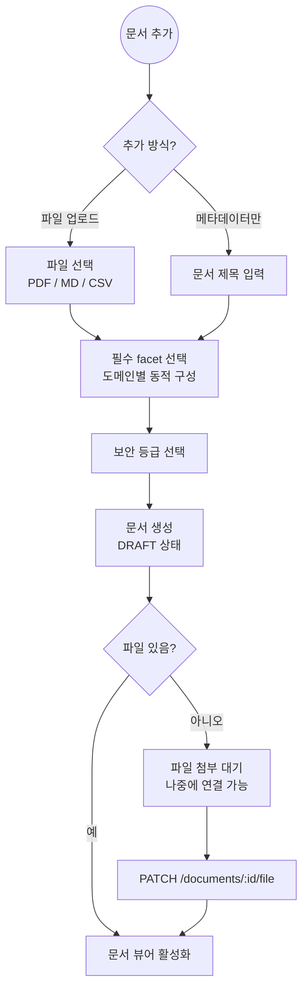

# KMS 유스케이스 정의서

## 액터 정의

| 액터 | 역할 | 설명 |
|------|------|------|
| 일반 사용자 | EMPLOYEE | 문서 조회, 검색, 업로드, 관계 생성 |
| 팀장 | TEAM_LEAD | 일반 사용자 권한 + 문서 삭제, CONFIDENTIAL 접근 |
| 임원 | EXECUTIVE | 팀장 권한 + SECRET 문서 접근 |
| 도메인 관리자 | ADMIN | 전체 권한 + 도메인/분류/사용자/API Key 관리 |
| 외부업체 | EXTERNAL | PUBLIC 문서만 조회 (API Key 기반) |

---

## 1. 일반 사용자 유스케이스

### 1.1 인증

#### UC1: 로그인
- **선행조건**: 관리자가 사용자 계정을 생성한 상태
- **기본 흐름**:
  1. 이메일과 비밀번호를 입력한다
  2. 시스템이 JWT 토큰(access + refresh)을 발급한다
  3. 대시보드로 이동한다
- **예외 흐름**: 인증 실패 시 에러 메시지 표시

#### UC2: 토큰 갱신
- **선행조건**: refresh 토큰이 유효한 상태
- **기본 흐름**: access 토큰 만료 시 자동으로 갱신
- **예외 흐름**: refresh 토큰도 만료되면 로그인 페이지로 리다이렉트

### 1.2 문서 조회

#### UC3: 대시보드 확인
- **기본 흐름**:
  1. 전체 문서 통계(전체/ACTIVE/DRAFT/경고) 확인
  2. 도메인별 현황 테이블에서 각 도메인의 문서 분포 확인
  3. 최근 활동 목록에서 팀원들의 작업 내역 확인
  4. 도메인 클릭 시 해당 도메인 워크스페이스로 이동

#### UC4: 도메인 워크스페이스 탐색
- **기본 흐름**:
  1. 3패널 레이아웃 진입 (트리 / 문서 목록 / 미리보기)
  2. 왼쪽 분류 트리에서 facet을 선택하여 문서 필터링
  3. 중앙 문서 목록에서 문서 클릭 시 오른쪽 미리보기 표시
  4. 더블클릭 시 문서 상세 페이지로 이동

#### UC5: 분류 트리 탐색
- **기본 흐름**:
  1. 도메인의 requiredFacets에 따라 계층 트리가 동적으로 구성됨
  2. 트리 노드를 클릭하면 해당 분류의 문서만 필터링
  3. 각 노드에 문서 수가 표시됨

#### UC6: 문서 목록 필터링
- **기본 흐름**:
  1. 라이프사이클 필터 (DRAFT / ACTIVE / DEPRECATED) 선택
  2. 정렬 기준 변경 (생성일, 파일명, 크기 등)
  3. 페이지네이션으로 전체 목록 탐색
- **제약**: 사용자의 역할에 따라 보안 등급이 높은 문서는 목록에서 자동 제외

#### UC7: 통합 검색
- **기본 흐름**:
  1. 키워드(파일명 기준) 입력
  2. 도메인 필터, 라이프사이클 필터 선택 (선택사항)
  3. 검색 결과에서 분류 경로, 상태, 보안 등급 확인
  4. 클릭 시 문서 상세 페이지로 이동

#### UC8: 문서 상세 보기
- **기본 흐름**:
  1. 메타데이터 패널에서 상태, 보안 등급, 신선도, 버전, 분류 정보 확인
  2. 문서 뷰어에서 본문 확인 (PDF/Markdown/CSV)
  3. 변경 이력 타임라인 확인
  4. 관련 문서(관계) 목록 확인 및 네비게이션
- **제약**: 보안 등급이 사용자 역할보다 높으면 접근 거부

### 1.3 문서 생성

#### UC12: 파일 업로드
- **선행조건**: 도메인 워크스페이스에 진입한 상태
- **기본 흐름**:
  1. "문서 추가" 다이얼로그에서 "파일 업로드" 모드 선택
  2. 도메인의 필수 facet(동적 구성)을 모두 선택
  3. 보안 등급 선택 (기본값: INTERNAL)
  4. 파일 드래그 또는 클릭하여 선택 (PDF/MD/CSV만)
  5. 업로드 완료 시 DRAFT 상태로 생성
- **예외 흐름**: 허용되지 않은 파일 형식 시 에러 메시지
- **후행조건**: 문서 목록에 새 문서 표시

#### UC13: 메타데이터만 생성 (문서 껍데기)
- **선행조건**: 도메인 워크스페이스에 진입한 상태
- **기본 흐름**:
  1. "문서 추가" 다이얼로그에서 "메타데이터만" 모드 선택
  2. 문서 제목 입력
  3. 필수 facet 선택, 보안 등급 선택
  4. 생성 완료 — 파일 없는 문서(껍데기)가 DRAFT로 생성
- **용도**: 문서 체계를 먼저 설계하고, 실제 파일은 나중에 연결

#### UC14: 파일 후속 첨부
- **선행조건**: 메타데이터만 생성된 문서가 존재
- **기본 흐름**:
  1. 문서 상세 페이지에서 "파일 첨부" 버튼 클릭
  2. 파일 선택 (PDF/MD/CSV)
  3. 첨부 완료 시 문서 뷰어가 활성화

### 1.4 문서 관리

#### UC15: 라이프사이클 전환
- **기본 흐름**:
  1. 문서 상세 페이지에서 전환 버튼 클릭
  2. 확인 다이얼로그에서 승인
  3. 상태 전환: DRAFT → ACTIVE 또는 ACTIVE → DEPRECATED
- **제약 (SSOT)**: ACTIVE 전환 시 동일 분류 경로에 이미 ACTIVE 문서가 있으면 거부

#### UC16: 분류 수정
- **기본 흐름**:
  1. 문서 상세 페이지에서 분류 정보 수정
  2. 낙관적 잠금(rowVersion) 기반 충돌 검증
- **예외 흐름**: 다른 사용자가 먼저 수정한 경우 충돌 알림

#### UC17: 파일 다운로드
- **선행조건**: 파일이 첨부된 문서
- **기본 흐름**: 상세 페이지에서 "다운로드" 클릭 → 원본 파일 다운로드

#### UC18: 변경 이력 조회
- **기본 흐름**: 문서 상세 페이지의 변경 이력 타임라인에서 모든 변경사항 확인
- **기록되는 이벤트**: CREATE, UPDATE, FILE_ATTACH, LIFECYCLE_CHANGE, DELETE

### 1.5 관계 관리

#### UC19: 관계 생성
- **선행조건**: 문서 2개 이상 존재
- **기본 흐름**:
  1. 관계 유형 선택: PARENT_OF, CHILD_OF, SIBLING, REFERENCE, SUPERSEDES
  2. 대상 문서 선택
  3. 양방향 관계(PARENT_OF↔CHILD_OF, SIBLING)는 자동으로 역방향도 생성
- **제약**: 순환 참조 방지 (DB 트리거), scope 검증 (same_domain / any)

#### UC20: 관련 문서 탐색
- **기본 흐름**: 문서 상세 페이지에서 관련 문서 목록 확인 → 클릭하여 이동

---

## 2. 도메인 관리자 유스케이스

### 2.1 도메인 관리

#### UC21: 도메인 목록 조회
- **기본 흐름**:
  1. 관리자 메뉴 > "도메인/분류 관리" 진입
  2. 등록된 모든 도메인의 코드, 이름, 활성 상태 확인

#### UC22: 도메인 분류 구조 확인
- **기본 흐름**:
  1. 도메인을 선택하면 해당 도메인의 분류 구조 표시
  2. 필수 Facet 목록 확인 (도메인별로 다름)
  3. SSOT Key 확인 (어떤 facet 조합이 유일성을 결정하는지)

#### UC23: facet별 마스터 데이터 조회
- **기본 흐름**:
  1. 도메인 선택 시 해당 도메인의 각 facet 데이터 표시
  2. 코드, 이름, 정렬 순서, Tier(HOT/WARM/COLD) 확인
  3. 비활성 항목은 자동 제외

### 2.2 사용자 관리

#### UC24: 사용자 생성
- **기본 흐름**:
  1. 관리자 메뉴 > "사용자 관리" 진입
  2. 이메일, 비밀번호, 이름, 역할 입력
  3. 사용자 생성 완료

#### UC25: 역할 할당
- **할당 가능 역할**: EXTERNAL, EMPLOYEE, TEAM_LEAD, EXECUTIVE, ADMIN
- **역할별 접근 범위**:
  - EXTERNAL: PUBLIC 문서만
  - EMPLOYEE: PUBLIC + INTERNAL
  - TEAM_LEAD: PUBLIC + INTERNAL + CONFIDENTIAL + 문서 삭제
  - EXECUTIVE: 전체 보안 등급 접근
  - ADMIN: 전체 권한 + 시스템 관리

#### UC26: 사용자 활성/비활성
- **기본 흐름**: 사용자 목록에서 활성 상태 토글
- **효과**: 비활성 사용자는 로그인 불가

### 2.3 API Key 관리

#### UC27: API Key 생성
- **기본 흐름**:
  1. API Key 이름과 역할 지정
  2. 생성 시 Key 값이 한 번만 표시됨
  3. 외부 시스템(RAG 등)에서 이 Key로 API 호출
- **주의**: 생성 후 Key를 다시 확인할 수 없으므로 즉시 복사 필요

#### UC28: API Key 역할 지정
- **기본 흐름**: 외부업체용은 EXTERNAL, 내부 시스템용은 EMPLOYEE 등 용도에 맞는 역할 부여
- **효과**: API Key의 역할에 따라 접근 가능한 문서 보안 등급이 결정

### 2.4 보안 관리

#### UC29: 문서 보안등급 변경
- **선행조건**: ADMIN 역할만 가능
- **기본 흐름**: 문서 수정 시 보안 등급(PUBLIC/INTERNAL/CONFIDENTIAL/SECRET) 변경
- **효과**: 등급 변경 즉시 해당 등급 미만의 사용자에게 비가시

#### UC30: 전체 보안등급 문서 접근
- **기본 흐름**: ADMIN은 SECRET 포함 모든 보안 등급의 문서에 접근 가능

---

## 3. 전체 유스케이스 흐름도

---

## 4. 문서 라이프사이클 상태도

---

## 5. 문서 생성 방식 비교

