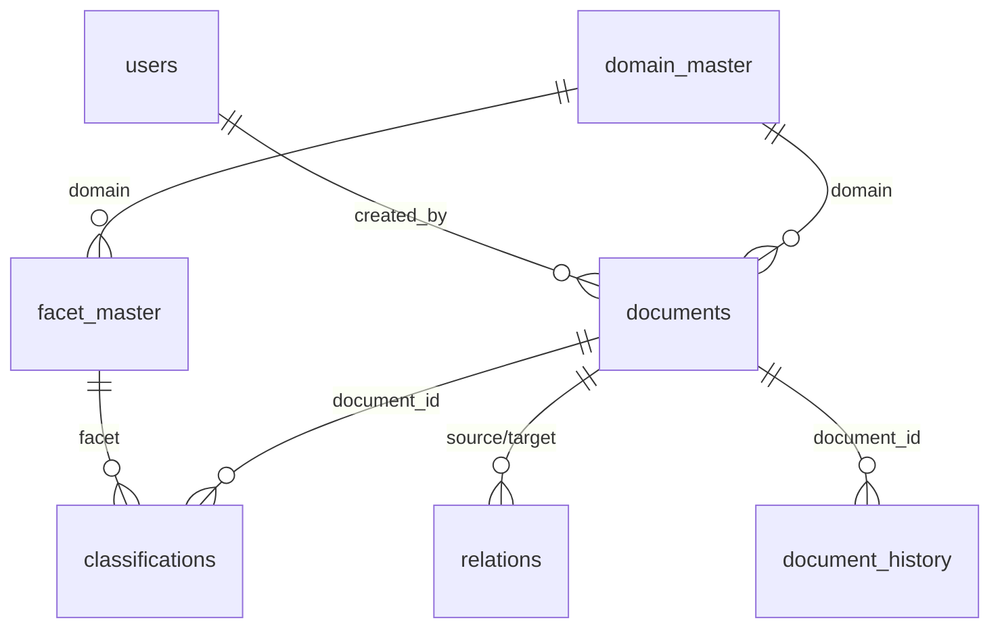

# KMS 개발자/운영자 가이드

> **대상**: IT팀 / 개발자 / 시스템 운영자
> **목적**: 시스템 아키텍처, 운영, 유지보수 참고
> **버전**: 1.0 | 2026-02-08

---

## 1. 시스템 개요

### 목적
문서 체계 관리 시스템 - 문서 저장, 분류, 관계 관리, 뷰어 제공

### 범위
- 포함: 파일 저장, 분류, 관계, 라이프사이클, 뷰어, API
- 제외: PDF 파싱, NLP, 벡터 DB, RAG (외부 연동)

---

## 2. 아키텍처

### 시스템 구조

```
┌─────────────────────────────────────────────────────────┐
│                  Vue 3 + Element Plus                    │
│                   (Admin Dashboard)                       │
└──────────────────────┬──────────────────────────────────┘
                       │ HTTP (REST)
┌──────────────────────▼──────────────────────────────────┐
│                  ASP.NET Core 8 API                      │
│                                                         │
│  [Controllers]     [Services]        [Repositories]     │
│  • DocumentCtrl    • DocumentSvc     • EF Core          │
│  • RelationCtrl    • RelationSvc     • PostgreSQL       │
│  • TaxonomyCtrl    • TaxonomySvc                        │
└──────────────────────┬──────────────────────────────────┘
                       │ TCP
┌──────────────────────▼──────────────────────────────────┐
│                   PostgreSQL 16                          │
│                                                         │
│  [documents]  [classifications]  [relations]  [facets] │
└──────────────────────┬──────────────────────────────────┘
                       │
                 [REST API /api/v1]
                       │
         ┌─────────────┴─────────────┐
         ▼                           ▼
    ┌─────────┐                 ┌─────────┐
    │ RAG 업체 │                 │ 미래 업체 │
    └─────────┘                 └─────────┘
```

### 레이어별 책임

| 레이어 | 책임 | 기술 |
|--------|------|------|
| Presentation | UI, 사용자 인터랙션 | Vue 3, Element Plus |
| API | 요청 처리, 인증 | ASP.NET Core 8 |
| Business | 비즈니스 로직 | C# Services |
| Data | 데이터 접근 | EF Core, PostgreSQL |

---

## 3. 기술 스택

### 프론트엔드

| 기술 | 버전 | 용도 |
|------|------|------|
| Vue 3 | 3.4+ | UI 프레임워크 |
| Vue Router | 4.x | 라우팅 |
| Pinia | 2.x | 상태 관리 |
| Element Plus | 2.x | UI 컴포넌트 |
| Vite | 5.x | 빌드 도구 |
| Axios | 1.x | HTTP 클라이언트 |
| pdf.js | - | PDF 뷰어 |
| marked.js | - | Markdown 렌더링 |
| vis-network | 9.x | 관계 그래프 |

### 백엔드

| 기술 | 버전 | 용도 |
|------|------|------|
| ASP.NET Core | 8.0 LTS | API 서버 |
| Entity Framework Core | 8.x | ORM |
| Npgsql | - | PostgreSQL 드라이버 |
| JWT Bearer | - | 인증 |

### 인프라

| 기술 | 버전 | 용도 |
|------|------|------|
| PostgreSQL | 16 | 데이터베이스 |
| nginx | - | 리버스 프록시 |
| Docker | - | 컨테이너 (선택) |

---

## 4. 데이터베이스 설계

> **정본**: `phase2/database-schema.md` 참조

### ERD (Mermaid)



### 테이블 요약

| 테이블 | PK | 주요 컬럼 |
|--------|-----|----------|
| `users` | uuid | email, password_hash, role |
| `domain_master` | code | display_name, required_facets |
| `facet_master` | id | facet_type, code, tier, max_age_days |
| `documents` | uuid | domain, lifecycle, file_*, version_*, reviewed_at, row_version |
| `classifications` | id | document_id, facet_type, facet_value |
| `relations` | uuid | source_id, target_id, relation_type |
| `document_history` | uuid | document_id, action, changes, user_id |
| `api_keys` | id | key_hash, permissions, expires_at |

### 주요 제약조건

| 제약 | 테이블 | 구현 |
|------|--------|------|
| 라이프사이클 | documents | CHECK (DRAFT, ACTIVE, DEPRECATED) |
| 파일형식 | documents | CHECK (pdf, md, csv) |
| 자기참조 금지 | relations | CHECK (source_id != target_id) |
| 순환 참조 방지 | relations | TRIGGER (INSERT/UPDATE) |
| SSOT | documents | TRIGGER (ACTIVE 중복 방지) |
| 낙관적 잠금 | documents | row_version 자동 증가 |

### 트리거 목록

| 트리거 | 테이블 | 시점 | 기능 |
|--------|--------|------|------|
| trg_check_cycle | relations | BEFORE INSERT/UPDATE | 순환 참조 방지 |
| trg_check_ssot | documents | BEFORE INSERT/UPDATE | SSOT 검증 |
| trg_update_hash | classifications | AFTER INSERT/UPDATE/DELETE | 분류 해시 갱신 |
| trg_doc_timestamp | documents | BEFORE UPDATE | updated_at, row_version 갱신 |

---

## 5. API 명세

### 인증

```
내부 API: JWT Bearer Token
외부 API: X-API-Key Header
```

### 내부 API (Admin)

```
인증
POST   /api/auth/login                 로그인 (JWT 발급)
POST   /api/auth/refresh               토큰 갱신
POST   /api/auth/logout                로그아웃

문서
POST   /api/documents                  문서 업로드
GET    /api/documents                  목록 조회 (?domain=&lifecycle=&page=&size=)
GET    /api/documents/{id}             상세 조회
PUT    /api/documents/{id}             수정 (row_version 필수)
DELETE /api/documents/{id}             삭제 (논리)
PATCH  /api/documents/{id}/lifecycle   라이프사이클 변경
PATCH  /api/documents/{id}/review      검토일 갱신 (신선도 리셋)

파일
GET    /api/documents/{id}/file        파일 다운로드
GET    /api/documents/{id}/preview     미리보기 (PDF/MD/CSV)

관계
GET    /api/documents/{id}/relations   관계 목록 (?depth=1)
POST   /api/relations                  관계 생성
DELETE /api/relations/{id}             관계 삭제 (UUID)

분류
GET    /api/taxonomy/{facetType}       분류 목록 (carriers, products, docTypes)
GET    /api/domains                    도메인 목록
```

### 외부 API (v1)

```
GET /api/v1/documents                  문서 목록 (필터, 페이징)
GET /api/v1/documents/{id}             메타데이터
GET /api/v1/documents/{id}/file        원본 다운로드
GET /api/v1/documents/{id}/relations   관계 조회
GET /api/v1/taxonomy/{type}            분류 목록

Query Parameters:
  ?domain=GA-SALES
  ?lifecycle=ACTIVE
  ?carrier=KB
  ?page=1&size=20
```

### 응답 형식

```json
{
  "success": true,
  "data": { ... },
  "error": null,
  "meta": {
    "page": 1,
    "size": 20,
    "total": 100
  }
}
```

### 에러 코드

| 코드 | 의미 |
|------|------|
| 400 | Bad Request (잘못된 요청) |
| 401 | Unauthorized (인증 실패) |
| 403 | Forbidden (권한 없음) |
| 404 | Not Found (문서 없음) |
| 409 | Conflict (중복 문서) |
| 422 | Unprocessable (순환 참조) |

---

## 6. 파일 저장 구조

```
/storage
├── originals/              # 원본 파일
│   └── {domain}/
│       └── {year}/
│           └── {uuid}.{ext}
│
├── thumbnails/             # PDF 썸네일 (선택)
│   └── {uuid}.png
│
└── temp/                   # 임시 업로드
    └── {upload_id}/
```

### 파일명 규칙

```
원본: {uuid}.{ext}
예시: 550e8400-e29b-41d4-a716-446655440000.pdf

썸네일: {uuid}.png
예시: 550e8400-e29b-41d4-a716-446655440000.png
```

---

## 7. 보안

### 인증/인가

| 구분 | 방식 | 대상 |
|------|------|------|
| Admin UI | JWT + Cookie | 내부 사용자 |
| 외부 API | API Key | 외주 업체 |

### API Key 관리

```sql
CREATE TABLE api_keys (
    id SERIAL PRIMARY KEY,
    key_hash VARCHAR(64) NOT NULL UNIQUE,
    name VARCHAR(100) NOT NULL,
    permissions JSONB DEFAULT '["read"]',
    expires_at TIMESTAMP,
    is_active BOOLEAN DEFAULT true,
    created_at TIMESTAMP DEFAULT NOW()
);
```

### 파일 보안

```
- 업로드 시 MIME 타입 검증
- 허용 확장자: .pdf, .md, .csv만
- 파일 크기 제한: 50MB
- 저장 경로 난독화 (UUID)
```

---

## 8. 운영 가이드

### 환경변수

```bash
# Database
DATABASE_HOST=localhost
DATABASE_PORT=5432
DATABASE_NAME=kms
DATABASE_USER=kms_user
DATABASE_PASSWORD=xxxx

# Storage
STORAGE_PATH=/data/storage

# JWT
JWT_SECRET=xxxx
JWT_EXPIRY=3600

# API
API_KEY_SALT=xxxx
```

### 헬스체크

```
GET /health          전체 상태
GET /health/db       DB 연결
GET /health/storage  스토리지 상태
```

### 로그

```
/var/log/kms/
├── app.log         # 애플리케이션 로그
├── access.log      # 접근 로그
└── error.log       # 에러 로그

로그 레벨: Debug, Info, Warning, Error
로그 보관: 30일
```

### 백업

```bash
# 데이터베이스
pg_dump -h localhost -U kms_user kms > backup_$(date +%Y%m%d).sql

# 파일 스토리지
rsync -av /data/storage/ /backup/storage/

# 권장 주기
- DB: 매일
- 파일: 매일 (증분)
- 전체 백업: 주간
```

### 모니터링

| 지표 | 임계치 | 알람 |
|------|--------|------|
| CPU | 80% | Warning |
| Memory | 85% | Warning |
| Disk | 90% | Critical |
| API 응답시간 | 2초 | Warning |
| 에러율 | 1% | Warning |

---

## 9. 배포

### 요구사항

```
- .NET 8 Runtime
- Node.js 20+
- PostgreSQL 16
- 저장소 500GB+
```

### 배포 순서

```bash
# 1. 백엔드 빌드
cd backend
dotnet publish -c Release -o ./publish

# 2. 프론트엔드 빌드
cd frontend
npm install
npm run build

# 3. DB 마이그레이션
dotnet ef database update

# 4. 서비스 시작
systemctl start kms-api

# 5. nginx 설정
systemctl reload nginx
```

### Docker (선택)

```dockerfile
# backend/Dockerfile
FROM mcr.microsoft.com/dotnet/aspnet:8.0
COPY ./publish /app
WORKDIR /app
ENTRYPOINT ["dotnet", "KMS.Api.dll"]
```

```yaml
# docker-compose.yml
services:
  api:
    build: ./backend
    ports:
      - "5000:5000"
    depends_on:
      - db

  db:
    image: postgres:16
    volumes:
      - pgdata:/var/lib/postgresql/data

volumes:
  pgdata:
```

---

## 10. 확장 포인트 (Phase 3)

### 인터페이스 예약

```csharp
// Phase 2에서 정의만
public interface IDocumentProcessor
{
    Task<ExtractedContent> ExtractText(string filePath);
    Task<ClassificationSuggestion> SuggestClassification(string text);
}

// Phase 3에서 구현
public class PythonDocumentProcessor : IDocumentProcessor
{
    private readonly HttpClient _pythonClient;

    public async Task<ExtractedContent> ExtractText(string filePath)
    {
        return await _pythonClient.PostAsync("/extract", ...);
    }
}
```

### 추가 테이블 (미구현)

```sql
-- Phase 3에서 추가
CREATE TABLE document_content (
    document_id UUID REFERENCES documents(id),
    full_text TEXT,
    keywords JSONB,
    processed_at TIMESTAMP,
    PRIMARY KEY(document_id)
);

CREATE TABLE document_embeddings (
    document_id UUID REFERENCES documents(id),
    embedding VECTOR(768),  -- pgvector
    model_version VARCHAR(50),
    created_at TIMESTAMP,
    PRIMARY KEY(document_id)
);
```

---

## 11. 트러블슈팅

### 자주 발생하는 문제

| 증상 | 원인 | 해결 |
|------|------|------|
| 파일 업로드 실패 | 파일 크기 초과 | nginx client_max_body_size 확인 |
| PDF 미리보기 안됨 | pdf.js 버전 | 브라우저 콘솔 에러 확인 |
| 관계 생성 실패 | 순환 참조 | 관계 경로 확인 |
| API 401 에러 | JWT 만료 | 토큰 갱신 |

### 디버깅

```bash
# 로그 확인
tail -f /var/log/kms/error.log

# DB 연결 테스트
psql -h localhost -U kms_user -d kms -c "SELECT 1"

# API 테스트
curl -X GET http://localhost:5000/health
```

---

## 12. 참고 문서

| 문서 | 경로 | 설명 |
|------|------|------|
| Phase 2 상세 | `../phase2/README.md` | 상세 설계 |
| Phase 3 계획 | `../phase3/README.md` | 확장 계획 |
| 기술 스택 결정 | `../architecture/tech-stack-decision.md` | Python vs .NET |

---

**문서 끝**
